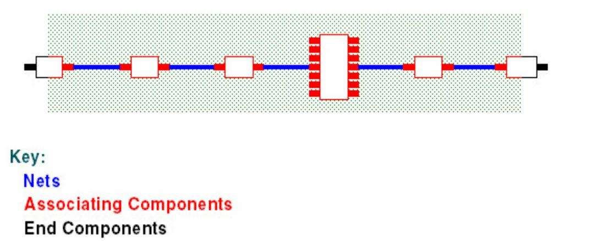

# **Chapter 10 Electrical Nets**

You can associate an array of nets joined by discrete components, creating an electrical net to which you can apply rules as you would to a single net. The length of an electrical net is the combined lengths of the nets and discrete components of which it is composed.

The following figure shows an example of an electrical net.

### **Figure 15. Electrical Net Components and Nets**

Length, differential pair and matched length rules can apply to an electrical net as though it were a single net.

[Electrical Net Creation and Modification](#page-1-0) [Deletion of Electrical Nets](#page-6-0) [Excluding Nets from Electrical Net Creation](#page-7-0) [Excluding Components from Electrical Net Creation](#page-8-0) [Canceling Electrical Net Creation by Nets](#page-9-0) [Canceling Electrical Net Creation by Components](#page-10-0) [Selecting Electrical Nets](#page-10-1) [Setting Electrical Net Properties](#page-11-0) [Creating a Matched Length Group of Electrical Nets](#page-11-1) Creating a [Differential](#page-11-2) Pair of Electrical Nets [Conditions Governing Electrical Net Creation](#page-12-0)

# **Electrical Net Creation and Modification**

You can create or modify electrical nets to meet your design requirements.

There are three ways to create and modify your electrical nets.

By default these methods are independent of each other (that is, you can use any of the methods by itself), because the commands/properties by which they interact are defaulted to allow you to choose one method to use, and ignore the others. Choosing one method and sticking with it is the simplest course. If you want to mix methods in your design, you must first understand how the methods interact, as described in ["Conditions Governing Electrical Net Creation"on page 151.](#page-12-0)

[General Restrictions and Prerequisites](#page-1-1) [Creating Electrical Nets by Selecting the Nets](#page-2-0) [Creating Electrical Nets by Selecting the Components](#page-3-0) [Creating Electrical Nets Automatically by Refdes Prefix](#page-4-0)

# **General Restrictions and Prerequisites**

Consider certain restrictions and prerequisites before creating electrical nets.

The following restrictions apply to all 3 electrical net creation methods:

- A plane net cannot be part of an electrical net.
- A net having more pins than the limit specified in the "Maximum non-plane-net pin count" field cannot be part of an electrical net.

**Tip** Virtual pins are not included in a net's pin count.

- An electrical net that would have more nets than the limit specified in the "Maximum net count per electrical net" field of the Electrical Nets dialog box is not created.
- Components through which an electrical net passes must be either discrete two-pin components, or multiple pin components that conform to the following conditions:
	- All the pins must connect to a gate.
	- Each gate must have exactly two pins.

No component that does not conform to these conditions can create an electrical net, that is, no electrical net can go through it.

The following prerequisite is recommended for all 3 electrical net creation methods.

Before you begin creating electrical nets, you should make sure that you set the "Maximum net count per electrical net" and "Maximum non-plane-net pin count" fields in the Electrical Netson page 409 dialog box appropriately for your design. These fields set limits on the number of nets allowed in an electrical net, and on the number of pins allowed in a single net included in an electrical net. If these values are set inappropriately for your design, SailWind Router does not create electrical nets that it would otherwise create, or the software creates them differently than you expect, as follows:

- The software does not create an electrical net if the potential electrical net exceeds the "Maximum net count per electrical net" limit.
- If any net in the potential electrical net exceeds the "Maximum non-plane-net pin count" limit, the software may split the electrical net, truncate it, or not create it at all, depending on the location of the faulty net.

**Tip** Virtual pins are not included in a net's pin count.

For more information, see ["Conditions Governing Electrical Net Creation"on page 151](#page-12-0).

# **Creating Electrical Nets by Selecting the Nets**

Use this method if you want to create electrical nets by selecting nets.

**Tip** Whenever you create, delete, or change electrical nets, the software regenerates all electrical nets in the design. Therefore, always verify that the results of an electrical nets operation are what you expect by reading the messages in the Output Window.

### **Procedure**

- 1. In the workspace, select the nets you want to make into electrical nets.
- 2. Right-click and click the **Create Electrical Net** popup menu item.

As an alternative, in the Net Properties dialog box, on the **Electrical Net** tab, select the Create electrical net check box.

# **Results**

The selected nets are made into an electrical net, and the Net Properties Create electrical net check box is selected for all the selected nets.

Are the results different from what you expected?

- SailWind Router may have split or truncated an expected electrical net, or not created it at all, because one or more of its nets or components did not conform to the [General Restrictions and](#page-1-1) [Prerequisites](#page-1-1)for creating electrical nets.
- Some nets cannot be made into electrical nets; for example, two selected nets from opposite sides of the board will have the Create electrical net check box selected, but no electrical net will be created.
- **Mixed-method restriction:** If a component to which one of the selected nets is attached has been excluded from electrical net creation, it cannot create an electrical net, that is, no electrical

net can go through it. (A component or net is excluded from electrical net creation if its Create electrical net and "Allow electrical net creation..." check boxes are both cleared.)

For more information, see ["Conditions Governing Electrical Net Creation"on page 151.](#page-12-0)

**Related Topics**

[Canceling Electrical Net Creation by Nets](#page-9-0)

[Excluding Nets from Electrical Net Creation](#page-7-0)

# **Creating Electrical Nets by Selecting the Components**

Use this method if you want to create electrical nets by selecting components to associate its connected nets.

### **Tip**

Whenever you create, delete, or change electrical nets, SailWind Router regenerates all electrical nets in the design. Therefore, always verify that the results of an electrical nets operation are what you expect by reading the messages in the Output Window.

### **Procedure**

- 1. In the workspace, select the components whose nets you want to make into electrical nets.
- 2. Right-click and click the **Create Electrical Net** popup menu item.

As an alternative, in the Component Properties dialog box, on the **Electrical Nets** tab, select the Create electrical net check box.

# **Results**

The nets attached to the selected components are made into electrical nets, and the Component Properties "Create electrical net" property is set for all the selected components.

Are the results different from what you expected?

- SailWind Router may have split or truncated an expected electrical net, or not created it at all, because one or more of its nets or components did not conform to the [General Restrictions and](#page-1-1) [Prerequisites](#page-1-1)for creating electrical nets.
- **Mixed-method restriction:** If you have excluded a net that is attached to a selected component from electrical net creation, it cannot be included in an electrical net. (A component or net is excluded from electrical net creation if its Create electrical net nets and Allow electrical net creation... check boxes are both cleared.)

For more information, see ["Conditions Governing Electrical Net Creation"on page 151.](#page-12-0)

### **Related Topics**

[Excluding Components from Electrical Net Creation](#page-8-0)

[Canceling Electrical Net Creation by Components](#page-10-0)

# **Creating Electrical Nets Automatically by Refdes Prefix**

If you want to create electrical nets automatically, use this method to specify the refdes prefixes of any components through which the nets pass.

**Tip** Whenever you create, delete, or change electrical nets, SailWind Router regenerates all electrical nets in the design. Therefore, always verify that the results of an electrical nets operation are expected by reading the messages in the Output Window.

# **Prerequisites**

This procedure creates electrical nets for all components that have the specified refdes prefixes and conform to the [General Restrictions and Prerequisites](#page-1-1)for creating electrical nets. Ensure the refdes prefixes of any set of components you plan to group into electrical nets are unique.

# **Procedure**

- 1. Click the **Setup > Electrical Nets** menu item.
- 2. In the Maximum net count per electrical net box, type the maximum number of nets to be allowed in electrical nets.
- 3. In the Maximum non-plane-net pin count box, type the maximum number of pins allowed in nets belonging to electrical nets. Nets that have pin counts higher than this maximum are considered plane nets, and are not included in electrical nets.

**Tip** Virtual pins are not included in a net's pin count.

4. In the Discrete component prefixes area, enter the refdes prefixes of the components you want to be creating electrical nets.

## **Tip**

The text entry field names are only for convenience; prefixes for any type of component can be entered in any field.

# **Results**

When you click **OK** or **Apply**, electrical nets regenerate based on the new or changed set of specified refdes prefixes.

Rules (min/max length, matched length groups, differential pairs) for electrical nets that are unchanged in the regeneration are kept. Electrical nets that are changed (including changes to the set of components they pass through), or deleted:

- Lose their rules
- Are removed from matched length groups, and
- Diff pairs containing them are removed.

Are the results different from what you expected?

- SailWind Router might have split or truncated an expected electrical net, or not created it at all, because one or more of its nets or components did not conform to the [General Restrictions and](#page-1-1) [Prerequisites](#page-1-1)for creating electrical nets.
- **Mixed-method Restriction:** If any of the selected components, or any net attached to a selected component, has been excluded from electrical net creation, it cannot be included in an electrical net. (SailWind Router excludes a component or net from electrical net creation if its "Create electrical net" and "Allow electrical net creation..." check boxes are both cleared.)

For more information, see ["Conditions Governing Electrical Net Creation"on page 151.](#page-12-0)

### **Related Topics**

[Deleting Electrical Nets Manually](#page-6-1)

[Excluding Nets from Electrical Net Creation](#page-7-0)

[Excluding Components from Electrical Net Creation](#page-8-0)

# **Deletion of Electrical Nets**

You can delete electrical nets manually or—if you created them automatically through the Electrical Nets dialog box—you can delete them automatically.

[Deleting Electrical Nets Manually](#page-6-1) [Deleting Electrical Nets Automatically](#page-6-2)

# **Deleting Electrical Nets Manually**

You can remove electrical nets manually from the workspace or from Project Explorer.

**Tip** Deleting an electrical net does not delete physical nets.

# **Procedure**

- 1. In Project Explorer or the workspace, select the electrical nets you want to delete.
- 2. Right-click and click either the **Delete** or the **Delete Electrical Net** popup menu item.

# **Results**

The Create electrical net check box is cleared for all the physical nets of the selected electrical nets. If any physical nets have also been made into electrical nets by component (including by refdes prefix), for those nets the "Allow electrical net creation by component" check box is cleared as well.

# **Related Topics**

[Canceling Electrical Net Creation by Nets](#page-9-0)

[Excluding Nets from Electrical Net Creation](#page-7-0)

# **Deleting Electrical Nets Automatically**

You can "automatically" delete a group of electrical nets which you have created using the refdes prefix method.

**Tip** Whenever you create, delete, or change electrical nets, SailWind Router regenerates all electrical nets in the design. So you should always verify that the results of an electrical nets operation are what you expected by reading the messages in the Output Window.

### **Procedure**

- 1. Choose the **Setup > Electrical Nets** menu item.
- 2. Delete the refdes prefixes of the components that should not be creating electrical nets.
- 3. Click **OK**.

### **Results**

The electrical nets created by components having the specified refdes prefix are deleted, split or truncated.

Are the results different from what you expected?

### • **Mixed-method restrictions:**

- If a component having the deleted refdes prefix also has the Component Properties "Create electrical net" check box selected, the nets of that component remain in an electrical net.
- If a component having the deleted refdes prefix has the "Allow electrical net creation by refdes prefix and nets" check box selected, and both nets attached to a two-pin component (or to a single gate of a multiple-pin component) have the "Create electrical net" check box checked, those nets will remain in an electrical net.

For more information, see ["Conditions Governing Electrical Net Creation"on page 151.](#page-12-0)

### **Related Topics**

[General Restrictions and Prerequisites](#page-1-1)

[Excluding Components from Electrical Net Creation](#page-8-0)

# **Excluding Nets from Electrical Net Creation**

You can select physical nets for exclusion from any electrical net.

**Tip** This procedure clears both the Net Properties "Create electrical net" check box and the "Allow electrical net creation by component" check box, removing the selected nets from any current electrical net and preventing electrical net creation by component (including by refdes prefix). For more information, see ["Conditions Governing Electrical Net Creation"on page 151.](#page-12-0)

### **CAUTION:**

Whenever you create, delete, or change electrical nets, SailWind Router regenerates all electrical nets in the design. Therefore, always verify that the results of an electrical nets operation are expected by reading the messages in the Output Window.

### **Procedure**

- 1. In the workspace, select the net(s) you want to exclude from electrical net creation.
- 2. Right-click and click the **Disable Electrical Net Creation** popup menu item.

As an alternative, in the Net Properties dialog box, on the **Electrical Net** tab, clear both the "Create electrical net" and "Allow electrical net creation by components" check boxes.

### **Results**

The selected nets are removed from existing electrical nets, and the Net Properties "Create electrical net" and "Allow electrical net creation by components" check boxes are cleared for all the selected nets.

# **Related Topics**

[Conditions Governing Electrical Net Creation](#page-12-0)

[Canceling Electrical Net Creation by Nets](#page-9-0)

[Excluding Components from Electrical Net Creation](#page-8-0)

# **Excluding Components from Electrical Net Creation**

You can prevent an individual component from creating electrical nets—a component through which an electrical net passes. If you exclude a component that is not already part of an electrical net, it cannot become part of an electrical net created by net or by refdes prefix. In addition, if the component is already part of an electrical net, excluding it removes it from the electrical net.

**Note:** This procedure clears both the Component Properties "Create electrical net" and "Allow electrical net creation..." check boxes, preventing the selected components from creating electrical nets. For more information, see ["Conditions Governing Electrical Net Creation"on page 151](#page-12-0).

**Tip** Whenever you create, delete, or change electrical nets, SailWind Router regenerates all electrical nets in the design. Therefore, always verify that the results of an electrical nets operation are expected by reading the messages in the Output Window.

# **Procedure**

- 1. In the workspace, select the components you want to exclude from creating electrical nets.
- 2. Right-click and click the **Disable Electrical Net Creation** popup menu item.

As an alternative, in the Component Properties dialog box, clear both the "Create electrical net" and "Allow electrical net creation by refdes prefix or by nets" check boxes.

## **Results**

The selected components are excluded from electrical net creation. If a component is part of an existing electrical net, it is removed, that is, the electrical net no longer goes through it. Removing a component from an electrical net splits, truncates, or deletes the electrical net, depending upon its configuration and the position of the removed component.

Are the results different from what you expected?

• Nets attached to the excluded component may still be made into electrical nets through other components.

# **Related Topics**

[Conditions Governing Electrical Net Creation](#page-12-0)

[Excluding Nets from Electrical Net Creation](#page-7-0)

# **Canceling Electrical Net Creation by Nets**

You can cancel or end the "electrical net creation by the net" method.

**Tip** Whenever you create, delete, or change electrical nets, SailWind Router regenerates all electrical nets in the design. Therefore, always verify that the results of an electrical nets operation are expected by reading the messages in the Output Window.

# **Procedure**

- 1. In the workspace or Project Explorer, select the nets you want to remove from electrical nets.
- 2. Right-click and click the **Properties** popup menu item.
- 3. In the Electrical Nets tab, clear the Create electrical net check box.

**Tip** If you want to exclude the nets from electrical net creation altogether, also clear the "Allow electrical net creation by components" check box.

# **Results**

The selected nets are removed from existing electrical nets.

Are the results different from what you expected?

• **Mixed-method restriction:** Nets that are also made into electrical nets by the component and/or the refdes prefix method remain in electrical nets.

# **Related Topics**

[Conditions Governing Electrical Net Creation](#page-12-0)

# **Canceling Electrical Net Creation by Components**

Cancel the creation of an electrical net that is created by the components it passes through.

# **Tip**

Whenever you create, delete, or change electrical nets, SailWind Router regenerates all electrical nets in the design. Therefore, always verify that the results of an electrical nets operation are what you expected by reading the messages in the Output Window.

# **Procedure**

- 1. In the workspace or Project Explorer, select the components whose electrical net creation you want to cancel.
- 2. Right-click and choose the **Properties** popup menu item.
- 3. In the Electrical Nets area, clear the "Create electrical net" check box.

**Tip** If you want to exclude the components from electrical net creation by any method, also clear the "Allow electrical net creation by refdes prefix and by nets" check box.

# **Results**

Electrical net creation by the selected component is canceled.

Are the results different from what you expected?

- **Mixed-method restriction:** Nets that conform to the following criteria remain in electrical nets throughout the selected components:
	- The nets are attached to selected components, and
	- The nets are also made into electrical nets by the net and/or the refdes prefix method

# **Selecting Electrical Nets**

Use a popup menu item to select an electrical net. Selecting the electrical net also selects all physical nets in the electrical net.

### **Procedure**

- 1. With nothing selected, right-click and click the **Select Nets** popup menu item.
- 2. In the workspace, select one of the nets in the electrical net you want to select.

3. Right-click and click the **Select Electrical Net** popup menu item.

**Tip** You can also select electrical nets in the Project Explorer.

# **Setting Electrical Net Properties**

Use the Electrical Net Properties dialog box to set or modify electrical nets properties.

### **Procedure**

- 1. Select the electrical nets whose properties you want to set.
- 2. Right-click and click the **Properties** popup menu item.
- 3. In the Electrical Net Properties dialog box, make the appropriate settings in the Electrical Net on page 411 and Lengthon page 413 tabs, and click **OK**.

# **Creating a Matched Length Group of Electrical Nets**

You can group electrical nets together to create a matched length group.

# **Procedure**

1. [Select the electrical netson page 149.](#page-10-1)

**Tip** You can also select nets to add to the group.

- 2. Right-click and click the **Make Matched Length Net Group** popup menu item.
- 3. As an alternative, in the Project Explorer, select the electrical nets and copy/paste or drag and drop them into a matched length net group, or into the Matched Length Net Groups group.

# **Creating a Differential Pair of Electrical Nets**

You can select electrical nets and create a differential pair.

# **Procedure**

- 1. [Select the electrical netson page 149.](#page-10-1)
- 2. Right-click and click the **Make Differential Electrical Net** popup menu item.
- 3. As an alternative, in the Project Explorer, select the electrical nets and copy/paste or drag and drop them into the Differential Pairs group.

# **Conditions Governing Electrical Net Creation**

A number of conditions regulate the creation of electrical nets.

Electrical net creation is controlled by the following dialog box settings:

- The "Create electrical net" and "Allow electrical net creation by components" check boxes in the Net Properties dialog box.
- The "Create electrical net" and "Allow electrical net creation by refdes prefix or by nets" check boxes in the Component Properties dialog box.
- Refdes prefixes you specify in the Electrical Nets dialog box.
- The "Maximum net count per electrical net" and "Maximum non-plane-net pin count" fields in the Electrical Nets dialog box.

**Tip** Virtual pins are not included in the net pin count.

The default settings for these check boxes are:

- The "Create electrical net" nets check boxes, which create electrical nets, are cleared by default for all nets and components. So by default, no electrical nets created.
- The "Allow electrical net creation..." check boxes, which allow the selected net or component to be added to an electrical net by other methods, are selected by default for all nets and components. So by default, you create electrical nets by any of the three methods.
- The "Maximum net count per electrical net" default value is 5.
- The "Maximum non-plane-net pin count" default value is 25.

A discrete component and its attached nets become part of an electrical net only if the following conditions 1 and 2 are true:

- 1. You set the component and net properties to meet one of the following conditions:
	- Component Properties "Create electrical net" is set and neither attached net is excluded from electrical net creation. (A component or net is excluded from electrical net creation if you clear its "Create electrical net" and "Allow electrical net creation..." check boxes.)
	- Net Properties "Create electrical net" check box is selected for both nets and the component is not excluded from electrical net creation. (A component or net is excluded from electrical net creation if you clear its "Create electrical net" and "Allow electrical net creation..." check boxes.)
- Component Properties "Allow electrical net creation..." check box is selected and no attached net is excluded from electrical net creation. Also the component's refdes prefix is specified in the Electrical Nets dialog box. (A component or net is excluded from electrical net creation if you clear its "Create electrical net" and "Allow electrical net creation..." check boxes.)
- 2. The component, its nets, and the potential electrical net to which it will belong, all conform to the [General Restrictions and Prerequisites](#page-1-1)for creating electrical nets.