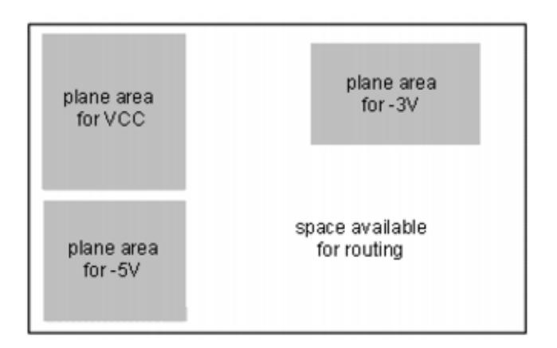
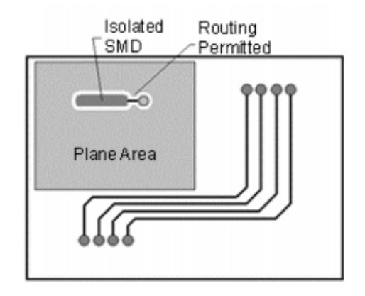
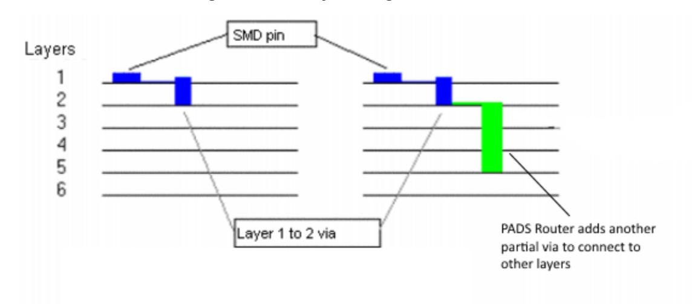

# **Chapter 16 Routing Setup**

An important step before routing your design involves optimizing the topology and net distribution, and setting routing restrictions. Also important is defining how you want to add fanouts and test points to the design.

[Routing Settings](#page-1-0)

## **Routing Settings**

SailWind Router offers a broad selection of setup options and constraints for configuring your design to achieve exceptional routing results.

[Performing Length Minimization](#page-1-1) [Rescheduling Nets](#page-1-2) [Split/Mixed Plane Layer Setup](#page-2-0) [Routing on Split/Mixed Layers](#page-5-0) [Routing with Layer Restrictions](#page-6-0) [Routing with Restrictions on Component Layers](#page-6-1) [Routing on Restricted Component Layers Assigned as Split/Mixed Planes](#page-7-0) Working with [Advanced](#page-7-1) Vias [Working](#page-8-0) With Fanouts and Partial Vias Setting and Tuning Length [Constraints](#page-9-0) Options

### **Performing Length Minimization**

*Length minimization* examines the design and assesses the current topology settings of the nets. Using these settings, SailWind Router reorders the nets to establish the shortest length between each of the connection points.

#### **Procedure**

- 1. Click the **Tools > Length Minimization** menu item.
- 2. Length minimization runs with the default topology type or the topology type you set on the **Topology** tab of the Properties dialog box.

**Related Topics**

Properties Dialog Box, Topology Tab

## **Rescheduling Nets**

Net rescheduling lets you change distribution of unroutes without using SailWind Layout ECO operations. You can move one end of an unroute from the current source pin or virtual pin to another pin. You can reschedule nets even if a net topology has a type of "Protected" as assigned in the **Topology** tab of the Design Properties or Net Properties dialog boxes.

**CAUTION:**

The net must contain unroutes to reschedule it.

### **Restrictions and Limitations**

You cannot reschedule the following unroutes:

- Unroutes connected to copper planes or T-junctions.
- Unroutes that span subnets.
- Unroutes belonging to differential pairs. You can reschedule differential pairs only if an unroute exists in each pair member.

### **Procedure**

1. Select an unroute then right-click and click the **Reschedule** popup menu item.

Everything in the workspace dims except the unroutes, pins, virtual pins, and protected vias that are valid end points for rescheduling.

2. Point to the pin where you want to reconnect the unroute. You can reconnect to pins or protected vias if they belong to the subnet of the selected unroute and if the connection maintains net integrity.

When you find a valid connection point, the pointer graphic changes to a double-circle with a cross hair through it. In addition, a ToolTip appears informing you that the pin is available for connection —or if not, why.

- 3. Click to complete the rescheduling.
- 4. When you complete rescheduling, the net automatically switches to a Protected topology type (on the **Topology** tab of the Net Properties dialog box).

### **Tip**

When you reschedule an unroute in a differential pair, a parallel rescheduling is performed in the other member of the pair. You can click **Undo** on the standard toolbar to undo this parallel rescheduling.

## **Split/Mixed Plane Layer Setup**

SailWind Router routes on split/mixed plane layers only if the layer has an open area not covered by a plane area.

### **Scenario 1**

All nets assigned to the layer have a plane area polygon. Open space is available for routing on the layer.

### **Scenario 2**

No nets assigned to the layer have a plane area polygon. *No open space is available for routing on the layer*. The entire layer is reserved for plane areas. Pre-routing analysis posts the following warning to the Output window in this situation: "Split/mixed layers <named layers> have automatically created plane areas. SailWind Router will route only assigned nets on these layers. To correct the problem, use SailWind Layout to define plane area polygons."

| Default plane area for VCC, for -5V, and for -3V |  |
|--------------------------------------------------|--|
| No routing area available                        |  |
|                                                  |  |
|                                                  |  |

### **Scenario 3**

Some nets, but not all, that are assigned to the layer have plane area polygons. *No open space is available for routing on the layer*. The space without plane area polygons is reserved for plane area polygons of the nets assigned to the layer that do not yet have polygons. Pre-routing analysis posts the following warning to the Output window in this situation, "Split/mixed layers <named layers> have automatically created plane areas. SailWind Router will route only assigned nets on these layers. To correct the problem, use SailWind Layout to define plane area polygons."

#### **Note:**

Nets with polygons route to the plane area. The nets with no polygons route to the plane *layer* as if the entire layer is one shared plane area. Therefore, a pin from a net with no polygon can be fanned out to a point inside a plane area polygon defined for another net. While nets will not short because the plane processing in SailWind Layout prevents it, this fanning out can lead to isolated thermals.

### **Scenario 4**

Nets are assigned to the Split/Mixed plane layer and polygons exist on the layer, but the layer has been temporarily changed from a Split/Mixed layer to a Routing layer in SailWind Layout. The whole layer is available for routing. For instructions and tips, see ["Routing on Split/Mixed Layers"on page 256](#page-5-0).

## **Routing on Split/Mixed Layers**

Plane areas on Split/Mixed Layers form obstacles to routing; therefore, you must take certain steps to permit routing on Split/Mixed layers.

### **Restrictions and Limitations**

- Plane area polygons are obstacles to routing. Nets assigned to the layer without polygons flag the entire layer as a polygon. For more information see ["Split/Mixed Plane Layer Setup"on](#page-2-0) [page 253.](#page-2-0)
- When you define a component layer as a split/mixed plane layer, the layer will be used for connecting SMD pins, through hole pins or vias.

### **Procedure**

- 1. In the Design Properties, on the **Layers** and **Layer Biasing** tabs, enable the layers for routing.
- 2. To permit routing on the Split/Mixed plane layers, you must do one of the following:
	- a. Create plane area polygons for all nets assigned to the layer leaving open space for routing on the layer or plane area cutouts for the areas in which you want to permit routing.
	- b. Temporarily set the layer as a No Plane layer in the SailWind Layout, Layer Setup dialog:
		- i. On the Standard toolbar, click the **Layout** button to open the design in SailWind Layout.
		- ii. Choose the **Setup> Layer Definition** menu item.
		- iii. Select the Split/Mixed layer and click the **Assign Nets** button.
		- iv. Because the assigned nets will be lost, record the net names assigned to the layer and then close the Plane Layer Nets dialog box. Polygon shapes do not lose their net assignments.
		- v. In the Plane Type area, click No Plane and click **OK**.
		- vi. On the Standard toolbar click the **Route** button to open the design in SailWind Router.
- 3. Route the design as required. If autorouting, it might be helpful to assign a high Cost to the Split/ Mixed layer to prefer routing on other layers when possible. You set the Cost value in the Design Properties on the **Layers** tab.
- 4. If you followed instructions above to change the layer type to a No Plane layer, reverse that process:
	- a. Open the design in SailWind Layout to set the layer as a Split/Mixed layer.
	- b. Reassign the nets to the layer. The plane area polygon outlines automatically re-inherit the correct net name assignments.

## **Routing with Layer Restrictions**

A routing-restricted layer is any electrical (but non CAM) plane layer that you disable for routing. This includes a component mounting layer specified as a split/mixed plane.

You can define routing with layer restrictions in two ways:

- Define a layer bias design rule. This rule limits the layers upon which you can route traces for nets, net classes, groups, pin pairs, or all net objects, when it is assigned as a default routing rule.
- Restrict an electrical layer in the **Layers** tab of the Design Properties dialog box.

Typically, you restrict a layer or bias net objects to avoid routing traces on specific layers. For example, you may want to disable the outer layers of the board and route traces mostly on internal layers to reduce the incidence of cross talk. You can assign layer bias rules to achieve the same result, but this limits the application to objects rather than restricting all routing from a specific layer in the design.

#### **Related Topics** Setting Layer Biasing Rules

Setting Layer Rules

### **Routing with Restrictions on Component Layers**

You can set up your design to impose layer restrictions that control which layers allow routing.

The following figure shows how this routing program would route a net containing only SMD pins with no layer restrictions, and how it would route the same net when you impose layer restrictions.

#### **Figure 52. Possible Routing Patterns**

When you impose a layer restriction that excludes routing from component layers, routing is not eliminated on the component layers completely. If the restriction is respected literally, SMD pins on the restricted component layer may remain unconnected. Therefore, restrictions are respected for component layers as a soft rule to allow routing to SMD pins.

### **Routing on Restricted Component Layers Assigned as Split/Mixed Planes**

If you choose to restrict routing on component layers designated as split/mixed planes, split/mixed plane area polygons are treated as obstacles. However, the program routes inside split/mixed plane area polygons on component layers to allow connections to SMD pins.

The following figure illustrates the principle:

#### **Figure 53. Split/Mixed Plane with Space Available for Routing**

### **Working with Advanced Vias**

To support advanced via designs, SailWind Router routes within split plane areas on split/mixed plane layers. SailWind Router limits the trace length and routes only when blind or buried via configurations exist. Short traces route automatically between partial vias to complete routing of nets with partial vias on split/mixed planes.

When working with advanced vias:

- SailWind Router does not permit CAM planes routing layers for either autorouting or interactive routing operations.
- You can use assigned vias for routing only if these vias start or end on the split/mixed planes, but this does not guarantee that traces connecting the vias will be the shortest possible. Some other routing operations may adjust plane traces resulting in increased length.

[Figure 54](#page-8-1) shows an example design of three layers with an internal split/mixed plane layer. The design has only two blind vias that connect layer 1 to layer 2 and layer 2 to layer 3. The graphic on the left shows routing results without using partial vias and the graphic on the right shows routing results when partial vias are used. To achieve the best results, the router places a trace on the split/mixed plane layer.

**Figure 54. Three-Layer Design with a Split/Mixed Plane Layer**

### **Working With Fanouts and Partial Vias**

SailWind Router works well when you use through-vias during fanout operations. You can fan out SMD pins using a single through-via to provide access to the SMD on all layers.

With partial vias, however, SailWind Router does not produce proper fanouts. A single via is not sufficient for use with partial vias because only one via is added, spanning only a limited number of layers. To resolve the issue of limited access for fanout operations, the fanout autorouter pass adds more vias to enable access to all layers, except opposite layers.

For example, if the plane is on the second layer for a six-layer design, SailWind Router adds partial vias to connect the pin to the second layer and connect the second layer to all other layers except the last.

#### **Tip**

Any nets assigned to an internal plane layer are dispersed with partial vias, which does not add enough vias to connect to the plane layer.

### **Setting and Tuning Length Constraints Options**

SailWind Router offers sophisticated length tuning options that allow you to create length constraints for individual nets as well as classes, groups and differential pairs.

[Setting Up Routing to Length Constraints](#page-9-1) Setting up [Differential](#page-10-0) Pairs Tuning Options

### **Setting Up Routing to Length Constraints**

Use routing-to-length constraints to adjust the length of length-controlled traces. SailWind Router automatically maintains length-based design rules for nets, electrical nets, classes, pin pairs, groups, and differential pairs during autorouting according to the constraint settings you set in the **Routing** category > **Tune** subcategory of the Options dialog box. The software adjusts or rips up traces during the tune pass based on their compliance with minimum and maximum trace length rules. If necessary, SailWind Router increases net and pin pair lengths to satisfy length rules by introducing accordion patterns to the trace (during the tune pass).

**Tip** You can set length rules in Class, Net, Electrical Net, Pin Pair, Differential Pair, and Matched Length Properties dialog boxes.

#### **Procedure**

- 1. Click the **Tools > Options** menu item; then, in the Options dialog box, click the **Routing** category > **Tune** subcategory.
- 2. In the Minimum amplitude box, type a number to specify the minimum height or width for any accordion pattern that SailWind Router uses.
- 3. In the Maximum amplitude box, type a number to specify the maximum height or width of any accordion pattern that SailWind Router uses.
- 4. In the Minimum gap box, type a number to define the distance between accordions.
- 5. In the Max hierarchy level box, type a number to specify how many steps SailWind Router uses to create accordions. For additional information, see "Maximum Hierarchy Level" in the Tune Pass. on page 272
- 6. In the Miter ratio box, type a number to specify the miter ratio for accordion corners.
- 7. To use an arc instead of a diagonal segment in the accordion, click "Use arcs in miters."
- 8. To determine how much extra length is added above the required matched length group tolerance (in percent of the tolerance), type a number in the Extra length added above required by matched length group tolerance box.

#### **Tip**

Example: If you type 0, the tuned net will be <Leader length - tolerance> length. If you type 100, the net will get the same length as the group leader. The leader net is the net in the matched length group that has the longest length.

9. If you need to complete traces that break length rules, click "Ignore length rules when required to complete traces."

10. Click **OK**.

**Related Topics**

Add Length to Traces

### **Setting up Differential Pairs Tuning Options**

Use the Differential Pairs area on the **Routing** category > **Tune** subcategory of the Options dialog box to control the use of differential pair accordions while tuning routing length.

#### **Procedure**

- 1. Click the **Tools > Options** menu item; then in the Options dialog box, click the **Routing** category > **Tune** subcategory.
- 2. To use an accordion to make differential pairs the same length, select the "Add diff pair correction accordions when tuning" check box.
- 3. If you do not want to allow correction accordions where two traces go together at the gap, select the "Do not create correction accordions in gap portion" check box.
- 4. Select the "Create correction accordions only when length difference is greater than the matched length tolerance" check box if you want to restrict the software to creating differential pair accordions only in instances where the length difference is greater than the matched length.
- 5. Click **OK**.