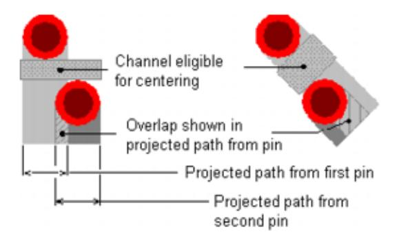
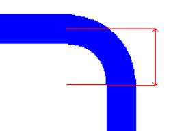
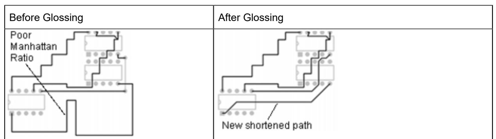
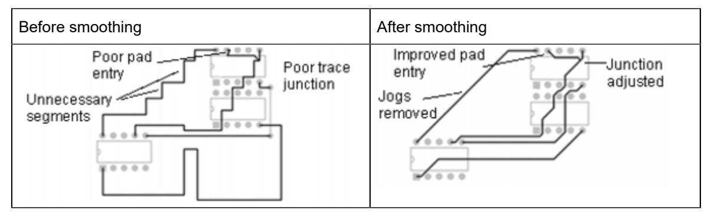
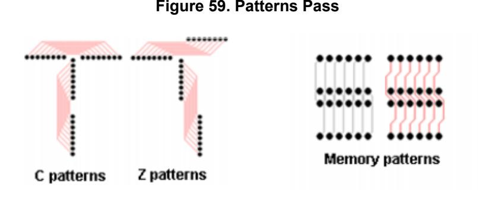

# **Chapter 17 Autorouting**

Setting up a strategy of pass types and routing order ensures the best results when performing batch autorouting.

[Creating a Prerouting Analysis Report](#page-0-0) [Autorouting Strategy](#page-0-1) [Autorouting](#page-2-0) Pass Types [Setting Up the Autorouting Strategy](#page-10-0) [Specifying the Passes to Route](#page-11-0) [Setting the Routing Order](#page-12-0) [Autorouting a Design](#page-13-0) [Pausing Autorouting](#page-13-1) [Resuming Autorouting](#page-14-0) [Stopping Autorouting](#page-14-1) [Routing Progress Indicator](#page-14-2) [Reporting Routing Results](#page-14-3) Assigning Test Points During [Autorouting](#page-15-0) [Autorouting Messages](#page-16-0)

# <span id="page-0-0"></span>**Creating a Prerouting Analysis Report**

The Prerouting Analysis report provides information about design properties that may impede autorouting, such as grid settings, nets that have a disabled routing status, or pin pairs that have a shove-protected status.

#### **Procedure**

- 1. Click the **Tools > Pre-routing Analysis** menu item.
- 2. After the prerouting analysis finishes, review any errors or warnings that are sent to the **Status** tab of the Output window.

#### **Related Topics**

Reporting Design Information

# <span id="page-0-1"></span>**Autorouting Strategy**

The autorouting strategy is a set of options that define how a board should be autorouted. A strategy contains several passes. You can autoroute the entire design using a strategy, or you can select components and route them one by one using a pass type.


**Note:** This section discusses autorouting the entire design and the pass types in the strategy. For more information on routing components one at a time, see Autorouting by Selection.

The autorouting strategy defines the sequential operations to perform during autorouting, including:

- Passes that the autorouter should run
- Pass types to run during autorouting
- Trace protection
- Pausing at the end of each pass
- Intensity of autorouting
- Order in which to autoroute components, nets, net classes, differential pairs, and matched length groups

You cannot save autorouting strategies. Set the strategy for each file you want to autoroute.

For more information, see "["Specifying the Passes to Route"on page 274](#page-11-0)" and [""Setting the Routing](#page-12-0)  [Order"on page 275](#page-12-0)."

# <span id="page-2-0"></span>**Autorouting Pass Types**

The strategy for autorouting contains several pass types. Each pass completes a specific task; it may also perform a number of subpasses.

- **Prerouting Passes**  Use these passes only when necessary because they can hinder routing completion. The default strategy starts with the Route pass and skips these prerouting passes.
	- **Fanout pass**  Only for complicated or dense components, like BGAs. If you use the Fanout pass for the entire design, the resulting fanouts occupy too much space on the board. As a result, routing becomes more difficult, more vias are placed, more time is needed to route, and completion rates drop.
	- **Patterns pass**  Only for boards with extremely regular connections. You can also use this pass to create several versions of the design, for comparison.
- **Postrouting Passes**  Center, Optimize, Miters, Test Point, and Tune are postrouting passes. The Intensity setting in the **Strategy** tab significantly affects these passes. For more information, refer to [""Autorouting Strategy"on page 263](#page-0-1)."
- [Center Pass](#page-2-1) [Fanout Pass](#page-3-0) [Miters Pass](#page-5-0) [Optimize pass](#page-6-0) [Patterns Pass](#page-8-0) [Route Pass](#page-8-1) [Tune](#page-9-0) Pass

# <span id="page-2-1"></span>**Center Pass**

The center pass automatically places traces equidistant from the pads of adjacent component pins or vias to evenly distribute any available space in the channel. Centering does not violate design rules.

SailWind Router maintains differential pairs during centering. The shoulder portions of the differential pair, in the start and end zones, center as normal trace segments. The segments in the controlled gap portion center as one wide trace. Differential pairs that are split around obstacles do not center.

A channel is eligible for centering if a projected path from the pins or vias overlaps.

#### **Figure 56. Channels Eligible for Centering**



To limit the number of channels to center, set a maximum channel width. Any channel larger than this width is not eligible for centering. Set the Maximum channel width on the **Routing** tab of the Options dialog box.

The following are restrictions for the center pass:

- The Center pass only centers traces that are parallel to the channel orientation.
- The software centers traces by "stretching" the segments that are perpendicular to the channel. Trace centering does not take place if no perpendicular traces are available or if they do not have enough space to stretch.
- The Center pass does not add corners to achieve centering.
- The Center pass can only adjust traces that pass through a channel. It cannot adjust a nearby trace to accommodate centering.
- The Center pass does not adjust any angle trace segments.
- The Center pass does not maintain length rules or accordions. The Center pass adjusts trace segments that are part of accordions as regular trace segments; it does not preserve the accordion. However, it does not perform centering if it results in new errors.

For more information, refer to the Centering value in the ""Options Dialog Box, Routing Category, General Subcategory"on page 450" and "["Autorouting Strategy"on page 263.](#page-0-1)"

### <span id="page-3-0"></span>**Fanout Pass**

By performing the fanout pass, you shorten overall autorouting times and increase completion rates because this pass creates access to pins early in the process.

This pass places vias for inaccessible SMD component pins and routes from the vias to the pins. This pass locates all SMD pins in the design and routes a short trace, terminated with a via, from each pin. Set options for the fanout pass on the "Properties Dialog Box, Fanout Tab" on page 486.

**Tip**

Protect any fanouts you create to prevent post-fanout routing or editing operations from shoving or rerouting the fanout traces. These post-fanout operations ignore Fanout length settings in the **Fanout** tab of the Properties dialog box.

The fanout pass includes two processes: preplaced fanouts and free fanouts.

### **Preplaced Fanouts**

This process tries to place vias that obey the current minimum spacing rules and the via spacing you set. If the via placement violates a rule, SailWind Router does not place the via and does not create a fanout for the pin. After successfully placing vias, SailWind Router routes the fanout.

You can specify whether vias are placed on a fixed grid or spaced to accommodate one trace or two traces running between them. Set the spacing using the Via Spacing options in the **Fanout** tab of the Properties dialog box.

You can also specify whether pins and vias are shared to complete the fanout. You can fanout a number of pins by interconnecting them to a single, common via. Set this sharing feature through the Sharing options in the **Fanout** tab (of the Properties dialog box).

You can also customize the fanout pattern for vias to help avoid obstructions or unusable board areas. Set patterns in the Alignment list and Direction list in the **Fanout** tab.


#### **Figure 57. Customizing the Fanout Pattern**

### **Free Fanouts**

The free fanouts process completes fanouts that failed the prerouted fanouts process by searching for a path, using push and shove, and using "rip up" and "retry" features to make room for the fanout, as shown in the following figure. The free fanouts process ignores pattern settings to complete the fanout.

#### **Figure 58. Free Fanouts Process**


### <span id="page-5-0"></span>**Miters Pass**

The miters pass converts all route corners of a specified angle to diagonal corners. You can set Miter options on the **Routing** tab of the Options dialog box. Depending on the settings in the **Routing** tab, you can convert a corner of any degree corner to a miter.

SailWind Router adds miters to trace corners only when space permits. If a miter creates spacing or first corner rule violations, the software skips the corner and does not add a miter.

If you choose to use arcs for miters, the software creates a miter using the following calculation: <trace width> / 2 X ratio



Small segments and clearance violations provide two reasons to use arcs as miters.

If a trace has small segments, and it is impossible to create miters that are large enough, SailWind Router creates an arc for the three segments:


If it is impossible to create an arc of the required size because of a clearance violation, the software does not perform any pushing and plowing or trace adjustment. It creates a smaller arc instead:


### **Miters and Length Tuning**

Tune operations assume traces are smoothed before you add accordions. If tuning is performed before the miter pass, the addition of miters changes the length of traces, potentially creating length violations. SailWind Router tries to add/remove length differences on the first parallel segments of modified traces or other traces belonging to the same net if it is required.

For differential pairs, miters can cause different violations on traces. In this case SailWind Router tries to adjust length of the controlled gap portion common for the both traces, as well as shoulders for each trace separately.

### <span id="page-6-0"></span>**Optimize pass**

The optimize pass analyzes each trace and tries to improve the quality of the route pattern by removing extra segments, reducing via usage, and shortening trace lengths. The optimize pass includes these processes: via minimize, glossing, and smoothing.

### **Via Minimize**

The via minimize process reduces via usage in the design by ripping up existing traces and finding a new path that uses fewer vias, as shown in the following figure.


#### **Table 62. Via Minimize Process**

### **Glossing**

The glossing process reduces the Manhattan Ratio for traces, as shown in the following figure.

#### **Table 63. Glossing Process**



### **Smoothing**

Smoothing removes unnecessary corners and segments in traces while maintaining the same path. Smoothing can also reduce length, which not only frees up room on the board for additional traces, but also helps meet and maintain pad entry and first corner rules.

The smoothing process does the following:

- Reduces the Manhattan ratio.
- Improves pad entryand trace junctions.
- Optimizestrace patterns without changing their topology.
- Eliminates same net trace crossings that push-and-shove processes can leave.
- Eliminates same net trace-to-corner violations by connecting the trace directly to the pin.
- Eliminates same net trace-to-trace violations.

**Tip** Smoothing does not maintain length rules on length-controlled traces.



#### **Table 64. Smoothing Process**

For more information, refer to ""Interactive Routing Setup"on page 291" and ""Trace Smoothing" on page 351."

### <span id="page-8-0"></span>**Patterns Pass**

The patterns pass searches for groups of unrouted connections that it can complete using typical C routing patterns, Z routing patterns, and memory patterns. The patterns pass then routes them.



During the patterns pass, a bounding box surrounds the group of unroutes to pattern route. If enough space exists to create traces and obey clearance rules, SailWind Router creates the pattern. If obstacles appear within the bounding box or if the pattern violates rules, the pattern fails.

#### **Figure 60. Bounding Box During a Patterns Pass**


For C patterns, the pins that form the C pattern must align along the X-axis or Y-axis or the pattern fails.

#### **Figure 61. C Patterns During a Patterns Pass**


### <span id="page-8-1"></span>**Route Pass**

The route pass is the core pass, which performs the majority of autorouting. During this pass, SailWind Router tries to sequentially route each unroute until it has tried all connections. The route pass contains many processes -- serial, rip up and retry, push and shove, and touch and cross.

The following table displays the Route pass processes.

| Process          | Action                                                                                                                                                                                                                             |
|------------------|------------------------------------------------------------------------------------------------------------------------------------------------------------------------------------------------------------------------------------|
| Serial           | Converts unroutes to traces by finding the shortest path around the<br>obstacles between the end points of the unroute. No obstacles can exist in<br>the path.<br>If a path is not found, SailWind Router skips the unroute.       |
| Rip Up and Retry | Increases completion rates by unrouting existing traces and finding new<br>paths to create space for other traces.<br>If SailWind Router cannot find a a new path, it cancels the process and                                      |
|                  | returns the trace to its original state.                                                                                                                                                                                           |
| Push and Shove   | Pushes traces aside to create room for new traces. The software performs<br>this process together with the rip up and retry process.                                                                                               |
| Touch and Cross  | Eliminates touch and cross violations that are created by other autorouting<br>operations that create or modify existing traces or patterns.                                                                                       |
|                  | For example, the push and shove process may force a trace to "hop" over<br>a pin, creating a cross violation for the trace exiting the pin. This process<br>successively attempts to reroute the trace to eliminate the violation. |
|                  | If the software cannot resolves a violation, it cancels the operation and<br>returns the trace to its original state.                                                                                                              |

#### **Table 65. Route Pass Processes**


**Tip** SailWind Router performs this process with all other passes and processes. It will not complete a trace with a violation. It either removes all violations or it cancels trace routing.

## <span id="page-9-0"></span>**Tune Pass**

The tune pass adjusts the length of length-controlled traces. The pass only examines trace lengths for completely routed nets, electrical nets, pin pairs, or differential pairs and analyzes the current length if you have enabled length rules and length control.

The tune pass makes adjustments based on the following conditions:

- If the cumulative length of the adjacent trace segments is within the range of minimum and maximum trace length, the tune pass skips the trace and does not adjust it.
- If the trace is longer than the maximum trace length, the tune pass rips it up and places it in a queue for routing.
- If the trace length is less than the minimum trace length, the tune pass changes the length by adding accordion patterns.
- If only one member of a differential pair meets the matched length group rule, the pair is considered mismatched and the tune pass adjusts the noncompliant member of the pair.

• If the length delta between members of a differential pair is greater than 300 mils, the tune pass skips the pair, leaving it in its previous state (either unrouted or untuned).

### **Tip**

When tuning a differential pair, SailWind Router adds small accordions in the Shoulder area of the shorter trace, without plowing or shoving obstacles. If the Shoulder areas cannot accommodate the small accordion, SailWind Router adds the accordion in the Controlled gap area, as close as possible to the Shoulder area.


### **Maximum Hierarchy Level**

Length adjustments are created in stages. The first stage is a regular horizontal or vertical accordion. If this is still not enough length, the accordion direction is turned 90 degrees and an additional accordion is created. SailWind Router will continue adding the accordions at 90 degrees until the length adjustment is met, or until the maximum hierarchy level is met.

| Regular Accordion | Accordion with 90 degree<br>accordion added | Accordion with a Maximum<br>Hierarchy Level of 3 |
|-------------------|---------------------------------------------|--------------------------------------------------|

<span id="page-10-0"></span>By default, Maximum Hierarchy Level values are set to 8 in designs created before PADS Router 9.0.

# **Setting Up the Autorouting Strategy**

SailWind Router offers extreme flexibility in setting up an autorouting strategy. You can choose from a series of specific routing pass types to accomplish your desired autorouting tasks. You can also systematically set up your routing strategy to specify the order in which SailWind Router routes specific design objects.

For example, you could set up a strategy to perform the following:

- Fanout specific high pin count components and protect the routes
- Fanout the rest of the components
- Route critical signals such as clocks
- Route the power nets
- Route all of the nets associated with a specific component
- Route the data bus on specific layers for return path control
- Route the address bus on specific layers for net distribution control
- Route the differential pairs nets on specific layers for impedance control
- Route the balance of miscellaneous nets on specific layers

You have complete control over the routing order, the routing pass intensity, and the ability to start, stop, pause, and inspect your routing results at any point in the process.

# <span id="page-11-0"></span>**Specifying the Passes to Route**

Use the **Routing** category > **Strategy** subcategory to specify which passes to run, the routing intensity to use, whether or not to protect the generated traces, and whether to pause after a pass completes.

### **Procedure**

- 1. Click the **Tools > Options** menu item; then, in the Options dialog box, click the **Routing** category > **Strategy** subcategory.
- 2. In the Pass column, select each pass type you want to run. You can run any combination of passes.
- 3. Select the "Protect" check box (In the Protect column of the table in the "Pass definition" area) if you want SailWind Router to protect any generated traces after performing the selected pass. For example, select the Protect check box for the Center pass type if you want SailWind Router to protect trace changes generated during the Center pass. (This protects traces and glues vias that are completed during the corresponding pass type.)
- 4. In the Pause column, select the pass check box if you want SailWind Router to pause routing after completing the corresponding pass.
- 5. In the Intensity column, select the appropriate intensity.

*Intensity* determines the effort and time the router can spend on a pass. You cannot set an intensity for the Center pass.

6. Set the [routing orderon page 275](#page-12-0).

- 7. Click **OK**.
- 8. After defining your strategy, click the **Start Autorouting** button on the Routing toolbar to autoroute the design.

#### **Results**

If the Options dialog box is open, a check mark appears in the Done column for each pass that completes. The check marks remain in the **Routing** category > **Strategy** subcategory until you modify the autorouting strategy, or restart autorouting. This is a read-only column; you cannot manually mark a pass as complete.

The strategy is saved by default in the *\SailWind Projects* folder.

### **Related Topics**

[Setting the Routing Order](#page-12-0)

[Autorouting a Design](#page-13-0)

[Autorouting](#page-2-0) Pass Types

# <span id="page-12-0"></span>**Setting the Routing Order**

Use the Routing order list to specify the order in which to autoroute components, nets, net classes, differential pairs, and matched length groups for the selected pass.

### **Restrictions and Limitations**

Certain object types within the Routing order definition pane are not valid for routing order operations. The **Selected** button is available only when components, nets, net classes, differential pairs, and matched length groups are selected either in the object view pane, in the design itself, or in the Routing order definition pane.

### **Procedure**

- 1. Click the **Tools > Options** menu item; then, in the Options dialog box, click the **Routing** category > **Strategy** subcategory.
- 2. In the Pass Type column (of the "Pass definition" table), click the pass type for which you want to set the routing order. The default routing order appears in the Routing Order box below the table.
- 3. To add items to the routing order, do any of the following:
	- To add all nets associated with plane layers, click **Plane Nets**.
	- To add all nets, click **All Nets**.
	- To add individual nets, select the component or nets to add in the left pane (Routing order definition), and then click **Selected**.
	- To remove all items from the Routing Order list, click **Clear**.

You can also add nets attached to components to the routing order, using the following:

- **Object View tab of the Project Explorer** You add nets from the **Object View** tab in exactly the same way as you add them using the Routing order definition list.
- **The work area** Make sure you make nets available for selection on the Selection Filter toolbar.
- 4. Use the Routing Order pane buttons to delete and move items.
- 5. Click **OK**.

#### **Results**

The routing strategy is saved in the *\SailWind Projects* folder. When you autoroute the design, these settings are used. If the dialog box is open, a check mark appears in the Done column upon completion of each pass.

#### **Related Topics**

[Autorouting Strategy](#page-0-1)

[Autorouting a Design](#page-13-0)

## <span id="page-13-0"></span>**Autorouting a Design**

The Autoroute command starts the autorouter and begins performing the routing algorithms and passes you specify in the Options dialog box > **Routing** category > **Strategy** subcategory.

#### **Restrictions and Limitations**

- You cannot autoroute a design that has no board outline or has a board outline that is not a closed shape. Attempting to do so results in a "Cannot route design with open board outline" error message. Use SailWind Layout to create the board outline.
- If you choose to autoroute a design before you [set a strategyon page 263,](#page-0-1) a message appears prompting you to set a strategy.
- When you Autoroute a selected object, the All Nets setting in the routing order (set in the Options dialog box > **Routing** category > **Strategy** subcategory) is ignored.

### **Procedure**

On the Routing toolbar, click the **Start Autorouting** button or click the **Tools > Autoroute > Start** menu item. When you start autorouting or running pass types on selection, the program performs a prerouting analysis and reports any errors or warnings to the **Status** tab of the Output window. If you want to correct any of the reported issues, you must first stop autorouting.

# <span id="page-13-1"></span>**Pausing Autorouting**

Use Pause to pause autorouting between passes to check—for example—on statistics and completion rates before continuing or canceling the autoroute. The Pause feature stops routing at the end of

the current subpass. SailWind Router stores the pass and point within the pass so you can resume autorouting from the point where you paused.

### **Procedure**

- 1. On the standard toolbar, click the **Routing toolbar** button.
- 2. Click the **Pause** button.

# <span id="page-14-0"></span>**Resuming Autorouting**

Use Resume to start autorouting after pausing. Routing begins at the subpass where you paused. Use Stop to end autorouting.

#### **Procedure**

- 1. On the standard toolbar, click the **Routing** button.
- 2. Click the **Resume** button.

# <span id="page-14-1"></span>**Stopping Autorouting**

Use **Stop** to end autorouting at any time. The **Stop** button ends routing at the end of the current connection. SailWind Router then clears all of the Done check boxes in the Options dialog box > **Routing**  category > **Strategy** subcategory.

You cannot resume autorouting when you choose **Stop**. You can only start autorouting from the beginning of the strategy.

### **Procedure**

- 1. On the standard toolbar, click the **Routing** button.
- 2. Click the **Stop** button.

# <span id="page-14-2"></span>**Routing Progress Indicator**

The status bar contains a routing progress indicator with a ToolTip that displays the completion rate of each pass and subpass the router performs. This helps you assess the effectiveness of the strategy and the settings you selected for routing.

# <span id="page-14-3"></span>**Reporting Routing Results**

When you autoroute your design by running a pass type or by starting an autorouting command, SailWind Router reports two types of messages: prerouting analysis messages and routing status messages. These messages appear in a routing report that lists prerouting messages, the name of the design, the number of passes, the pass types performed, and other statistics for each pass.

The routing report, *RoutingReport.txt*, is located in the *\SailWind Projects* folder. A link to this file is automatically created in the **Status** tab of the Output window. You can open and view the file by clicking the link on the **Status** tab.

#### **Related Topics**

[Autorouting Strategy](#page-0-1)

[Autorouting Messages](#page-16-0)

# <span id="page-15-0"></span>**Assigning Test Points During Autorouting**

You can create an accessible net during autorouting. This process enables test point placement during the autorouting "Route" pass. As it adds traces, the autorouter attempts to also add test points for each net using vias or component pins along the net. The via or pin acts as the test point for the net whenever someone inserts the PCB into the Automatic Test Equipment (ATE). Adding test points during autorouting sacrifices completion rates for accessibility.

#### **Procedure**

- 1. Click the **Tools > Options** menu item; then in the Options dialog box, click the Test Points category.
- 2. Select the "Create test points during autorouting" check box. Set other testability options as needed. For more information, see "Options Dialog Box, Test Points Category" on page 459.
- 3. Click **OK**.
- 4. On the Routing toolbar, click the **Start** button. When you autoroute the design, SailWind Router uses the test point settings.


**Tip** During test point placement, SailWind Router respects test point keepouts set in SailWind Layout.

#### **Related Topics**

Test Points Pass

Properties Dialog Box, Test Points Tab

# <span id="page-16-0"></span>**Autorouting Messages**

When you autoroute your design (by either using an autorouting command or running a pass type), SailWind Router reports two types of messages: prerouting analysis and routing status.

When autorouting completes, or when you stop autorouting, SailWind Router creates a routing report that details the results of the autoroute. For more information, see [Routing Report](#page-21-0).

[Prerouting Analysis](#page-16-1) [Routing Status](#page-17-0) [Routing Done](#page-20-0) Routing [Progress](#page-20-1) Indicator ToolTip [Routing Report](#page-21-0)

# <span id="page-16-1"></span>**Prerouting Analysis**

When you start autorouting, SailWind Router analyzes the design for problematic conditions that may affect or cancel routing. Related messages appear in the **Status** tab of the Output window. These messages appear in the Routing Report only if the entire design is routed. To correct any of the reported issues, you must first stop routing.

### **Selection Dependency**

As shown in the following table, the type of prerouting analysis depends on the current selection.

| Selection | Analysis Scope                        | Analysis Content                   |
|-----------|---------------------------------------|------------------------------------|
| Nothing   | Whole design                          | All                                |
| Net       | Net                                   | Thermal status                     |
|           |                                       | Potential plane nets               |
|           |                                       | No routing settings                |
|           |                                       | Via settings                       |
|           |                                       | Vias to planes                     |
| Pin Pair  | Pin pair                              | Thermal status                     |
|           |                                       | No routing settings                |
| Unroute   | Unroute with adjacent pins and vias   | Thermal status                     |
|           |                                       | No routing settings for owning net |
| Component | Pin pairs connected to component pins | Thermal status                     |
|           |                                       | No routing settings                |
| Pin       | Pin pairs connected to the pin        | Thermal status                     |
|           |                                       | No routing settings                |

#### **Table 66. Selection Dependency**

### <span id="page-17-0"></span>**Routing Status**

When you start autorouting, the current routing status appears. These messages appear on the status bar and in the **Status** tab of the Output window. Routing status messages appear in the session log under the heading "Batch Router Statistics." Routing status messages update with each pass and subpass of the router.

For more information on the session log, see "Status Tab" on page 57.

### **Center Pass Messages**

The following is a center pass message, whose parts are explained in the following table.

Centering gate 264/1738 (HorDir, layer6)

# **Part of Message Description** gate Current gate being processed Dir Direction of the current gate (Hor, Vert, or 135)

#### **Table 67. Parts of a Center Pass Message**

### **Fanout Pass Messages**

layer Layer of the current gate

The following is a fanout pass message, whose parts are explained in the following table.

```
Pins 162 of 198 (82%) Duration 00:00:31 (+00:00:20)
```
#### **Table 68. Parts of a Fanout Pass Message**

| Part of Message | Description                                                                                                                                  |
|-----------------|----------------------------------------------------------------------------------------------------------------------------------------------|
| Pins            | Number of pins fanned out, followed by the total number of pins selected for fanout,<br>and the fanout completion percentage in parentheses. |
| Duration        | Amount of time the router spent on this pass, followed by the total time spent<br>routing in parentheses.                                    |

**Tip** SailWind Router reports individually the status of fanned out pins belonging to the same island. For example, if three pins belong to the same island (connected with each other by traces), SailWind Router fans out all three pins with one shared via during the fanout pass. In this case the message displays three pins fanned out (Pins 3 of 3 (100%) Vias 1 Duration 00:00:01 (+00:00:01)).

### **Patterns Pass Messages**

The following is a patterns pass message, whose parts are explained in the following table.

Routed 15 Total 65 of 650 (10%) Vias 181 Duration 00:01:31 (+00:01:00)

|  |  |  |  |  | Table 69. Parts of a Patterns Pass Message |
|--|--|--|--|--|--------------------------------------------|
|--|--|--|--|--|--------------------------------------------|

| Part of<br>Message | Description                                                                                                                                                                           |
|--------------------|---------------------------------------------------------------------------------------------------------------------------------------------------------------------------------------|
| Routed             | Number of connections routed in this pass, followed by the total number of routed<br>and unrouted connections in the design, and the pattern completion percentage in<br>parentheses. |
| Vias               | Number of vias added during this pass.                                                                                                                                                |
| Duration           | Amount of time the router spent on this pass, followed by the total time spent routing<br>in parentheses.                                                                             |

### **Route Pass Messages**

The following is a route pass message, whose parts are explained in the following table.

Routed 635 Total 650 of 650 (100%) Vias 481 Duration 00:06:41 (+00:05:10)

| Part of<br>Message | Description                                                                                                                                                                         |
|--------------------|-------------------------------------------------------------------------------------------------------------------------------------------------------------------------------------|
| Routed             | Number of connections routed in this pass, followed by the total number of routed<br>connections in the design, and the routed connections completion percentage in<br>parentheses. |
| Vias               | Total number of vias added during this pass.                                                                                                                                        |
| Duration           | Amount of time the router spent on this pass, followed by the total time spent routing<br>in parentheses.                                                                           |

### **Optimize Pass Messages**

The following shows an optimize pass message, whose parts are explained in the following table.

```
Optimized 5% Vias 451 (-30) Trace length 66 (-5) inches Duration 00:07:41 
(+00:01:00)
```

|  |  |  | Table 71. Parts of an Optimize Parts Message |  |  |
|--|--|--|----------------------------------------------|--|--|
|--|--|--|----------------------------------------------|--|--|

| Part of Message | Description                         |
|-----------------|-------------------------------------|
| Optimized       | Optimization completion percentage. |

| Part of Message | Description                                                                                                                   |
|-----------------|-------------------------------------------------------------------------------------------------------------------------------|
| Vias            | Total number of vias in the design, followed by the number of vias reduced by<br>optimization in parentheses.                 |
| Trace Length    | Total length of traces routed in this pass, followed by the total length of traces<br>reduced by optimization in parentheses. |
| Duration        | Amount of time the router spent on this pass, followed by the total time spent<br>routing in parentheses.                     |

**Table 71. Parts of an Optimize Parts Message(continued)**


**Tip** Inches are used for Mils and Inches settings. Meters are used for Microns and Metric settings.

#### **Miters Pass Messages**

The following shows a miters pass message, whose parts are explained in the following table.

Trace 15 of 172 Miters 20 Duration 00:08:52 (+00:01:11)

**Table 72. Parts of a Miters Pass Message**

| Part of Message | Description                                                                                               |
|-----------------|-----------------------------------------------------------------------------------------------------------|
| Trace           | Total number of traces processed, followed by the total number of traces selected<br>for mitering.        |
| Miters          | Total number of miters added in this pass.                                                                |
| Duration        | Amount of time the router spent on this pass, followed by the total time spent<br>routing in parentheses. |

#### **Test Point Pass Messages**

The following shows a test point pass message, whose parts are explained in the following table.

Accessible nets 46 of 100 (46%) Duration 00:09:52 (+00:01:00)

#### **Table 73. Parts of a Points Pass Message**

| Part of Message | Description                                                                                                                                                                       |
|-----------------|-----------------------------------------------------------------------------------------------------------------------------------------------------------------------------------|
| Accessible Nets | Number of nets made accessible in this pass, followed by the total number of<br>nets with test point requirements in the design, and the test point completion<br>in parentheses. |
| Duration        | Amount of time the router spent on this pass, followed by the total time spent<br>routing in parentheses.                                                                         |

### **Tune Pass Messages**

The following shows a tune pass message, whose parts are explained in the following table.

Nets tuned 25 of 32 Pinpairs tuned 78 of 500 Duration 00:04:33 (+00:03:59)

| Part of Message | Description                                                                                                          |
|-----------------|----------------------------------------------------------------------------------------------------------------------|
| Nets tuned      | The number of nets tuned in this pass, followed by the total number of nets<br>with length restrictions.             |
| Pinpairs tuned  | The number of pin pairs tuned in this pass, followed by the total number of pin<br>pairs with length restrictions.   |
| Duration        | Total time the router spent routing, followed by the amount of time the router<br>spent on this pass in parentheses. |

**Table 74. Parts of a Tune Pass Message**

## <span id="page-20-0"></span>**Routing Done**

SailWind Router displays a message in the status bar after finishing all passes.

The following message appears in the status bar after all passes finish:

Done> Unroutes 0 Routed 164 of 164 (100%) Vias 100 Duration 00:09:52

The following table explains the parts of the message:

| Part of Message | Description                                                                                                                                                     |
|-----------------|-----------------------------------------------------------------------------------------------------------------------------------------------------------------|
| Unroutes        | Total number of unroutes in the design.                                                                                                                         |
| Routed          | Total number of routed links, followed by the total number of routed and unrouted<br>links in the design, and the routing completion percentage in parentheses. |
| Vias            | Total number of vias in the design.                                                                                                                             |
| Duration        | Amount of time the router spent on the pass, followed by the total time spent<br>routing in parentheses.                                                        |

**Table 75. Parts of the Routing Done Message**

# <span id="page-20-1"></span>**Routing Progress Indicator ToolTip**

The status bar also provides a progress indicator ToolTip that displays the completion rate of each pass and subpass the autorouter performs. Place the pointer over the status bar during autorouting to view the progress indicator ToolTip. This ToolTip helps determine the effectiveness of the strategy and your routing settings.

The following is an example of the ToolTip message that appears when you place the pointer over the status bar. A ToolTip message can have the parts shown in [Table](#page-21-1) [76](#page-21-1).

Subpass 1 of 12 Attempting 15 of 100 Complete 10 (U1.1-Via)

<span id="page-21-1"></span>

| Part of Message | Description                                                                                                                        |
|-----------------|------------------------------------------------------------------------------------------------------------------------------------|
| Subpass         | Subpass, followed by the total number of subpasses in the current pass.                                                            |
| Attempting      | Number of connections attempted in the current subpass, followed by the<br>number of connections selected for the current subpass. |
| Complete        | Number of successful attempts in the current subpass, followed by the current<br>connection in parentheses.                        |

#### **Table 76. Parts of the Tooltip Message**

### <span id="page-21-0"></span>**Routing Report**

A routing report is automatically created when autorouting completes or when you stop autorouting. It lists the name of the design being routed, the number of passes, the pass types performed, and other statistics for each pass. The routing report, *RoutingReport.txt*, is located in *\SailWind Projects*. A link to this file appears automatically in the **Status** tab of the Output window. You can open and view the file by clicking the link tab.


#### **Tip**

The prerouting analysis messages also appear in this report, but only if routing finishes. If you stop autorouting, the prerouting analysis messages do not appear in the report.

For more detailed information, see The Routing Report.