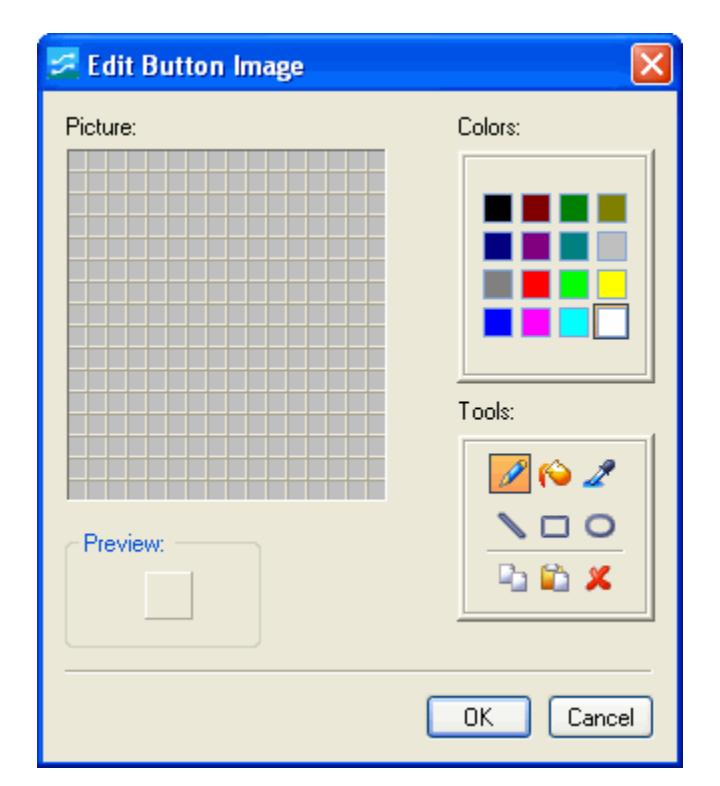
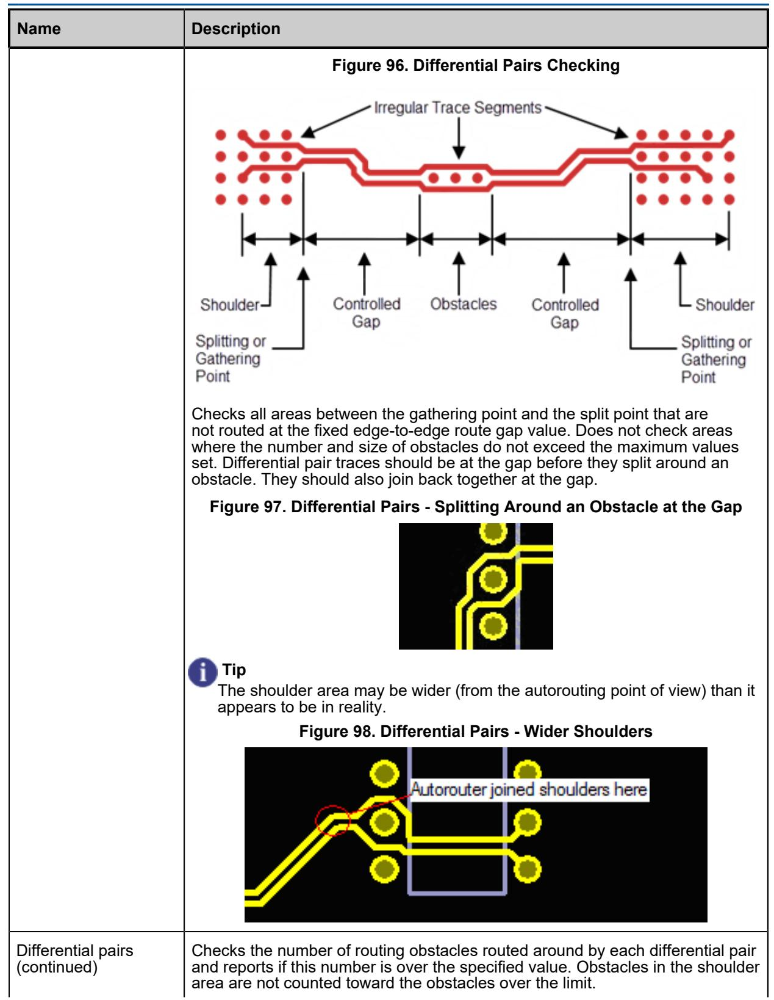
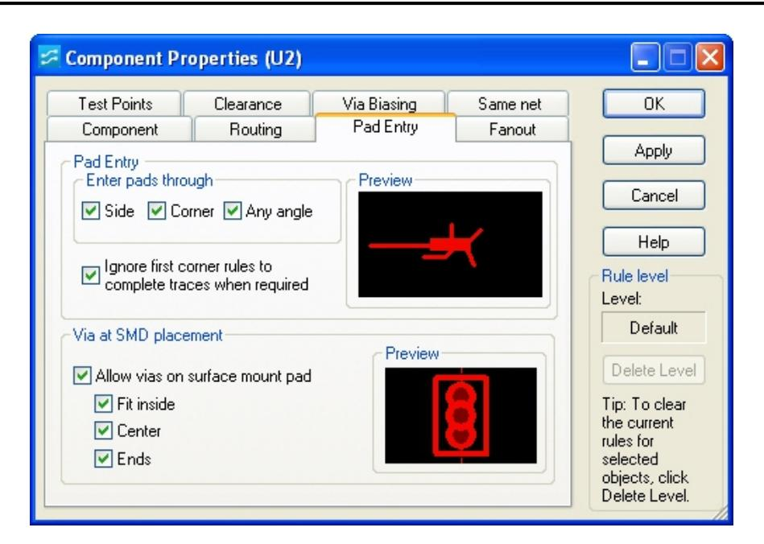
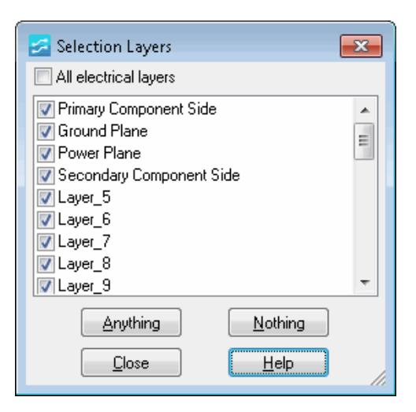

# **Chapter 24 SailWind Router GUI Reference**

The various dialog boxes throughout SailWind Router provide access to tools and settings. Each dialog box provides a Help icon for accessing additional information.

[Add/Edit Command Dialog Box](#page-3-0) [Archiver Dialog Box](#page-4-0) [Archiver Additional Files Dialog Box](#page-6-0) [Archiver Libraries Dialog Box](#page-7-0) [Assign Shortcut Dialog Box](#page-8-0) [Check for Updates Dialog Box](#page-9-0) [Component](#page-10-0) Properties Dialog Box, Electrical Nets Tab Customize Dialog Box, [Commands](#page-12-0) Tab [Customize](#page-13-0) Dialog Box, Keyboard and Mouse Tab [Customize](#page-15-0) Dialog Box, Macro Files Tab [Customize](#page-16-0) Dialog Box, Options Tab [Customize](#page-18-0) Dialog Box, Toolbars and Menus Tab [Design Rule Checking Dialog Box](#page-20-0) [Edit Button Image Dialog Box](#page-22-0) [Edit Filter Dialog Box](#page-23-0) [Electrical Nets Dialog Box](#page-24-0) Electrical Net [Properties](#page-26-0) Dialog Box, Electrical Net Tab Electrical Net [Properties](#page-28-0) Dialog Box, Length Tab [Error Detected Dialog Box](#page-29-0) [Find Dialog Box](#page-30-0) [Find Dialog Box, Spreadsheet Window](#page-32-0) [Installed](#page-33-0) Options Dialog Box, License File Tab Net [Properties](#page-35-0) Dialog Box, Electrical Net Tab [Options Dialog Box, Colors Category](#page-37-0) Options Dialog Box, Design [Verification](#page-40-0) Category [Options Dialog Box, Display Category](#page-46-0) [Options Dialog Box, Fabrication Category](#page-48-0) Options Dialog Box, Global Category, Backups [Subcategory](#page-51-0) Options Dialog Box, Global Category, File Locations [Subcategory](#page-54-0) Options Dialog Box, Global Category, General [Subcategory](#page-56-0) [Options Dialog Box, Placement Category](#page-60-0) [Options Dialog Box, Flooding Category](#page-62-0) Options Dialog Box, Routing Category, General [Subcategory](#page-65-0) Options Dialog Box, Routing Category, Strategy [Subcategory](#page-71-0) Options Dialog Box, Test Points [Category](#page-74-0) Options Dialog Box, Text and Lines [Category](#page-77-0) Options Dialog Box, Routing Category, Tune [Subcategory](#page-79-0)

[SailWind Suite Configuration Dialog Box](#page-81-0) Properties Dialog Box, [Clearance](#page-83-0) Tab Properties Dialog Box, [Component](#page-84-0) Tab [Properties Dialog Box, Copper](#page-86-0) [Properties](#page-87-0) Dialog Box, Copper Cut Out Tab [Properties Dialog Box, Copper Cut Out Corner](#page-88-0) [Properties Dialog Box, Copper Cut Out Segment](#page-89-0) [Properties](#page-90-0) Dialog Box, Copper Plane Tab [Properties Dialog Box, Copper/Copper Plane Corner](#page-92-0) [Properties Dialog Box, Copper/Copper Plane Segment](#page-93-0) [Properties](#page-94-0) Dialog Box, Corner Tab [Properties](#page-95-0) Dialog Box, Drill Tab (Pin) [Properties](#page-97-0) Dialog Box, Drill Tab (Via) [Properties](#page-99-0) Dialog Box, Drill Tab (Virtual Pin) [Properties](#page-101-0) Dialog Box, Fanout Tab [Properties Dialog Box, Flooding tab](#page-104-0) [Properties](#page-106-0) Dialog Box, Grid Tab [Properties](#page-108-0) Dialog Box, Group Tab [Properties](#page-110-0) Dialog Box, Keepout Tab [Properties Dialog Box, Keepout Segment](#page-111-0) [Properties](#page-112-0) Dialog Box, Layer Biasing Tab [Properties](#page-114-0) Dialog Box, Layers Tab [Properties](#page-116-0) Dialog Box, Length Tab [Properties](#page-117-0) Dialog Box, Net Tab Properties Dialog Box, No [Properties](#page-118-0) Tab [Properties](#page-119-0) Dialog Box, Pad Entry Tab [Properties](#page-121-0) Dialog Box, Pad Stack Tab (Pins) [Properties](#page-123-0) Dialog Box, Pad Stack Tab (Vias) [Properties](#page-124-0) Dialog Box, Pad Stack Tab (Virtual Pins) [Differential](#page-126-0) Pair Properties Dialog Box, Pair Tab [Properties](#page-128-0) Dialog Box, Pin Tab [Properties](#page-130-0) Dialog Box, Pin Pair Tab [Properties](#page-132-0) Dialog Box, Routing Tab [Properties](#page-134-0) Dialog Box, Same Net Tab [Properties](#page-136-0) Dialog Box, Test Points Tab [Properties](#page-137-0) Dialog Box, Test Points Tab (Nets) Properties Dialog Box, Test Points Tab [\(Component](#page-138-0) or Via Type) [Properties](#page-139-0) Dialog Box, Topology Tab [Properties](#page-141-0) Dialog Box, Trace Tab [Properties](#page-143-0) Dialog Box, Trace Segment Tab [Properties](#page-145-0) Dialog Box, Via Tab [Properties](#page-147-0) Dialog Box, Via Biasing Tab [Properties](#page-149-0) Dialog Box, Virtual Pin Tab [Selection Layers Dialog Box](#page-151-0)

[Shortcut Dialog Box](#page-152-0) View Nets [Dialog](#page-153-0) Box

# **Add/Edit Command Dialog Box**

To access: Click **Tools > Customize** (menu item) > **Commands** tab > **New** or **Edit** button

Create commands that you can use as selections on menus or as buttons on toolbars.

| <b>Add command</b> |           |                                        |  |  |  |
|--------------------|-----------|----------------------------------------|--|--|--|
| Command name:      | Based on: | ۱٦ ◯ Use Default Image:             |  |  |  |
| &New               | &New      | Select User-defined Image:             |  |  |  |
| Arguments:         |           | ◓ᆇ▭ ₪ ◎ S                     |  |  |  |
|                    |           | Щ. ≫ ≫ <b>Read</b> <b>CON</b> |  |  |  |
| Description:       |           |                                        |  |  |  |
| Create a new file. |           |                                        |  |  |  |
|                    |           |                                        |  |  |  |
|                    |           | Edit New                            |  |  |  |
|                    |           |                                        |  |  |  |
|                    | 0K        | Cancel Help                         |  |  |  |

| Field                     | Description                                                                                                                                                                                              |
|---------------------------|----------------------------------------------------------------------------------------------------------------------------------------------------------------------------------------------------------|
| Command name              | The name of the new command. Tip Type an ampersand before the letter you want to use as the Alt keyboard shortcut.                                                                              |
| Based on                  | The command on which you want to base the new command.                                                                                                                                                   |
| Arguments                 | Any arguments for the new command. Tip: Use a space to separate arguments. If an argument contains a space, enclose the argument in quotation marks (""). Restriction: SailWind Router only. |
| Description               | Lists what the new command does.                                                                                                                                                                         |
| Use Default Image         | Use the recommended image.                                                                                                                                                                               |
| Select User-defined Image | Select or create your own image to associate with the new command.                                                                                                                                    |
| New                       | Open the Edit Button Image Dialog Box.                                                                                                                                                                   |
| Edit                      | Open button in the Edit Button Image Dialog Box.                                                                                                                                                         |

# **Archiver Dialog Box**

To access:

• Click the **File > Archive** menu item

Create archives of your schematics, designs, files and folders, and libraries.

| <b>⊅</b> Archiver                                    |  |  |  |  |
|------------------------------------------------------|--|--|--|--|
| PCB Design                                           |  |  |  |  |
| C:\PADS Projects\Samples\preview.pcb $\ddots$     |  |  |  |  |
| $\triangledown$ Create PDF                           |  |  |  |  |
| Schematic                                            |  |  |  |  |
| C:\PADS Projects\Samples\PREVIEW.SCH $\dddotsc$   |  |  |  |  |
| Create PDF                                           |  |  |  |  |
| Add libraries                                        |  |  |  |  |
| OAI                                                  |  |  |  |  |
| ⊙ Select                                             |  |  |  |  |
| anlogdev, common, motor-tx, preview, usr $\cdots$ |  |  |  |  |
| Additional files                                     |  |  |  |  |
| C:\PADS Projects\Samples\preview\                 |  |  |  |  |
|                                                      |  |  |  |  |
|                                                      |  |  |  |  |
| Target folder                                        |  |  |  |  |
| C:\PADS Projects\archives\preview $\cdots$        |  |  |  |  |
| Compress using zip format                            |  |  |  |  |
| 0K Cancel Help                                 |  |  |  |  |

| Field      | Description                                                                                                                                                                                                                                                                                    |
|------------|------------------------------------------------------------------------------------------------------------------------------------------------------------------------------------------------------------------------------------------------------------------------------------------------|
| PCB Design | Specifies the location and name of the PCB design you want to archive. SailWind Router automatically populates this box with the information from the current design. To change the design, or if no design is open, type the location or click the browse button next to the box. |

| Field                     | Description                                                                                                                                                                                                                       |  |
|---------------------------|-----------------------------------------------------------------------------------------------------------------------------------------------------------------------------------------------------------------------------------|--|
|                           | Note: The Create PDF check box is unavailable in SailWind Router.                                                                                                                                                              |  |
| Schematic                 | Specifies the location and name of the schematic file you want to archive. To choose the file you want, type the location or click the browse button next to the box.                                                       |  |
| Add libraries             | Specifies that you want to include libraries in the archive. • All— Add all of your libraries to the archive. • Select— Add only the libraries you specify. Click the browse button next to the box to open the Archiver |  |
| Additional files          | Libraries Dialog Box. Specifies that you want to include other files and folders in your archive. Click the browse button to open the Archiver Additional Files Dialog Box.                                              |  |
| Target folder             | Specifies where you want the archive to be located. Type the path or click the browse button next to the box. Restriction: If you clear the "Compress using zip format" check box, the target folder must be empty.   |  |
| Compress using zip format | Creates a zip file when you select this check box. The resulting filename conforms to the following format:                                                                                                                    |  |
|                           | <project_name>YYYYMMDDHHMMSS.zip</project_name>                                                                                                                                                                                   |  |
|                           | Where YYYY is the year, MM is the month, DD is the day, HH is the hour - in military time, MM is the minute, and SS is the second of the exact time you created the file.                                                   |  |

# **Archiver Additional Files Dialog Box**

To access: Click the **File > Archive** menu item > select the Additional Files check box > click the corresponding browse button

Add files and folders to the design you want to archive.

| Archiver: Additional Files        |            |
|-----------------------------------|------------|
| C:\PADS Projects\Samples\preview\ | Add File   |
|                                   | Add folder |
|                                   | Remove     |
|                                   | Remove All |
|                                   |            |
|                                   |            |
|                                   |            |
| Help                              | Close      |

| Field                 | Description                                                                                                                 |
|-----------------------|-----------------------------------------------------------------------------------------------------------------------------|
| Additional files list | Lists the files and folders you want to include in your archive.                                                            |
| Add File button       | Opens the Additional File dialog box where you can select individual files you want to add to the Additional files list. |
| Add folder button     | Opens the Browse for Folder dialog box where you can select an entire folder to add to the Additional files list.        |
| Remove button         | Removes the selected file or folder from the Additional files list.                                                         |
| Remove All button     | Removes all of the files and folders from the Additional files list.                                                        |

# **Archiver Libraries Dialog Box**

To access: Click the **File > Archive** menu item > select the Add libraries check box > choose the Select option > click the corresponding browse button

Add libraries to the design you want to archive.

| <b>≤ Archiver: Libraries</b>                                                                             |                                                       |                                                                         |  |
|----------------------------------------------------------------------------------------------------------|-------------------------------------------------------|-------------------------------------------------------------------------|--|
| Available libraries: amd connect intel misc motor-ic national pmi signetic ti | $Add \gg$ << Remove Add All >> << Remove All | Selected libraries: anlogdev common motor-tx preview usr |  |
|                                                                                                          |                                                       | Close Help.                                                          |  |

| Field               | Description                                                                                               |
|---------------------|-----------------------------------------------------------------------------------------------------------|
| Available libraries | Lists all of the libraries available for you to add to the archive.                                       |
|                     | Restriction: If your library is not listed in the Library Manager, it will not appear in this list. |
| Add button          | Moves the selected library from the Available libraries list to the Selected libraries list.           |
| Remove button       | Moves the selected library from the Selected libraries list to the Available libraries list.           |
| Add All button      | Moves all of the libraries from the Available libraries list to the Selected libraries list.           |
| Remove All button   | Moves all of the libraries from the Selected libraries list to the Available libraries list.           |

# **Assign Shortcut Dialog Box**

To access: Click the **Tools > Customize** menu item > **Keyboard and Mouse** tab > New button (in the Current Shortcuts area)

Create a new shortcut key.

| <b>Assign shortcut for &amp;Undo</b>                                                      |                                                                                                                                                                                                   |                                                                                                                           |  |
|-------------------------------------------------------------------------------------------|---------------------------------------------------------------------------------------------------------------------------------------------------------------------------------------------------|---------------------------------------------------------------------------------------------------------------------------|--|
| $\odot$ Press new shortcut key(s) (there can be more than one):                        | Similar shortcuts assigned to other commands:                                                                                                                                                  |                                                                                                                           |  |
|                                                                                           | Shortcut                                                                                                                                                                                          | Mode Command                                                                                                           |  |
| or select a pointer event Click ◯ Middle ⊙ Left Right Shift Ctrl Alt | <backspace> <delete> <end> <esc> <math>\langle</math>F1&gt; <math>\langle</math>F2&gt; <f3> <math>\langle</math>F4&gt; ZERN</f3></esc></end></delete></backspace> | Backup Edit Delete Group Redraw Cancel Help Add Route Dynamic Route Laver Toggle Calaat Din Daira |  |
| 0K                                                                                        | Cancel                                                                                                                                                                                            | Help                                                                                                                      |  |

| Field                  | Description                                                                                                                                                                                |
|------------------------|--------------------------------------------------------------------------------------------------------------------------------------------------------------------------------------------|
| Press new shortcut key | Type the shortcut keys and the combination you want to use. For example, if you want to run a macro by pressing the Shift key and F9 key simultaneously, type "Shift+F9" in the box. |
| Select a pointer event | If you want to use a combination of mouse movements/button clicks instead of shortcut keys to initiate a command, specify the pointer/mouse combination here.                        |
| Similar shortcuts list | Lists the shortcut keys already assigned to other commands.                                                                                                                                |

# **Check for Updates Dialog Box**

To access: Click the **Help > Check for Updates** menu item

Manually check for a new version of SailWind, and disable or enable automatic checks.

| <b>≤ Check for Updates</b>                                                  |  |
|-----------------------------------------------------------------------------|--|
| Check for Updates Click this button to check if new version is available |  |
| Disable "Check for Updates" functionality                                   |  |

| Field                                        | Description                                                                                                                                                                                                             |
|----------------------------------------------|-------------------------------------------------------------------------------------------------------------------------------------------------------------------------------------------------------------------------|
| Check for Updates button                     | Manually checks for a new version of the SailWind software.                                                                                                                                                             |
| Disable "Check for Updates" functionality | Determines if SailWind automatically checks for a new version of the software.                                                                                                                                       |
|                                              | Select the check box to stop SailWind Router from automatically checking for a new version of the SailWind products; clear the check box if you want SailWind Router to automatically check for a new version. |

### **Component Properties Dialog Box, Electrical Nets Tab**

To access: Select a component > Right-click > **Properties** popup menu item > **Electrical Nets** tab View and control the electrical net status of components.

| Component Properties (R5)                                           |           |        |                                              | $\times$                                                 |
|---------------------------------------------------------------------|-----------|--------|----------------------------------------------|----------------------------------------------------------|
| Routing Via Biasing                                              | Pad Entry | Fanout | <b>Test Points</b> <b>Electrical Nets</b> | <b>OK</b>                                                |
|                                                                     |           |        |                                              | Apply                                                    |
|                                                                     |           |        |                                              | Cancel                                                   |
|                                                                     |           |        |                                              | Help                                                     |
|                                                                     |           |        |                                              | Rule level Level:                                     |
|                                                                     |           |        |                                              | <b>Default</b>                                           |
| Create electrical net                                               |           |        | Delete Level                                 |                                                          |
| $\sqrt{\ }$ Allow electrical net creation by refdes prefix and nets |           |        | Tip: To clear the current                 |                                                          |
| 68                                                                  |           |        |                                              | rules for selected objects, click Delete Level. |
|                                                                     |           |        | Same net                                     |                                                          |

| Field                 | Description                                                                                                                                                                                                       |
|-----------------------|-------------------------------------------------------------------------------------------------------------------------------------------------------------------------------------------------------------------|
| List box              | Name(s) of the electrical nets attached to or going through the component. An electrical net name has a suffix of 3 caret symbols (^^^).                                                                    |
| Create electrical net | Select the check box to create an electrical net of the component's nets. Tip You can also affect this check box by the Create Electrical Net popup command for selected components. Restrictions: |

| Field                                                      | Description                                                                                                                                                                                                                                                                                                                                                                                                                                                                                                                                                    |
|------------------------------------------------------------|----------------------------------------------------------------------------------------------------------------------------------------------------------------------------------------------------------------------------------------------------------------------------------------------------------------------------------------------------------------------------------------------------------------------------------------------------------------------------------------------------------------------------------------------------------------|
|                                                            | • If a net of a selected component is excluded from electrical net creation, you cannot include it in an electrical net.                                                                                                                                                                                                                                                                                                                                                                                                                                    |
|                                                            | (A component or net is excluded from electrical net creation if its "Create electrical net" and "Allow electrical net creation" check boxes are both cleared.)                                                                                                                                                                                                                                                                                                                                                                                           |
|                                                            | • If a selected component has more than two pins, the following conditions must apply, or the component cannot create an electrical net, that is, the electrical net cannot go through the component:                                                                                                                                                                                                                                                                                                                                                    |
|                                                            | • All pins must connect to a gate.                                                                                                                                                                                                                                                                                                                                                                                                                                                                                                                             |
|                                                            | • Each gate must have exactly two pins.                                                                                                                                                                                                                                                                                                                                                                                                                                                                                                                        |
|                                                            | • If you select the "Create electrical net" check box in the Net Properties dialog box for the component's nets, you must also clear the "Allow electrical net creation by refdes prefix and nets" check box.                                                                                                                                                                                                                                                                                                                                         |
|                                                            | Clear the check box to remove the component from electrical net creation, that is, to prevent an electrical net from going through it.                                                                                                                                                                                                                                                                                                                                                                                                                      |
|                                                            | Tip You can also clear this check box by the Disable Electrical Net Creation popup menu item for selected components.                                                                                                                                                                                                                                                                                                                                                                                                                                    |
|                                                            | Clear both this check box and the "Allow electrical net creation by refdes prefix and nets" check box to prevent the selected components from creating electrical nets (that is, to prevent any electrical net from going through them).                                                                                                                                                                                                                                                                                                              |
| Allow electrical net creation by refdes prefix and nets | Select the check box to allow the component's nets to be included in electrical nets automatically by specifying the component's refdes prefix in the Electrical Nets dialog box, or by setting the "Create electrical net" check box in the Net Properties dialog box.                                                                                                                                                                                                                                                                               |
|                                                            | Clear the check box to prevent electrical net creation of the selected components' nets through those components by nets or by refdes prefix. The nets can still be made into electrical nets by the other components attached to them.                                                                                                                                                                                                                                                                                                               |
|                                                            | Tip This check box is also cleared by the Disable Electrical Net Creation popup command for selected components.                                                                                                                                                                                                                                                                                                                                                                                                                                         |
|                                                            | Restriction: If you clear this check box, you must also clear the "Create electrical net" check box to prevent the selected components from creating electrical nets (that is, to prevent any electrical net from going through them).                                                                                                                                                                                                                                                                                                             |
| Discrete length                                            | Enter the length to be used for this component when calculating net length.                                                                                                                                                                                                                                                                                                                                                                                                                                                                                 |
|                                                            | Half the Discrete length value is added to each connected pin pair and net length measurement. You can add a value to represent the length of the component pin that will solder to the pad. For electrical nets, this value gives a more accurate total length measurement where physical nets are chained together through discrete components. Without a Discrete length value, lengths of connected pin pairs and nets are measured only up to the origin of the pad. This may not be the geometric center of the pad in offset pads. |

### **Customize Dialog Box, Commands Tab**

To access: Choose the **Tools > Customize** menu item > **Commands** tab

Add commands to menus or toolbars, or create custom menus.

| <b>Customize</b>                                                                                                                                                                                                                             |                                                                                                                                                                                                                                                                        |
|----------------------------------------------------------------------------------------------------------------------------------------------------------------------------------------------------------------------------------------------|------------------------------------------------------------------------------------------------------------------------------------------------------------------------------------------------------------------------------------------------------------------------|
| Commands Toolbars and Menus Categories: File Edit View Setup Tools Help New Menu Standard Toolbar Cluster View Mode Stand Drafting Toolbar Design Toolbar Cluster View Mode Desir. Description: | Options Macro Files Keyboard and Mouse 的 × Commands: New <b>B</b> Open <b>E</b> Save Save As Import Hint: Select category and command. (Optional: Click Add Command button to customize command.) Drag command to menu or toolbar. |
|                                                                                                                                                                                                                                              | Help Close                                                                                                                                                                                                                                                          |

| Field           | Description                                                                                                                                                                                                                                                             |
|-----------------|-------------------------------------------------------------------------------------------------------------------------------------------------------------------------------------------------------------------------------------------------------------------------|
| Categories list | Limits the display of available commands in the Commands list, according to category. For example, clicking the "Routing Toolbar" category displays only those commands found in the Routing toolbar (such as Start Autorouting, Stop Autorouting, and so on). |
| Commands list   | Select from a list of commands available to add to a menu or toolbar.                                                                                                                                                                                                |
| Command toolbar | Add a new command, delete a command you have added, or rename a command.                                                                                                                                                                                             |

## **Customize Dialog Box, Keyboard and Mouse Tab**

To access: Choose the **Tools > Customize** menu item > **Keyboard and Mouse** tab

Create and customize shortcut keys.

| <b>Customize</b>                                                                                                                                    |                                                                                                                                                                             |                            |   |                                                      |                                                 |  |
|-----------------------------------------------------------------------------------------------------------------------------------------------------|-----------------------------------------------------------------------------------------------------------------------------------------------------------------------------|----------------------------|---|------------------------------------------------------|-------------------------------------------------|--|
| Commands Mode: All modes Route Copy Associating Cc Decal Editor Adding Termin Selector Move Swap Part Description: | Toolbars and Menus Commands: <b>Extra</b> File <b>B</b> Edit <b>New</b> Setup Tools <b>B</b> Help Standard Toolbar $\overline{\epsilon}$ TITL | Keyboard and Mouse DX ! | ⋗ | Options Current shortcuts: <b>Shortcuts</b> | Macro Files <b>DX</b> Reset All Report |  |
|                                                                                                                                                     |                                                                                                                                                                             |                            |   | Close                                                | Help                                            |  |

| Field                     | Description                                                                                                                                                                 |  |  |  |
|---------------------------|-----------------------------------------------------------------------------------------------------------------------------------------------------------------------------|--|--|--|
| Mode list                 | Restricts the displayed list of commands.                                                                                                                                   |  |  |  |
| Commands list             | The list of commands available for which to assign a shortcut.                                                                                                              |  |  |  |
| Command toolbar           | Add a new command (opens the Add Command Dialog Boxon page 388), delete a command you have added, or rename a command (opens the Edit Command dialog boxon page 388). |  |  |  |
| Current shortcuts list    | The list of shortcuts assigned to the selected command.                                                                                                                     |  |  |  |
| Current shortcuts toolbar | Add a new shortcut (open the Assign Shortcut Dialog Box), or delete a shortcut you have added.                                                                           |  |  |  |
| Description               | Lists what the selected command does.                                                                                                                                       |  |  |  |
| Reset                     | Sets the selected toolbar or shortcut menu to the default settings.                                                                                                         |  |  |  |

| Field  | Description                                      |
|--------|--------------------------------------------------|
| Report | Saves a report of all current shortcut commands. |

# **Customize Dialog Box, Macro Files Tab**

To access: Choose the **Tools > Customize** menu item > **Macro Files** tab

Create commands from macro files and add them to toolbars and menus.

#### **Tip**

To create a command from a macro command file, the macro command file (.mcr) must already exist. You can create a macro by recording it in a SailWind tool or scripting it in Macro language. For more information, see Creating Macros.

| Customize    |                                                                                                                                                      |                                                                    |              |  |
|--------------|------------------------------------------------------------------------------------------------------------------------------------------------------|--------------------------------------------------------------------|--------------|--|
|              |                                                                                                                                                      | Commands Toolbars and Menus Keyboard and Mouse Options Macro Files |              |  |
|              | <b>Macro Command Files:</b>                                                                                                                          | 約× /                                                               | Description: |  |
|              |                                                                                                                                                      |                                                                    |              |  |
|              |                                                                                                                                                      |                                                                    |              |  |
|              |                                                                                                                                                      |                                                                    |              |  |
|              |                                                                                                                                                      |                                                                    |              |  |
| Commands tab | Hint: Click on a check box to enable or disable a macro command file. Macro commands from enabled files are available in Macro category of the |                                                                    |              |  |

| Field                    | Description                                                                                                                                    |  |  |  |
|--------------------------|------------------------------------------------------------------------------------------------------------------------------------------------|--|--|--|
| Macro Command Files list | Displays a list of macro files you have opened.                                                                                                |  |  |  |
|                          | Add a macro to the list (opens the Open Macro dialog box), delete a macro from the list, or edit the location of a macro you have added. |  |  |  |
| Description              | Lists what the selected macro does.                                                                                                            |  |  |  |

# **Customize Dialog Box, Options Tab**

To access: Choose the **Tools > Customize** menu item > **Options** tab

Customize the SailWind interface by changing the appearance of menus and toolbars.

| <b>Toolbars and Menus</b> Commands                                                                  |  | Keyboard and Mouse                                                                                           |      | Macro Files |
|--------------------------------------------------------------------------------------------------------|--|--------------------------------------------------------------------------------------------------------------|------|-------------|
| Toolbar Show ToolTips on toolbars V Show shortcuts in ToolTips Large Icons                    |  | Misc Menu animations: V Menu shadows Wait until <enter> before executing long shortcuts</enter> | None |             |
| Personalized Menus Show recent commands first Show full menus after delay Reset my usage data |  | Visual Style:                                                                                                |      |             |
|                                                                                                        |  | Microsoft Office 2003 Interface language:                                                                 |      |             |
|                                                                                                        |  |                                                                                                              |      |             |

| Field                                                          | Description                                                                                   |
|----------------------------------------------------------------|-----------------------------------------------------------------------------------------------|
| Show ToolTips on toolbars                                      | Displays the button name over the toolbar button when you hover over it with your pointer. |
| Show shortcuts in ToolTips                                     | In addition to the name in the ToolTip, displays the shortcut for the button.              |
| Large Icons                                                    | Displays icons on the toolbar larger than the default size.                                   |
| Menu animations list                                           | The type of animation for your menus: None, Unfold, Slide, or Fade.                        |
| Menu shadows                                                   | Displays a shadow behind the menu.                                                            |
| Wait until <enter> before executing long shortcuts</enter> | Delays the execution of shortcut keys until you press Enter.                                  |
| Show recent commands first                                     | Displays your recent menu command selections at the top of the list.                       |

#### SailWind Router GUI Reference Customize Dialog Box, Options Tab

| Field                       | Description                                                                                                                                  |  |
|-----------------------------|----------------------------------------------------------------------------------------------------------------------------------------------|--|
| Show full menus after delay | Displays the full menu after a slight pause.                                                                                                 |  |
| Reset my usage data         | Restores the default set of commands to the menus and toolbars. Tip This option does not undo any explicit customizations you made. |  |
| Visual Style                | Sets the look and feel of your toolbars and title bars.                                                                                      |  |
| Interface Language          | Specifies the language for all dialog boxes and messages displayed: English, Japanese, Brazilian Portuguese, or Chinese Simplified.    |  |

# **Customize Dialog Box, Toolbars and Menus Tab**

To access: Choose the **Tool > Customize** menu item > **Toolbars and Menus** tab

Create custom toolbars and shortcut menus.

**Tip**

To create a custom main menu, use the **Commands** tab on the Customize dialog box. See Creating a Custom Menu.

| Toolbars and Menus Commands                                                                                                                                                                | Keyboard and Mouse                       |                                  | Options   Macro Files |
|-----------------------------------------------------------------------------------------------------------------------------------------------------------------------------------------------|------------------------------------------|----------------------------------|-----------------------|
| Toolbars: 凹 × ♪                                                                                                                                                                            | Shortcut menus: Select shortcut menu: |                                  |                       |
| <b>BGA Toolbar</b> Cluster View Mode Design T Cluster View Mode ECO Tod Cluster View Mode Standard Design Toolbar Dimensioning Toolbar Drafting Toolbar Show text labels |                                          | -------------------------------- |                       |
| <b>Reset All</b> Reset                                                                                                                                                                     | Reset                                    |                                  | Reset All             |

| Field                 | Description                                                                                |
|-----------------------|--------------------------------------------------------------------------------------------|
| Toolbars list         | Specify which toolbars to display in the main window.                                      |
|                       | Add a new toolbar, delete a toolbar you have added, or rename a toolbar you have added. |
| Show text labels      | Shows the text label on the button in addition to the icon.                                |
| Select shortcut menus | Specifies the shortcut menu you want to customize.                                         |

#### SailWind Router GUI Reference Customize Dialog Box, Toolbars and Menus Tab

| Field     | Description                                                         |  |
|-----------|---------------------------------------------------------------------|--|
|           | Restriction: This option applies to SailWind Router only.        |  |
| Reset     | Sets the selected toolbar or shortcut menu to the default settings. |  |
| Reset All | Sets all toolbars or shortcut menus back to their default settings. |  |

# **Design Rule Checking Dialog Box**

To access:

- Choose the **Tools > DRC Settings** menu item
- **DRC Filter Toolbar > DRC Settings** button

Select which design rules to enable during DRC checking and choose the desired error response for each rule category.

| <b>Design Rules</b> | Enable  | <b>Error Response</b> |  |
|---------------------|---------|-----------------------|--|
| Clearance           |         | Prevent               |  |
| <b>Trace width</b>  | Prevent |                       |  |
| Same net            |         | Prevent               |  |
| Placement           |         | Prevent               |  |
| Length              |         | Prevent               |  |

| Column       | Description                                                                                                                                                                                                                                                                                                            |
|--------------|------------------------------------------------------------------------------------------------------------------------------------------------------------------------------------------------------------------------------------------------------------------------------------------------------------------------|
| Design Rules | Shows the design rule categories available for design rule checking:                                                                                                                                                                                                                                                |
|              | • Clearance — Checks against all rules set on the "Properties Dialog Box, Clearance Tab"on page 468                                                                                                                                                                                                                 |
|              | • Trace width — Checks against Trace width rules set on the "Properties Dialog Box, Routing Tab"on page 517                                                                                                                                                                                                         |
|              | • Same net — Checks against all rules set on the "Properties Dialog Box, Same Net Tab"on page 519                                                                                                                                                                                                                   |
|              | • Placement — Checks against the "Minimum spacing between components" rule set in the Component assembly area on the "Options Dialog Box, Fabrication Category"on page 433                                                                                                                                       |
|              | • Length — Checks against any rules defined on the "Properties Dialog Box, Length Tab"on page 501 for all net objects in the design                                                                                                                                                                              |
| Enable       | When you enable DRC for a design rule, SailWind Router checks for design rule violations only for that design rule. When you clear the Enable check box for a specified design rule, the software ignores all the violations that occur for that design rule during interactive routing and route editing. |
|              | To enable DRC for all the design rules, click the Enable title to select the entire column, and then select one of the check boxes in                                                                                                                                                                               |

| Column                     | Description                                                                                                                                                                                                                                                                                                                                                                                                            |
|----------------------------|------------------------------------------------------------------------------------------------------------------------------------------------------------------------------------------------------------------------------------------------------------------------------------------------------------------------------------------------------------------------------------------------------------------------|
|                            | this column. If you need to disable the column selection, click a cell in another column.                                                                                                                                                                                                                                                                                                                           |
|                            | You can also select design rules on the DRC Filter toolbar. Click the button for each design rule you want to check.                                                                                                                                                                                                                                                                                                |
| Error Response             | In the Error Response column, click the cell of the design rule for which you want to set an error response. Select the appropriate response for how you want SailWind Router to handle design rule violations when it encounters them during interactive routing, trace editing, and placement editing operations.                                                                                        |
|                            | Available error responses are as follows:                                                                                                                                                                                                                                                                                                                                                                              |
|                            | • Prevent— Prevents design rule violations. If errors are encountered during routing and placement editing operations, the program returns to the state that existed before encountering the error and displays a brief message in the Status tab of the Output window and in the workspace near the pointer location. You can then manually initiate the Explain command to view the error details. |
|                            | • Explain— Allows the temporary creation of a violation. When an error is detected, the operation is suspended, error markers are created, and the errors are automatically explained in the Spreadsheet window. The system may let you accept the violation and continue the operation with errors or reject the violation and return to the state that existed before the creation of the error.   |
|                            | • Warn— Creates error markers, warns, and continues with the next operation. The error is created in the database and marked with an error marker.                                                                                                                                                                                                                                                               |
| Error Response (Continued) | Note that you can set the error response for adjacent rules, non-adjacent rules, or the entire design rule set:                                                                                                                                                                                                                                                                                                     |
|                            | • To set the same error response for multiple adjacent design rules, click the first design rule, press Shift, click the last design rule in the range, and select the error response you want from the list.                                                                                                                                                                                                 |
|                            | • To set the same error response for multiple nonadjacent design rules, click any design rule, press Ctrl while you click other design rules that you want to select, and select the error response you want from the list.                                                                                                                                                                                   |
|                            | • To set the same error response for the entire design rule set, click the Error Response title to select the entire column, and then select the error response you want from the list.                                                                                                                                                                                                                          |

# **Edit Button Image Dialog Box**

To access: Choose the **Tools > Customize** menu item > **Commands** tab > **New** button > **Select User-Defined Image** option > **New** or **Edit** button

Create or edit button icons.

| Field       | Description                                                  |
|-------------|--------------------------------------------------------------|
| Colors area | Select a color to use with the tools                         |
| Tools area  | Select a tool to draw/edit the picture or icon of the button |

# **Edit Filter Dialog Box**

To access: In the Spreadsheet window, click the **Define Filter Settings** button.

Use this dialog box to find objects in the currently selected tab of the Spreadsheet window.

| Edit filter s                                 |                                               |                | $\mathbf x$ -9 - |
|--------------------------------------------------|-----------------------------------------------|----------------|------------------------|
| Show objects where:                              |                                               | ←→ 約×          |                        |
| Trace Width Minimum Is not equal to 0.006        |                                               |                | Less $-$               |
| And Routed length Is less than 2                 |                                               |                |                        |
|                                                  |                                               | New button     |                        |
| Not $\odot$ Or O And Routed length ▼ | □(□) ← Boolean Operators Is less than ▼ | $\overline{a}$ |                        |
| <b>Property List</b>                             | <b>Condition List</b>                         | Value Edit Box |                        |
| <b>OK</b>                                        | Cancel Apply                               | Help           |                        |

| Field                            | Description                                                                                                                    |
|----------------------------------|--------------------------------------------------------------------------------------------------------------------------------|
| Show objects where:              | Displays the current list of conditions that compose the search expression.                                                 |
| New button                       | Click to add a condition to the search expression                                                                              |
| More button                      | Click to expand the dialog box to create a multiple-condition search.                                                          |
| Less button                      | Click to contract the dialog box to create a simple single-condition search.                                                |
| Boolean Selectors                | Set these appropriately to describe the boolean structure as you add additional conditions for multiple-condition searches. |
| Property List                    | Select the object property you wish to test against the condition.                                                             |
| Condition List Value Edit Box | Specify the condition and value to test the property against.                                                                  |

# **Electrical Nets Dialog Box**

To access: Choose the **Setup > Electrical Nets** menu item.

Create and delete electrical nets by adding or removing the refdes prefixes of the associating components, that is, the components through which the electrical nets now pass (when you are deleting) or will pass (when you are creating).

#### **Note:**

Electrical nets are not available in *engineering change order (ECO) operations*.

| Maximum net count per electrical net: |                                                                                                                                                | 5                         |  |  |
|---------------------------------------|------------------------------------------------------------------------------------------------------------------------------------------------|---------------------------|--|--|
| Maximum non-plane-net pin count:      |                                                                                                                                                | 25                        |  |  |
|                                       | Tip: Nets with pin counts greater than this value will be considered as potential plane nets and will not be included into electrical nets. |                           |  |  |
|                                       |                                                                                                                                                |                           |  |  |
|                                       |                                                                                                                                                |                           |  |  |
|                                       |                                                                                                                                                |                           |  |  |
| Discrete component prefixes           |                                                                                                                                                |                           |  |  |
| Discrete Type                         |                                                                                                                                                | <b>Ref. Des. Prefixes</b> |  |  |
| Capacitor                             |                                                                                                                                                |                           |  |  |
| Connector                             |                                                                                                                                                |                           |  |  |
| <b>Diode</b>                          |                                                                                                                                                |                           |  |  |
| Inductor                              |                                                                                                                                                |                           |  |  |
| Resistor R. RN                        |                                                                                                                                                |                           |  |  |
|                                       | Tip: Type a comma separated list of prefixes for components that will merge nets                                                               |                           |  |  |

| Field                                   | Description                                                                                                                                          |
|-----------------------------------------|------------------------------------------------------------------------------------------------------------------------------------------------------|
| Maximum net count per electrical net | When creating electrical nets, it is possible that you may create electrical nets containing an unreasonable number of nets.                      |
|                                         | To prevent this, specify the maximum number of nets allowed in an electrical net. Electrical nets having more than this limit are not created. |
|                                         | Tip This limit also applies to the creation of electrical nets manually by component and by net.                                               |

| Field                           | Description                                                                                                                                                                                                    |
|---------------------------------|----------------------------------------------------------------------------------------------------------------------------------------------------------------------------------------------------------------|
| Maximum non-plane-net pin count | When creating electrical nets, it is possible that you may include nets that are potential plane nets. (Plane nets are not allowed in electrical nets.)                                                  |
|                                 | To prevent this, specify the maximum pin count for nets included in electrical nets.                                                                                                                        |
|                                 | Tips:                                                                                                                                                                                                          |
|                                 | • This limit also applies to the creation of electrical nets manually by component and by net.                                                                                                              |
|                                 | • Virtual pins are not included in a net's pin count.                                                                                                                                                          |
| Discrete component prefixes     | Specify the refdes prefixes of the associating components to create new electrical nets. Examples:                                                                                                          |
|                                 | R specifies all R <num> components, where <num> is a non-empty number.</num></num>                                                                                                                         |
|                                 | #R specifies all <num1>R<num2> components;</num2></num1>                                                                                                                                                       |
|                                 | <num1> can be empty.</num1>                                                                                                                                                                                    |
|                                 | #_R specifies all <num1>_R<num2> components,</num2></num1>                                                                                                                                                     |
|                                 | where <num1>and <num2> are non-empty numbers.</num2></num1>                                                                                                                                                    |
|                                 | Tips:                                                                                                                                                                                                          |
|                                 | • The discrete type categories are only for convenience; prefixes for any type of component can be entered in any field.                                                                                    |
|                                 | • If a selected component has more than two pins, the following conditions must apply, or the component cannot create an electrical net, that is, the electrical net cannot go through the component: |
|                                 | • All pins must connect to a gate.                                                                                                                                                                             |
|                                 | • Each gate must have exactly two pins.                                                                                                                                                                        |
|                                 | Delete refdes prefixes of existing associating components to remove them from electrical nets.                                                                                                              |

### **Electrical Net Properties Dialog Box, Electrical Net Tab**

To access: Select an electrical net > right-click > choose the **Properties** popup menu item > **Electrical Net** tab

View and manage electrical net status.

| Electrical Net Properties (PJH^^^)                                 | $\times$                       |
|--------------------------------------------------------------------|--------------------------------|
| Electrical Net Length                                              | OK                             |
| 300 Unrouted length: Routed length: 0 Total vias: 0 | Apply Cancel <b>Help</b> |
| Protect traces and vias; disallow editing                          |                                |
| Trace width:                                                       |                                |

| Field                                        | Description                                                                                                                                                                                                                                                                                                                                            |
|----------------------------------------------|--------------------------------------------------------------------------------------------------------------------------------------------------------------------------------------------------------------------------------------------------------------------------------------------------------------------------------------------------------|
| Unrouted length                              | The length of the unrouted part of the electrical net.                                                                                                                                                                                                                                                                                                 |
| Routed length                                | The length of the routed part of the electrical net.                                                                                                                                                                                                                                                                                                   |
| Total vias                                   | The number of vias on this electrical net.                                                                                                                                                                                                                                                                                                             |
| Protect traces and vias; disallow editing | Specifies to prohibit unrouting or moving a routed trace. Tip You can make protected traces visually distinguishable from unprotected traces. In the Options dialog box, in the Global category > General subcategory, select the "Distinguish protected traces and vias" check box. Protected traces will be displayed as outlines. |
| Trace width                                  | Specifies the width of all traces on an electrical net.                                                                                                                                                                                                                                                                                                |

#### SailWind Router GUI Reference Electrical Net Properties Dialog Box, Electrical Net Tab

| Field | Description                                                                                                     |
|-------|-----------------------------------------------------------------------------------------------------------------|
|       | Restriction: If the electrical net has protected traces, these trace width properties cannot be modified. |

# **Electrical Net Properties Dialog Box, Length Tab**

To access: Select an electrical net > right-click > choose the **Properties** popup menu item > **Length** tab Restrict electrical net length.

| Electrical Net Properties (PJH^^^) | ×      |
|------------------------------------|--------|
| Electrical Net Length              | OK     |
|                                    | Apply  |
| Restrict length                    | Cancel |
| 25 Minimum length:              | Help   |
| 400 Maximum length:             |        |
|                                    |        |
|                                    |        |
|                                    |        |
|                                    |        |
|                                    |        |

| Field           | Description                                                                                                                    |  |
|-----------------|--------------------------------------------------------------------------------------------------------------------------------|--|
| Restrict length | Specifies that you want to set the minimum and/or maximum length values.                                                    |  |
| Minimum length  | Specifies the minimum value for the electrical net length. Restriction: Available only when Restrict length is selected. |  |
| Maximum length  | Specifies the maximum value for the electrical net length. Restriction: Available only when Restrict length is selected. |  |

## **Error Detected Dialog Box**

To access: This dialog box is inaccessible unless the software crashes and crash detection is enabled in the software *.ini* file.

The Error Detected dialog box opens at a crash and allows you to save a report of the SailWind environment as well as pertinent files into a compressed Dump File. You can then submit this file to Customer Support for troubleshooting.

| Name                      | Description                                                                                                                                                                                                                                                                                                                                                                   |  |
|---------------------------|-------------------------------------------------------------------------------------------------------------------------------------------------------------------------------------------------------------------------------------------------------------------------------------------------------------------------------------------------------------------------------|--|
| Comments box              | You can describe what you were doing when the error occurred or add additional information that might help when investigating the crash.                                                                                                                                                                                                                                |  |
| Attach BMW data check box | You can include BMW data and your project files. This enables customer support to play back what you were doing in your design leading up to the crash. This check box is unavailable if the BMW feature is not enabled. See alsoCrash Detection                                                                                                                  |  |
| Save button               | You must click the Save button if you want to create a report file. When you click the Save button, you are prompted with a Save As dialog box. The file that is created is called a Dump File and is compressed in the .zip format. This is the file that you must send to customer support. It will include the report, the BMW data, and the project files. |  |

# **Find Dialog Box**

To access: Choose the **Edit > Find** menu item.

Find and select single or multiple objects by reference designator, part type, matched length pin pair group, or other attributes.

**Note:** Find ignores the Selection Filteron page 137 settings and selects whatever you ask it to.

| $\blacktriangleright$ Find |                 | $\Sigma$ 回 $\Box$ |
|----------------------------|-----------------|-------------------------|
| Find by                    | Ref.Des. Prefix | Ref. Designators        |
| Ref. Designator            | 鷆 0             |                         |
| Select Action:          | 鷆 D 岸 〕      |                         |
| Value:                     | 鷆 Q 鷆 R      |                         |
| Add to selection           | 常∪              |                         |
| Selected items             | 岸× 岸 Y       |                         |
|                            |                 |                         |
| ОК                         | Cancel Apply | Help li.             |

| Field            | Description                                                                |  |
|------------------|----------------------------------------------------------------------------|--|
| Object Type list | Specifies how you want to search. You can find by any of the following: |  |
|                  | • Reference Designators                                                    |  |
|                  | • Part types                                                               |  |
|                  | • Decals                                                                   |  |
|                  | • Net classes                                                              |  |
|                  | • ML Net groups                                                            |  |
|                  | • Electrical Net                                                           |  |
|                  | • Nets                                                                     |  |
|                  | • ML Pin Pair groups                                                       |  |

| Field                       | Description                                                                                                                                                                                                                                                                                                                                                                                                                                                                                           |  |
|-----------------------------|-------------------------------------------------------------------------------------------------------------------------------------------------------------------------------------------------------------------------------------------------------------------------------------------------------------------------------------------------------------------------------------------------------------------------------------------------------------------------------------------------------|--|
|                             | • Differential pairs                                                                                                                                                                                                                                                                                                                                                                                                                                                                                  |  |
|                             | • Via types                                                                                                                                                                                                                                                                                                                                                                                                                                                                                           |  |
|                             | • Jumper vias                                                                                                                                                                                                                                                                                                                                                                                                                                                                                         |  |
|                             | • Keepouts                                                                                                                                                                                                                                                                                                                                                                                                                                                                                            |  |
|                             | • Test Point types                                                                                                                                                                                                                                                                                                                                                                                                                                                                                    |  |
| Action                      | Specifies the action to perform on items you find.                                                                                                                                                                                                                                                                                                                                                                                                                                                    |  |
|                             | • Select                                                                                                                                                                                                                                                                                                                                                                                                                                                                                              |  |
|                             | • Highlight                                                                                                                                                                                                                                                                                                                                                                                                                                                                                           |  |
|                             | • Unhighlight                                                                                                                                                                                                                                                                                                                                                                                                                                                                                         |  |
|                             | • Rotate 90                                                                                                                                                                                                                                                                                                                                                                                                                                                                                           |  |
|                             | • Flip Side                                                                                                                                                                                                                                                                                                                                                                                                                                                                                           |  |
|                             | • Move Sequential                                                                                                                                                                                                                                                                                                                                                                                                                                                                                     |  |
|                             | Exception: You cannot use Rotate 90, Flip Side, or Move Sequential on test points.                                                                                                                                                                                                                                                                                                                                                                                                                 |  |
|                             | Tip When you select objects with the Find dialog box, the shortcut menus change to the relevant commands for modifying the items.                                                                                                                                                                                                                                                                                                                                                            |  |
| Value                       | Narrows the search by the value you type. You can use wildcards or expressions.                                                                                                                                                                                                                                                                                                                                                                                                                    |  |
| Add to Selection            | Selects the items that you find. Each selected item appears in the Selected Items preview area.                                                                                                                                                                                                                                                                                                                                                                                                    |  |
|                             | Tip When you select objects with the Find dialog box, the shortcut menus change to the commands relevant for modifying the items.                                                                                                                                                                                                                                                                                                                                                            |  |
| Selected Items Preview area | Displays the selected items.                                                                                                                                                                                                                                                                                                                                                                                                                                                                          |  |
| Find lists                  | The content and title of these lists change depending on what you select from the Find By list. For example, if you are finding by reference designator, the first list displays reference designator prefixes. When you select a reference designator prefix to search by, for example D, the second list displays all reference designators with the D prefix. You can further limit the search by choosing a specific D reference designator prefix to search by, such as D2. |  |

# **Find Dialog Box, Spreadsheet Window**

To access: In the Spreadsheet window, click the **Find**button.

Use this dialog box to find objects in the currently selected tab of the Spreadsheet window.

| Find ⊕                                                                                                           | $\mathbf x$    |
|---------------------------------------------------------------------------------------------------------------------|----------------|
| Show objects where:                                                                                                 | ←→ り×          |
| Trace Width Minimum Is not equal to 0.006                                                                           | Less $-$       |
| And Routed length Is less than 2                                                                                    | New button     |
| Not O And O Or □( □) ← Boolean Operators                                                                   |                |
| $\overline{a}$ Is less than Routed length <b>Condition List</b> <b>Backward Search</b> Property List | Value Edit Box |
| Find next Help <b>Find</b> Cancel                                                                          |                |

| Field                            | Description                                                                                                                    |
|----------------------------------|--------------------------------------------------------------------------------------------------------------------------------|
| Show objects where:              | Displays the current list of conditions that compose the search expression.                                                 |
| New button                       | Click to add a condition to the search expression                                                                              |
| More button                      | Click to expand the dialog box to create a multiple-condition search.                                                          |
| Less button                      | Click to contract the dialog box to create a simple single-condition search.                                                |
| Boolean Selectors                | Set these appropriately to describe the boolean structure as you add additional conditions for multiple-condition searches. |
| Property List                    | Select the object property you wish to test against the condition.                                                             |
| Condition List Value Edit Box | Specify the condition and value to test the property against.                                                                  |
| Backward Search                  | Select this check box to search backward from the bottom of the list.                                                          |

### **Installed Options Dialog Box, License File Tab**

To access: Choose the **Help > Installed Options** menu item > **License File** tab

If you are using node-locked licensing, you can view the contents of a license file. If you are using floating licenses, you cannot view the actual license file, but you can view the status of the features associated with a server license.

| Installed Options                                           |                                |       | $\times$ |
|-------------------------------------------------------------|--------------------------------|-------|----------|
| License file                                                |                                |       |          |
| License File D:\SailWind\node-locked-any-239_EduOnly.lic | Source PAIZI_LICENSE_SERVER |       | View     |
|                                                             |                                |       |          |
| Suite Configuration                                         | Cancel OK                   | Apply | Help     |

| Field                      | Description                                                                                                               |
|----------------------------|---------------------------------------------------------------------------------------------------------------------------|
| License File column        | Displays the location of the license file(s) found on your computer.                                                      |
| Source column              | Displays the source of the license.                                                                                       |
| View button                | Click to display the contents of the license file in the License Information box. Restriction: Node-locked only. |
| Status button              | Click to display the status of this license in the License Information box. Restriction: Floating License only.     |
| License Information box    | Displays the contents (Node-locked) or the status (Floating) of the selected license.                                  |
| Suite Configuration button | Opens the SailWind Suite Configuration Dialog Box.                                                                        |

| Field | Description                                                                                                                                           |
|-------|-------------------------------------------------------------------------------------------------------------------------------------------------------|
|       | Restriction: Available only with floating/server-based licenses, a mix of different SailWind Suites, or a mix of unbundled licenses and suites. |

# **Net Properties Dialog Box, Electrical Net Tab**

To access: Select a net > Right-click > choose the **Properties** popup menu item > **Electrical Net** tab View and control the electrical net status of nets.

| Net Properties (PJH)                                                      |                     |                                                                      |                      |                                   | $\times$                                                                |
|---------------------------------------------------------------------------|---------------------|----------------------------------------------------------------------|----------------------|-----------------------------------|-------------------------------------------------------------------------|
| Clearance <b>Test Point</b> Name: PJH^^^ ○ Create electrical net | Routing Topology | Via Biasing Length Allow electrical net creation by components | Layer Biasing Net | Same net <b>Electrical Net</b> | OK Apply Cancel Help Rule level Level: <b>Default</b> |
|                                                                           |                     |                                                                      |                      |                                   | Delete Level                                                            |
|                                                                           |                     |                                                                      |                      |                                   |                                                                         |

| Field                                         | Description                                                                                                                                                                                                                                                                                                                                                                                               |
|-----------------------------------------------|-----------------------------------------------------------------------------------------------------------------------------------------------------------------------------------------------------------------------------------------------------------------------------------------------------------------------------------------------------------------------------------------------------------|
| Name:                                         | Name of the electrical net of which the net is a part. An electrical net name has a suffix of three caret symbols (^^^).                                                                                                                                                                                                                                                                               |
| Create electrical net                         | Select the check box to create electrical nets of the selected nets. Tip You can also set this check box (and create electrical nets) using the Create Electrical Net popup command for selected nets. Clear the check box to remove any selected net that is a part of an electrical net. Clear both check boxes to exclude the selected nets from inclusion in any electrical net. |
| Allow electrical net creation by component | Select the check box to allow the selected nets to be included in electrical nets by the following:                                                                                                                                                                                                                                                                                                    |

| Field | Description                                                                                                                                              |
|-------|----------------------------------------------------------------------------------------------------------------------------------------------------------|
|       | • Specifying, in the Electrical Nets dialog box, the refdes prefix of the nets' associating components, or                                            |
|       | • Selecting the Create electrical net check box in the Component Properties dialog box.                                                               |
|       | Clear the check box to disable electrical net creation by component (including by refdes prefix).                                                     |
|       | Tip This check box is also cleared by the Disable Electrical Net Creation popup command for selected nets.                                         |
|       | Restriction: Nets that have the Create electrical net check box selected are not disabled from electrical net creation by clearing this check box. |
|       | Clear both check boxes to exclude the selected nets from inclusion in any electrical net.                                                             |

# **Options Dialog Box, Colors Category**

To access:

- Choose the **Tools > Options** menu item > Colors category
- Click the **Options** button > Colors category
- Press the Ctrl + Enter keys > Colors category

Control the visibility and display colors of design layers and objects. Save color schemes for reuse.

|      | Colors                                                                                             |   |                                                                                                                                |  |  |        |                                                                                                                  |         |         |
|------|----------------------------------------------------------------------------------------------------|---|--------------------------------------------------------------------------------------------------------------------------------|--|--|--------|------------------------------------------------------------------------------------------------------------------|---------|---------|
|      | Color scheme                                                                                       |   | Color selection                                                                                                                |  |  |        |                                                                                                                  |         |         |
|      | Type or select the name of the color scheme you want to create or modify. Color scheme name: |   | Click a color and then click a single object cell. You can                                                                     |  |  |        |                                                                                                                  |         |         |
|      |                                                                                                    |   | also select multiple rows and columns from the spreadsheet below and then click a color.                                    |  |  |        |                                                                                                                  |         |         |
|      | Delete Save As                                                                                  |   |                                                                                                                                |  |  | Custom |                                                                                                                  | Default |         |
|      | ■Background  Selections ■Connection  Board outline  Test point  Thermals ■Guard bands              |   |                                                                                                                                |  |  |        | colors. To copy a row or column definition, click a layer or object name and then right-click to copy and paste. |         |         |
| $\#$ | Layers \ Object Types                                                                              |   | Pad Trace Via Copper Copper Text Des Sociolul. Errors Medium Net Mundum Net Medium Coppe. Net Outlines |  |  |        |                                                                                                                  |         | ot.Plc. |
|      | Visible only                                                                                       |   |                                                                                                                                |  |  |        |                                                                                                                  |         |         |
|      | 1 Component Side Layer 1                                                                           | J |                                                                                                                                |  |  |        |                                                                                                                  |         |         |
|      | 2 Routing Layer 2                                                                                  | J |                                                                                                                                |  |  |        |                                                                                                                  |         |         |
|      | 3 Gnd Plane Layer 3                                                                                | J |                                                                                                                                |  |  |        |                                                                                                                  |         |         |
|      | 4 VDD Mixed Plane Layer 4                                                                          |   |                                                                                                                                |  |  |        |                                                                                                                  |         |         |
|      | 5 Routing Layer 5                                                                                  |   |                                                                                                                                |  |  |        |                                                                                                                  |         |         |
|      | <b>6 Solder Side Layer 6</b>                                                                       |   |                                                                                                                                |  |  |        |                                                                                                                  |         |         |
|      | 7 Layer 7 and a series of the                                                                   |   |                                                                                                                                |  |  |        |                                                                                                                  |         |         |

| Field               | Description                                                                                                                   |  |  |
|---------------------|-------------------------------------------------------------------------------------------------------------------------------|--|--|
| Display scheme area |                                                                                                                               |  |  |
| Color scheme name   | Select a previously saved color scheme.                                                                                       |  |  |
| Save As             | Click to type a name for the new color scheme created from your current settings. The new name appears in the Color scheme |  |  |

| Field                        | Description                                                                                                                                                                                                                                                                                                                                                                                                                                                                                             |  |  |  |
|------------------------------|---------------------------------------------------------------------------------------------------------------------------------------------------------------------------------------------------------------------------------------------------------------------------------------------------------------------------------------------------------------------------------------------------------------------------------------------------------------------------------------------------------|--|--|--|
|                              | name list. The color scheme is saved in the .dsf file and is made active. For the location of the .dsf file and how to change the location, see File Locations Optionson page 439.                                                                                                                                                                                                                                                                                                                |  |  |  |
| Color selection area         |                                                                                                                                                                                                                                                                                                                                                                                                                                                                                                         |  |  |  |
| color palette                | Click a color tile. Then in the Layers\Object Types table, click the tile for the object type in a layer.                                                                                                                                                                                                                                                                                                                                                                                            |  |  |  |
| Custom                       | Click to change the palette of colors from which you can select.                                                                                                                                                                                                                                                                                                                                                                                                                                        |  |  |  |
| Default                      | Click to return the palette of colors from a customized palette to the default color palette.                                                                                                                                                                                                                                                                                                                                                                                                        |  |  |  |
| global object tiles area     | Background — Specifies the color of the design space background. Setting other objects to this color makes those objects invisible.                                                                                                                                                                                                                                                                                                                                                               |  |  |  |
|                              | Selections — Specifies the color of selected objects.                                                                                                                                                                                                                                                                                                                                                                                                                                                   |  |  |  |
|                              | Connection — Specifies the color of unrouted pin pair connections otherwise known as the ratsnest.                                                                                                                                                                                                                                                                                                                                                                                                   |  |  |  |
|                              | Board outline — Specifies the color of the board outline and board cut outs.                                                                                                                                                                                                                                                                                                                                                                                                                         |  |  |  |
|                              | Test point — Specifies the color of test point symbols that overlay test points. These symbols are only visible on the layer of the board set for probing.                                                                                                                                                                                                                                                                                                                                        |  |  |  |
|                              | Thermals — Specifies the color of thermal symbols on pads and vias that have a thermal connection. You can enable and disable the thermal connection in pad and via properties using the "Connect to plane with thermal" check box.                                                                                                                                                                                                                                                            |  |  |  |
|                              | Guard bands — Specifies the color of the shaded areas around objects that appears while interactively routing traces. The guard band displays the clearance you must keep from those objects. The width of the guard band is the clearance required between the object and trace being routed. The display of these guard bands can be turned on/off in the Options dialog box > Global category > General subcategoryon page 441 with the "Show guard bands on object" check box. |  |  |  |
| Layers \ Object Types matrix |                                                                                                                                                                                                                                                                                                                                                                                                                                                                                                         |  |  |  |
| Visible only                 | Select the check box to list only visible layers. A layer is visible if at least one tile is assigned a non-background color. You can use this setting to shorten the layers list to only those layers with which you are working.                                                                                                                                                                                                                                                             |  |  |  |
| Layers (rows)                | The rows of layers lists the layers as you've named them in the Layers Setup dialog box in SailWind Layout.                                                                                                                                                                                                                                                                                                                                                                                          |  |  |  |
|                              | Tips:                                                                                                                                                                                                                                                                                                                                                                                                                                                                                                   |  |  |  |

| Field                  | Description                                                                                                                                                                                                                                                                                                                                                 |  |  |  |  |
|------------------------|-------------------------------------------------------------------------------------------------------------------------------------------------------------------------------------------------------------------------------------------------------------------------------------------------------------------------------------------------------------|--|--|--|--|
|                        | • You can clear the check box of a row to make the layer invisible.                                                                                                                                                                                                                                                                                      |  |  |  |  |
|                        | • To make all items on a layer one color, click the number of the row to select all row objects and then click a color tile in the Selected Color area. You can also select multiple rows using Shift+click for a range or Ctrl+click for multiple selection.                                                                                      |  |  |  |  |
| Object Types (columns) | The columns list object types in the design.You can clear the check box of a column to make the objects invisible on all layers.                                                                                                                                                                                                                         |  |  |  |  |
|                        | • Top/Bottom Outline Objects — Used to control the visibility of component body outlines. Tiles in these columns associated with the Top and Bottom Component Side layers (Top Outl./Bot. Outl.) or Top/Bottom Silkscreen layers control the visibility of the component body outlines.                                                         |  |  |  |  |
|                        | • Top/Bottom Placement Outline Objects — Used to control the visibility of component placement outlines (derived from SailWind Layout Layer 20 outlines or auto-generated). Tiles in these columns associated with the Top and Bottom Component Side layers (Top Plc./Bot. Plc.) control the visibility of the component placement outlines. |  |  |  |  |
|                        | • Pin Numbers and Net Names — Sizing is controlled by the settings on the Display Options categoryon page 431.                                                                                                                                                                                                                                           |  |  |  |  |
|                        | Restriction: Even if the Net Nm. column check box is selected and the tiles on layers are given a color, the display of net names is still restricted by the state of the "Show net names on Traces, Vias, Pins" check boxes.                                                                                                                   |  |  |  |  |
| Show net names on      | Select the check boxes to activate locations where net names should be visible.                                                                                                                                                                                                                                                                          |  |  |  |  |
|                        | Requirement: To display net names on these objects, you must also select the check box for the Net Nm. column and give colors to color tiles in the column.                                                                                                                                                                                           |  |  |  |  |
|                        | Tips:                                                                                                                                                                                                                                                                                                                                                       |  |  |  |  |
|                        | • You can use the modeless commands NNT, NNV, and NNP to toggle these check boxes.                                                                                                                                                                                                                                                                       |  |  |  |  |
|                        | • The sizing and frequency of net name placement is controlled by the settings on the Display Options categoryon page 431.                                                                                                                                                                                                                               |  |  |  |  |
| Apply immediately      | SailWind Router applies to the design any color or visibility changes at the moment you make them in this dialog box; you do not need to click Apply first.                                                                                                                                                                                           |  |  |  |  |

# **Options Dialog Box, Design Verification Category**

To access:

- Click the **Options** button > Design Verification category
- Choose the **Tools > Options** menu item > Design Verification category
- Press the Ctrl + Enter keys > Design Verification category

Use the Design Verification category to set up design verification options.

| Design verification scheme Type or select the name of the scheme you want to define or modify. Design verification scheme name: |                                                                       |                           | Conduct checks On visible objects and layers only In visible workspace only |  |  |
|------------------------------------------------------------------------------------------------------------------------------------------|-----------------------------------------------------------------------|---------------------------|-----------------------------------------------------------------------------------|--|--|
| Save As Check design for V Object clearance                                                                                        |                                                                       | Delete                    | Automatic testing violations                                                      |  |  |
| V Net against all objects                                                                                                                |                                                                       |                           | Maximum via count                                                                 |  |  |
| Objects against board outline                                                                                                            |                                                                       |                           | V Fabrication                                                                     |  |  |
| Text outside board outline                                                                                                               |                                                                       |                           | Acid traps                                                                        |  |  |
| V Keepout restrictions                                                                                                                   |                                                                       |                           | <b>V</b> Copper slivers                                                           |  |  |
| Unused pads on inner split/mixed plane layers                                                                                            |                                                                       |                           | Drill hole clearance                                                              |  |  |
| Same net restrictions Minimum/maximum trace width Net, pin pair, and electrical net length Differential pairs                   | V Traces and pads sizes Via at SMD violations Placement outline |                           |                                                                                   |  |  |
| Minimum controlled gap length:                                                                                                           | 80.00                                                                 | $\boldsymbol{\mathsf{x}}$ | Component height restrictions                                                     |  |  |
| Maximum irregular trace length:                                                                                                          | 500                                                                   |                           |                                                                                   |  |  |

| Name                               | Description                                                         |
|------------------------------------|---------------------------------------------------------------------|
| Design verification scheme area | Select a scheme name if you want a predefined set of design checks. |

| Name                                        | Description                                                                                                                                                                                                                                                                                                                                                  |
|---------------------------------------------|--------------------------------------------------------------------------------------------------------------------------------------------------------------------------------------------------------------------------------------------------------------------------------------------------------------------------------------------------------------|
|                                             | Tip A scheme is an easy way to save all your current settings on this tab. You can quickly switch among the schemes to run other checks without having to specify options individually. Set the individual design checks and properties you want, and then click Save As. In the Scheme name box, type the name you want to assign to the new |
|                                             | design verification scheme, and then click OK.                                                                                                                                                                                                                                                                                                               |
| Conduct checks area                         | On visible objects and layers only — Select to avoid checking object and layers that have the Background color in the Layers/Object Types matrix in the Colors category.                                                                                                                                                                               |
|                                             | In visible workspace only — Select to avoid checking objects that outside the current view of the workspace.                                                                                                                                                                                                                                              |
| Check design for area                       |                                                                                                                                                                                                                                                                                                                                                              |
| Object clearance                            | Checks the minimum allowable clearance for each object type, and the minimum and maximum trace width.                                                                                                                                                                                                                                                     |
|                                             | Tip                                                                                                                                                                                                                                                                                                                                                          |
|                                             | Set clearances on the Clearance tab of the Properties dialog box. Set trace width on the Routing tab of the Properties dialog box.                                                                                                                                                                                                                        |
|                                             | Net against all objects — Checks clearance between each net or hierarchical level and any other obstacle type. Also checks clearance for each component or decal that has clearance rules set.                                                                                                                                                         |
|                                             | Objects against board outline — Checks clearance between the centerline of the board outline and the edge of a board cutout or other object.                                                                                                                                                                                                              |
|                                             | Text outside board outline — Checks for text strings on electrical layers that are outside the board outline and flags all instances of off board text as errors.                                                                                                                                                                                         |
|                                             | Keepout restrictions — Checks for keepout restriction violations. Does not check placement and height keepouts that are verified by Fabrication checking.                                                                                                                                                                                              |
|                                             | Unused pads on inner split/mixed plane layers — Checks clearance for pads on inner split/mixed plane layers that do not connect to traces.                                                                                                                                                                                                                |
|                                             | Same net restrictions — Checks clearance between objects along the same net.                                                                                                                                                                                                                                                                              |
|                                             | Minimum/maximum trace width — Checks traces against the designated minimum and maximum widths.                                                                                                                                                                                                                                                            |
| Net, pin pair, and electrical net length | Checks the minimum and maximum length for nets, pin pairs and electrical nets.                                                                                                                                                                                                                                                                            |
|                                             | Tip Set lengths on the "Properties Dialog Box, Length Tab"on page 501.                                                                                                                                                                                                                                                                                    |
| Differential pairs                          | Checks against differential pair property settings—the minimum and maximum length, the gap, the number and size of obstacles, and also against the minimum controlled gap length, and maximum irregular trace length settings here.                                                                                                                 |

| Name                            | Description                                                                                                                                                                                                                                                                                                                                                                                                                                                                                                                                                                                                                                                                                                                       |
|---------------------------------|-----------------------------------------------------------------------------------------------------------------------------------------------------------------------------------------------------------------------------------------------------------------------------------------------------------------------------------------------------------------------------------------------------------------------------------------------------------------------------------------------------------------------------------------------------------------------------------------------------------------------------------------------------------------------------------------------------------------------------------|
|                                 | Figure 99. Differential Pairs - Obstacle in Shoulder Area                                                                                                                                                                                                                                                                                                                                                                                                                                                                                                                                                                                                                                                                         |
|                                 |                                                                                                                                                                                                                                                                                                                                                                                                                                                                                                                                                                                                                                                                                                                                   |
|                                 | Checks the maximum obstacle size routed around by each differential pair.                                                                                                                                                                                                                                                                                                                                                                                                                                                                                                                                                                                                                                                         |
|                                 | Minimum controlled gap length — Set the percentage of the length of the diff pair that should have a controlled gap without obstacles.                                                                                                                                                                                                                                                                                                                                                                                                                                                                                                                                                                                         |
|                                 | Maximum irregular trace length — Checks for trace segments not routed at the route gap and identifies any trace segments longer than the specified value that might affect the integrity of the differential pair. Irregular trace segments include shoulder traces in the start and end zones as well as trace segments in the controlled gap portion of the routing where the gap is wider than the value of the route gap. Reported lengths in error descriptions include trace segments to the center of pads and vias. In the following example, the shoulder area is extensive and bridges two components. The irregular trace length report includes the entire length shown with the white arrow. |
|                                 | Tip                                                                                                                                                                                                                                                                                                                                                                                                                                                                                                                                                                                                                                                                                                                               |
|                                 | You set the gap between objects, restrict layer changes, minimum and maximum length, allow pair to split around obstacles, maximum number of obstacles, and maximum size of obstacles on the "Differential Pair Properties Dialog Box, Pair Tab"on page 511.                                                                                                                                                                                                                                                                                                                                                                                                                                                             |
|                                 | Restriction: Maximum number and size of obstacles are not checked in the zone between the connection point and the shoulder of the differential pair.                                                                                                                                                                                                                                                                                                                                                                                                                                                                                                                                                                       |
| Automatic testing violations | Checks for probe clearances, minimum pad sizes, SMD pin probing, test points on component pin on the component side, test point count per net setting, nail diameter settings, and test points on grid.                                                                                                                                                                                                                                                                                                                                                                                                                                                                                                                     |
| Maximum via count               | Checks for the maximum number of vias on nets and pin pairs.                                                                                                                                                                                                                                                                                                                                                                                                                                                                                                                                                                                                                                                                      |
| Fabrication                     | Checks the pad and trace size, drilling clearance, component assembly, acid trap size, and copper slivers.                                                                                                                                                                                                                                                                                                                                                                                                                                                                                                                                                                                                                     |
|                                 | SailWind Router does not have CAM document capabilities required to process some fabrication checks. Full fabrication checking can only be                                                                                                                                                                                                                                                                                                                                                                                                                                                                                                                                                                                     |

| Name                       | Description                                                                                                                                                                                                                                                                                                                                                                                                         |
|----------------------------|---------------------------------------------------------------------------------------------------------------------------------------------------------------------------------------------------------------------------------------------------------------------------------------------------------------------------------------------------------------------------------------------------------------------|
|                            | performed within SailWind Layout. SailWind Router does not check the following:                                                                                                                                                                                                                                                                                                                                  |
|                            | • Minimum solder mask slivers                                                                                                                                                                                                                                                                                                                                                                                       |
|                            | • Starved thermal checks                                                                                                                                                                                                                                                                                                                                                                                            |
|                            | • Silk screen over pads                                                                                                                                                                                                                                                                                                                                                                                             |
|                            | • Pad or drill to mask minimum annular ring                                                                                                                                                                                                                                                                                                                                                                         |
|                            | • Connect to plane (has thermal where needed)                                                                                                                                                                                                                                                                                                                                                                       |
|                            | • Solder bridge                                                                                                                                                                                                                                                                                                                                                                                                     |
|                            | Tip Set fabrication rules on the "Options Dialog Box, Fabrication Category"on page 433.                                                                                                                                                                                                                                                                                                                       |
|                            | Acid Traps — Checks all visible electrical layers as defined by CAM documents. Maximum area size indicates the maximum area of the acid traps to flag. The area of pools that are flagged will be less than this value.                                                                                                                                                                                       |
|                            | Figure 100. Acid Trap Maximum Area Size Checking                                                                                                                                                                                                                                                                                                                                                                    |
|                            |                                                                                                                                                                                                                                                                                                                                                                                                                     |
|                            | Maximum angle between objects is an angle between 0 and 90 degrees. Any copper items (traces, pads, or any other objects that exist on the layer) that form an angle smaller than this are flagged as an acid trap.                                                                                                                                                                                           |
|                            | Figure 101. Acid Trap Angle Checking                                                                                                                                                                                                                                                                                                                                                                                |
|                            |                                                                                                                                                                                                                                                                                                                                                                                                                     |
| Fabrication (Continued) | Copper slivers — Checks if there are areas in the copper that are so narrow they may flake off. This check detects potential slivers on the electrical and composite layers in the design. Minimum width indicates the maximum width of copper slivers to flag. This flags slivers of a width less than this value. Minimum Copper checks all visible electrical layers as defined by CAM documents. |
|                            | Figure 102. Sliver Checking                                                                                                                                                                                                                                                                                                                                                                                         |
|                            |                                                                                                                                                                                                                                                                                                                                                                                                                     |
|                            | Mask slivers in the solder mask layer are areas of the solder mask so narrow they may flake off. These flakes float around and may drop into an area that needs to be soldered later, resulting in a bad board.                                                                                                                                                                                               |

#### SailWind Router GUI Reference Options Dialog Box, Design Verification Category

| Name                             | Description                                                                                                                                                                                                                                                                                 |
|----------------------------------|---------------------------------------------------------------------------------------------------------------------------------------------------------------------------------------------------------------------------------------------------------------------------------------------|
|                                  | Minimum Mask indicates the maximum size of the slivers to flag. This flags slivers of a width less than this value. Minimum Mask checks top and bottom solder mask layers, if visible as defined by CAM documents                                                                     |
|                                  | Figure 103. Minimum Mask Checking                                                                                                                                                                                                                                                           |
|                                  |                                                                                                                                                                                                                                                                                             |
|                                  | Drill hole clearance — If drills are too close to one another, they may break out during board manufacturing. Drilling clearance checks the minimum distance between drill hole edges. It also checks the allowance for the plated drill.                                          |
| Fabrication (Continued)       | Traces and pads sizes — Checks minimum trace width and minimum pad size of electrical layers.                                                                                                                                                                                            |
|                                  | Detects small electrical traces on the electrical layers in the design. Minimum Trace indicates the maximum allowable size of traces; traces with a width less than minimum trace will be flagged. This check runs on all visible electrical layers as defined by CAM documents.   |
|                                  | Detects small pads on the electrical layers. Minimum Pad indicates the maximum allowable pad size; pads with a diameter less than minimum pad will be flagged. This check runs on all visible electrical layers as defined by CAM documents.                                       |
| Via at SMD Violations            | Checks if the SMDs are to fit inside the pad, center within the pad, or be located at the end of the pad. The checking takes place only if the via outline intersects the SMD outline or is located completely inside SMD. The absence of a via at SMD is not considered an error. |
| Placement outline                | Checks that the distance between component placement outlines complies with the "Minimum spacing between components" value set in the Options dialog box, Fabrication category.                                                                                                       |
|                                  | Measurements are made from the centerlines of the 2D lines that define the component placement outline.                                                                                                                                                                                  |
|                                  | This check applies to all placement outlines (derived from SailWind Layout Layer 20 outlines or auto-generated).                                                                                                                                                                         |
| Component height restrictions | Checks the maximum component height on the top and bottom.                                                                                                                                                                                                                                  |

# **Options Dialog Box, Display Category**

To access:

- Choose the **Tools > Options** menu item > Display category
- Click the **Options** button > Display category
- Press the Ctrl + Enter keys > Display category

Set the text size of displayed net names and pin numbers, and the maximum allowable gap between net names on traces.

| Net name/pin number texts |                                       |                                                      |  |
|---------------------------|---------------------------------------|------------------------------------------------------|--|
|                           | Net name/pin number text size, pixels |                                                      |  |
| Minimum: 10               | Maximum: 50                           | Maximum gap between net names on traces, pixels: 500 |  |
|                           |                                       |                                                      |  |
|                           |                                       |                                                      |  |
|                           |                                       |                                                      |  |
|                           |                                       |                                                      |  |
|                           |                                       |                                                      |  |
|                           |                                       |                                                      |  |
|                           |                                       |                                                      |  |
|                           |                                       |                                                      |  |
|                           |                                       |                                                      |  |
|                           |                                       |                                                      |  |
|                           |                                       |                                                      |  |

| Field                                    | Description                                                                                                                                                                                                                                                                                                                      |
|------------------------------------------|----------------------------------------------------------------------------------------------------------------------------------------------------------------------------------------------------------------------------------------------------------------------------------------------------------------------------------|
| Net name/pin number text size, pixels | Type values for the smallest and largest text sizes you use in the net names. Net names change in size depending on the shape on which they are placed. The text remains in proportion to the boundaries of the object. For example, the net name will be smaller on a 10 mil trace than it would on a 50 mil trace. |

| Field                                              | Description                                                                                                                                                                                                                                                                                             |
|----------------------------------------------------|---------------------------------------------------------------------------------------------------------------------------------------------------------------------------------------------------------------------------------------------------------------------------------------------------------|
| Restriction: on" check boxes.                   | Net names will not appear on design objects, unless on the Colors Options categoryon page 422, you also select the check box for the Net Nm. column, give colors to color tiles in the column on the layers where you want the net names to appear, and select one or more of the "Show net names |
| Maximum gap between net names on traces, pixels | Type a value to set the gap at which the net names should be repeated at intervals along traces. The gap must be between 50 and 3000 pixels.                                                                                                                                                      |

# **Options Dialog Box, Fabrication Category**

To access:

- Choose the **Tools > Options** menu item Fabrication category
- **Options** button > Fabrication category
- Ctrl + Enter > Fabrication category

Use the Fabrication category to set design fabrication rules during design verification. Fabrication checks detect conditions that may result in errors in PCB fabrication or manufacturing.

**Description**

#### **Restriction:**

You cannot set fabrication rules at any level of the hierarchy except for component and drill clearances. You establish manufacturing clearances prior to performing the checks.

#### **Restriction:**

SailWind Router does not have the CAM document capabilities required to process some fabrication checks. Full fabrication checking can only be performed in SailWind Layout. SailWind Router does not check the following:

- Minimum solder mask slivers
- Starved thermal checks
- Silkscreen over pads
- Pad or drill to mask minimum annular ring
- Connect to plane (has thermal where needed)
- Solder bridge

|                                | 3       | Drilling clearance                       | 6              |
|--------------------------------|---------|------------------------------------------|----------------|
| Minimum pad size:              |         | Minimum spacing between holes:           |                |
| Minimum trace width:           | 3       | Allowance for plated drills:             | $\overline{3}$ |
| Acid trap detection            |         | Component assembly                       |                |
| Maximum area size:             | 3       | Minimum spacing between components:      | 6              |
| Maximum angle between objects: | 89.9999 | Maximum component height on top side:    | $\bf{0}$       |
|                                |         | Maximum component height on bottom side: | $\mathbf{0}$   |
| Minimum width:                 | 3       |                                          |                |
|                                |         |                                          |                |
|                                |         |                                          |                |
|                                |         |                                          |                |
|                                |         |                                          |                |
|                                |         |                                          |                |

| Name                          | Description                                                                                                                                                                                                                                          |  |
|-------------------------------|------------------------------------------------------------------------------------------------------------------------------------------------------------------------------------------------------------------------------------------------------|--|
| Pad and trace sizes area      |                                                                                                                                                                                                                                                      |  |
| Minimum pad size              | Sets the minimum diameter of the pads allowed by the fabrication procedures.                                                                                                                                                                      |  |
| Minimum trace width           | Sets the minimum trace width allowed by the fabrication procedures.                                                                                                                                                                               |  |
| Acid trap detection area      |                                                                                                                                                                                                                                                      |  |
| Maximum area size             | Specifies the maximum size of the acid traps to detect. It flags the small areas where the acid might pool up. The area flagged for a pool up should be smaller than this value.                                                               |  |
| Maximum angle between objects | Specifies areas of copper items (traces, pads, or any other objects that exist on the layer) with angles smaller than this value. Any of these items is flagged as an acid trap if it forms an angle smaller than the value specified here. |  |
| Copper sliver detection area  |                                                                                                                                                                                                                                                      |  |

| Name                                       | Description                                                                                                                                   |
|--------------------------------------------|-----------------------------------------------------------------------------------------------------------------------------------------------|
| Minimum width                              | Specifies the minimum size of the copper slivers to detect as errors. Slivers with widths smaller than this value are flagged.             |
| Drilling clearance area                    |                                                                                                                                               |
| Minimum spacing between holes              | Specifies the minimum value of the edge-to-edge spacing between two drill holes.                                                           |
| Allowance for plated drills                | Specifies the amount of space added to the plated drill holes to be used for copper plating inside a drill hole.                           |
|                                            | Tip You specify whether a via or pin is plated in Pad Stack Properties dialog box of SailWind Layout.                                   |
| Component assembly area                    |                                                                                                                                               |
| Minimum spacing between components      | Specifies the minimum distance between component placement outlines.                                                                       |
|                                            | Measurements are made from the centerlines of the 2D lines that define the component placement outline.                                    |
|                                            | This check applies to all placement outlines (derived from SailWind Layout Layer 20 outlines or auto-generated).                           |
|                                            | Note:                                                                                                                                         |
|                                            | Upon loading a design from SailWind Layout, this value populates with the value from the SailWind Layout "Body to body" clearance rule. |
| Maximum component height on top side    | Specifies the maximum height for all components on the top side layer.                                                                     |
|                                            | Tip Use the Clearance tab of the Component or Decal Properties dialog boxes to set this value.                                          |
| Maximum component height on bottom side | Specifies the maximum height for all components on the bottom side layer.                                                                  |
|                                            | Tip Use the Clearance tab of the Component or Decal Properties dialog boxes to set this value.                                          |

### **Options Dialog Box, Global Category, Backups Subcategory**

To access:

- Choose the **Tools > Options** menu item > **Global** category > **Backups** subcategory
- Click the **Options** button > **Global** category > **Backups** subcategory
- Press the Ctrl + Enter keys > **Global** category > **Backups** subcategory

Set the location and make other settings for automatic backups.

| <b>Global / Backups</b>                                                                                                                      |  |
|----------------------------------------------------------------------------------------------------------------------------------------------|--|
| File backups                                                                                                                                 |  |
| Backups location: C:\PADS Projects\                                                                                                          |  |
| 10 Interval (minutes):                                                                                                                    |  |
| $\overline{2}$ Number of backups:                                                                                                         |  |
| Use design name in backup file name                                                                                                          |  |
| Create backup files in design directory                                                                                                      |  |
| ○ Include extension directory ( <project>_PCB)</project>                                                                                     |  |
| Tip: Backups are created only if you make changes and occur when you finish an action. Additional backups are created during autorouting. |  |
|                                                                                                                                              |  |
|                                                                                                                                              |  |
|                                                                                                                                              |  |
|                                                                                                                                              |  |
|                                                                                                                                              |  |
|                                                                                                                                              |  |
|                                                                                                                                              |  |
|                                                                                                                                              |  |
|                                                                                                                                              |  |
|                                                                                                                                              |  |
|                                                                                                                                              |  |
|                                                                                                                                              |  |
|                                                                                                                                              |  |

| Field                                                        | Description                                                                                                                                                                                                                                                                                                                         |
|--------------------------------------------------------------|-------------------------------------------------------------------------------------------------------------------------------------------------------------------------------------------------------------------------------------------------------------------------------------------------------------------------------------|
| Backups location                                             | Displays the backup file location. This location is set in the File Locations categoryon page 439.                                                                                                                                                                                                                               |
|                                                              | Tip Backup files have the .bre extension.                                                                                                                                                                                                                                                                                        |
| Interval (minutes)                                           | Type the time in minutes between backups.                                                                                                                                                                                                                                                                                           |
| Number of backups                                            | Type the number of backups to keep before deleting old ones. When the number of backups reaches this limit, the oldest existing backup is deleted whenever a new backup is created. For example, if the number of backup files is set to 2, only the last two backup files are kept, depending on the interval you set. |
|                                                              | Tip This limit can specify the maximum number of backups for all designs, or the number of backups for each design. For more information, see the "Table 88" table.                                                                                                                                                        |
| Use design name in backup file name                       | Check the check box to use the design name plus "Router" in the backup filename, as follows:                                                                                                                                                                                                                                     |
|                                                              | <design_name>_Router_<month_day_hour_minute>.bre</month_day_hour_minute></design_name>                                                                                                                                                                                                                                              |
|                                                              | If this check box is not checked, backup files are named in this format:                                                                                                                                                                                                                                                            |
|                                                              | Router_ <month_day_hour_minute>.bre</month_day_hour_minute>                                                                                                                                                                                                                                                                         |
| Create backup files in design directory                   | Select this check box to place your backup files in the same directory as the design. This overrides the location set in the File Locations categoryon page 439.                                                                                                                                                              |
|                                                              | Tip Clear the check box if you want your backup files in one common backup directory.                                                                                                                                                                                                                                         |
| Include extension directory ( <project>_PCB)</project> | Select this check box to create a directory containing the 3D support files used in the design. The directory is named in this format:                                                                                                                                                                                           |
|                                                              | <design_name>_PCB</design_name>                                                                                                                                                                                                                                                                                                     |
|                                                              | This check box is checked by default.                                                                                                                                                                                                                                                                                               |
|                                                              | Tip Clear the check box if you do not want to create a backup directory containing the 3D support files used in the design.                                                                                                                                                                                                   |
|                                                              | Note: If you have assigned 3D models to parts in a design you must keep the <design_name>_PCB folder and the .pcb file together in the same directory location or the next time you open the .pcb file the 3D models will not appear.</design_name>                                                                   |

| Backup Settings                            | Resulting Backup Behavior                                                                                                                          |
|--------------------------------------------|----------------------------------------------------------------------------------------------------------------------------------------------------|
| Use design Name in backup file             | All backups saved in the default backup directory, and named                                                                                       |
| name                                       | Router_month_day_hour_minute.bre.                                                                                                                  |
| Create backup files in design              | "Number of backups" specifies the maximum total number of                                                                                          |
| directory                                  | backups for all designs.                                                                                                                           |
| Use design Name in backup file             | All backups saved in the default backup directory, and named                                                                                       |
| name                                       | <design_name>_Router_month_day_hour_minute.bre.</design_name>                                                                                      |
| Create backup files in design              | "Number of backups" specifies the maximum number of                                                                                                |
| directory                                  | backups for each design.                                                                                                                           |
| Use design Name in backup file             | Backups of each design saved in the design directory, and                                                                                          |
| name                                       | named Router_month_day_hour_minute.bre.                                                                                                            |
| Create backup files in design              | "Number of backups" specifies the maximum number of                                                                                                |
| directory                                  | backups for each design.                                                                                                                           |
| Use design Name in backup file             | Backups of each design saved in                                                                                                                    |
| name                                       | the design directory, and named                                                                                                                    |
| Create backup files in design directory | <design_name>_Router_month_day_hour_minute.bre. "Number of backups" specifies the maximum number of backups for each design.</design_name> |

#### **Table 88. File Backup Strategies**

### **Options Dialog Box, Global Category, File Locations Subcategory**

To access:

- Choose the **Tools > Options** menu item > **Global** category > **File Locations** subcategory
- Click the **Options** button > **Global** category > **File Locations** subcategory
- Press the Ctrl + Enter keys > **Global** category > **File Locations** subcategory

Change file locations.

| File Type:                                                                           | Location:                                                                                                                                                                                                                      |  |
|--------------------------------------------------------------------------------------|--------------------------------------------------------------------------------------------------------------------------------------------------------------------------------------------------------------------------------|--|
| Designs Reports Log Strategy Macro Schemes Backup Basic scripts | C:\PADS Projects\ C:\PADS Projects\ C:\PADS Projects\ C:\MentorGraphics\PADS\X:2.4\SDD_HOME\Settings C:\PADS Projects\ C:\MentorGraphics\PADSVX.2.4\SDD_HOME\Settings C:\PADS Projects\ C:\PADS Projects\ |  |
|                                                                                      |                                                                                                                                                                                                                                |  |
|                                                                                      |                                                                                                                                                                                                                                |  |
|                                                                                      |                                                                                                                                                                                                                                |  |
|                                                                                      |                                                                                                                                                                                                                                |  |

| Field                                                                                                                  | Description |  |  |  |
|------------------------------------------------------------------------------------------------------------------------|-------------|--|--|--|
| File locations area— In the Location section, double-click the location you want to change and type a new location. |             |  |  |  |

| Field | Description                                                                                                                                                                                                    |
|-------|----------------------------------------------------------------------------------------------------------------------------------------------------------------------------------------------------------------|
| data. | Alternative: In the Location section, double-click the location you want to change, and then click the Browse button to locate an existing folder. You can change to any location without compromising your |

### **Options Dialog Box, Global Category, General Subcategory**

To access:

- Choose the **Tools > Options** menu item > **Global** category > **General** subcategory
- Click the **Options** button > **Global** category > **General** subcategory
- Press the Ctrl + Enter keys > **Global** category > **General** subcategory

Set user interface options that are global to the design process.

| Show unroutes at recommended width Auto-hide unroutes for interactive actions                               | Design units: |                                  | Mils                                                                                                                                                          |
|----------------------------------------------------------------------------------------------------------------|---------------|----------------------------------|---------------------------------------------------------------------------------------------------------------------------------------------------------------|
| Make objects transparent Show traces and pads as outlines Distinguish protected traces and vias          |               | Minimum line width:              | 1                                                                                                                                                             |
| Show quard bands on object V Maintain scale and view on window resize Distinguish component rules traces |               |                                  | Tip: Type a width between 0 and 250 Mils as the minimum display width for lines. O displays all lines at actual width. Larger values speed redraw time. |
| Highlighted object display                                                                                     |               | Object movement                  |                                                                                                                                                               |
| Distinguish highlighted objects by:                                                                            | high          | Move object by:                  |                                                                                                                                                               |
| Crosshatching highlighted objects v Brightness:                                                                | low           | <b>Origin</b>                    |                                                                                                                                                               |
|                                                                                                                |               | Drag object using:               |                                                                                                                                                               |
| Filled object display                                                                                          |               | Drag and attach                  |                                                                                                                                                               |
| Keepout filt - Transparency Transparent                                                                  | high          | Pointer settings Pick radius: | Style:                                                                                                                                                        |
| Copper filt:                                                                                                   |               | 10                               | Vertical large cross                                                                                                                                          |
| Hatch spacing: 8 No fill                                                                                    | $\frac{1}{v}$ | V Length monitor                 | Pan display with pointer movements                                                                                                                            |

| Field                 | Description |
|-----------------------|-------------|
| Display settings area |             |

| Field                                         | Description                                                                                                                                                                                                                                              |
|-----------------------------------------------|----------------------------------------------------------------------------------------------------------------------------------------------------------------------------------------------------------------------------------------------------------|
| Show unroutes at recommended width         | Displays unroutes at the recommended width of a trace being routed. This option allows you to see the width of the trace before routing it.                                                                                                        |
|                                               | Tip You can set the recommended trace width on the Properties dialog box. In an open design with nothing selected, right-click, choose the Properties popup menu item, then open the Routing tab.                                            |
| Auto-hide unroutes for interactive actions | Temporarily hides unroutes when you route or edit traces interactively.                                                                                                                                                                               |
| Make objects transparent                      | Shows traces on multiple layers at once and makes all obstacles that may be hidden directly under the active layer visible.                                                                                                                           |
| Show traces and pads as outlines              | Shows all objects as outlines instead of as filled objects to speed redraw time. Traces appear as two parallel lines separated by the defined trace width. This also makes it easier for you to see the true boundaries of overlapping objects. |
| Distinguish protected traces and vias      | Displays normal unprotected objects as solid, and any protected objects as outlines. If you also select Show traces and pads as outlines, protected objects appear filled, and unprotected objects appear as outlines.                          |
| Show guard bands on object                    | Displays guard bands around objects during interactive routing. A guard band is a shape around traces and other obstacles. The width of the guard band is the required clearance between an object and the trace being routed.                  |
| Maintain scale and view on window resize   | Maintains the proportional scale and the same area of the workspace, when you resize the window.                                                                                                                                                      |
| Distinguish component rules traces         | Displays traces under component rules as outlines.                                                                                                                                                                                                       |
| Design units                                  | Select the design units you want to work with. All values in dialog boxes are displayed in these units, and any values you enter are interpreted in these units.                                                                                   |
|                                               | Tips:                                                                                                                                                                                                                                                    |
|                                               | • Values are converted when you change design units.                                                                                                                                                                                                     |
|                                               | • You can also use the following modeless commands to set design units:                                                                                                                                                                               |
|                                               | UM — Sets design units to mils.                                                                                                                                                                                                                          |
|                                               | UMM — Sets design units to millimeters (metric).                                                                                                                                                                                                         |
|                                               | UI — Sets design units to inches.                                                                                                                                                                                                                        |
|                                               | UUM — Sets design units to microns.                                                                                                                                                                                                                      |
| Minimum line width                            | Type a value to display lines with widths less than this value as centerlines, rather than as their actual width.                                                                                                                                     |
| Highlighted object display area               |                                                                                                                                                                                                                                                          |

| Field                              | Description                                                                                                                                                                                                                                                               |
|------------------------------------|---------------------------------------------------------------------------------------------------------------------------------------------------------------------------------------------------------------------------------------------------------------------------|
| Distinguish highlighted objects by | Select the way you want the highlighted objects to appear in the design. You can identify objects in the open design by differentiating them from other design objects.                                                                                             |
|                                    | Exception: You can only set the Brightness level if you selected Dimming other object color.                                                                                                                                                                           |
| Filled object display area         |                                                                                                                                                                                                                                                                           |
| Keepout fill                       | Specifies how keepout areas appear on the screen.                                                                                                                                                                                                                         |
|                                    | Transparency — Becomes available when you select the "Transparent" fill option. The "high" setting is equivalent to no fill and "low" setting is equivalent to solid fill.                                                                                          |
| Copper fill                        | Specifies how filled solid copper objects appear on the screen.                                                                                                                                                                                                           |
| or Copper, copper plane fill    | When the dynamic copper healing mode is disabled on the Flooding categoryon page 447 of the Options dialog box, the title of this list changes to "Copper, copper plane fill" indicating that the copper fill setting also affects the display of copper planes. |
|                                    | Hatch spacing — Becomes available when you set the fill setting to a "hatch" setting (Orthogonal hatch, Diagonal hatch, Orthogonal crosshatch, or Diagonal crosshatch). The Hatch spacing value must be between 1 and 32 in pixels.                              |
| Object movement area               |                                                                                                                                                                                                                                                                           |
| Move object by                     | • Origin—The pointer attaches to the origin of the object.                                                                                                                                                                                                                |
|                                    | • Cursor location— The pointer attaches to a point that is set when you started the move and maintains its X/Y offset relative to the object during the move.                                                                                                       |
|                                    | Example: If you start the Move command with the pointer at X=200,Y=500 and the selected component at X=0,Y=0, moving the pointer to X=1200,Y=1500 moves the component to X=1000,Y=1000.                                                                          |
|                                    | • Midpoint— The pointer attaches to the center of a rectangle enclosing the object.                                                                                                                                                                                    |
| Drag object using                  | • Drag and attach— Select the object, drag the object slightly to attach it to the pointer, and then release the mouse button. Move the pointer to the new location and click to complete the move.                                                              |
|                                    | Tip You can change the workspace view, start another                                                                                                                                                                                                                   |
|                                    | command, or change the selected component properties, while the object is attached to the pointer.                                                                                                                                                                     |
|                                    | • Drag and drop— Drag the object to the new location.                                                                                                                                                                                                                     |
|                                    | • No drag moves— Disables all drag moves.                                                                                                                                                                                                                                 |
| Pointer settings area              |                                                                                                                                                                                                                                                                           |
| Pick radius                        | The Pick radius value must be between 1 and 100 in pixels. Larger values mean the pointer can be further away and still select an                                                                                                                                      |

| Field                                 | Description                                                                                         |
|---------------------------------------|-----------------------------------------------------------------------------------------------------|
|                                       | object, but this can cause you to select other unintended objects within the same vicinity.      |
|                                       | Tip When many objects are in the same vicinity, you can cycle through them using the Tab key. |
| Style                                 | Select a style of cursor from the list.                                                             |
| Pan display with pointer movements | Select the check box to pan the display area when moving objects with the cursor.                |
| Length monitor                        | Select the check box to display net length values on the pointer.                                   |

# **Options Dialog Box, Placement Category**

To access:

- Choose the **Tools > Options** menu item > **Placement** category
- Click the **Options** button > **Placement** category
- Press the Ctrl + Enter keys > **Placement** category

Specify the behavior of placement operations for components in a design.

| Optimize net topology        | Reroute traces            | Set angle increment             |
|------------------------------|---------------------------|---------------------------------|
| <b>During move</b>           | <b>During move</b>        | $\vert$ 1 Rotate objects by: |
| After move                   | After move                |                                 |
| No optimization              | O No rerouting |                                 |
| Move fanouts                 |                           |                                 |
| Move components with fanouts |                           |                                 |
|                              |                           |                                 |
| Maximum fanout length: 250   |                           |                                 |
| Check violations during move |                           |                                 |
|                              |                           |                                 |
|                              |                           |                                 |
|                              |                           |                                 |
|                              |                           |                                 |
|                              |                           |                                 |

| Field                 | Description                                                                                                                                                                                                                                                                               |
|-----------------------|-------------------------------------------------------------------------------------------------------------------------------------------------------------------------------------------------------------------------------------------------------------------------------------------|
| Optimize net topology | Defines when to optimize the net topology. With net optimization enabled, the program tries to minimize connection lengths. You can optimize nets during component placement, after placing the component, or you can move the component without optimizing the net topology. |

| Field                        | Description                                                                                                                                                                                                                                                                  |
|------------------------------|------------------------------------------------------------------------------------------------------------------------------------------------------------------------------------------------------------------------------------------------------------------------------|
|                              | See also "Setting Net Topology"on page 291                                                                                                                                                                                                                                   |
| Reroute traces               | Defines the rerouting behavior for placement commands when moving a component with connected traces.                                                                                                                                                                      |
|                              | During move — Reroutes nets during placement. Traces that cannot be routed free of DRC violations during placement appear to be stretched and highlighted, and are rerouted again with batch routing tools after placement is completed.                            |
|                              | After move — Unroutes nets during placement, then reroutes them when placement is complete.                                                                                                                                                                               |
|                              | No rerouting — Unroutes nets during placement and leaves them unrouted when placement is complete. When you disable trace rerouting, traces attached to components that are moved, rotated, spun, or flipped before the placement operation starts are unrouted. |
|                              | See also "Reroute Traces"on page 349                                                                                                                                                                                                                                         |
| Set angle increment          | Sets the minimum angle increments for the Spin command. Type a value between 0 and 360 degrees to determine the angle by which to rotate objects when using the Spin command.                                                                                          |
|                              | During the Spin command, the placement grid settings are ignored and angle increments are used instead.                                                                                                                                                                   |
|                              | See also "Manipulating Components"on page 209                                                                                                                                                                                                                                |
| Move fanouts area            | Select the check box to specify whether or not to move fanout traces and vias and the selected component as a group during placement operations                                                                                                                        |
|                              | Type the maximum length of fanout traces to move with the component.                                                                                                                                                                                                      |
| Check violations during move | Select to check placement rule violations when moving or spinning a component. If body-to-body violations occur when moving or spinning a component, the neighboring components are highlighted, including placement keepouts or board outlines.                    |

# **Options Dialog Box, Flooding Category**

To access:

- Choose the **Tools > Options** menu item > Flooding category
- Click the **Options** button > Flooding category

Specify the behavior and settings for the representation of copper planes ("flooding") in a design.

| Remove isolated copper            |                                                            |                |  |  |
|-----------------------------------|------------------------------------------------------------|----------------|--|--|
|                                   | Add thermals to routed component pads                      |                |  |  |
| Replace unused pads with antipads |                                                            |                |  |  |
|                                   | Preserve via pads on start and end layers                  |                |  |  |
|                                   | Use design rule clearances to create thermals and antipads |                |  |  |
| Enable dynamic copper healing     |                                                            |                |  |  |
| Smoothing radius:                 | 0.5                                                        |                |  |  |
|                                   |                                                            |                |  |  |
| Minimum hatch area: 0             |                                                            |                |  |  |
| Hatch direction                   |                                                            |                |  |  |
| C Orthogonal                      | Diagonal                                                   |                |  |  |
| Thermals                          |                                                            |                |  |  |
|                                   | Drilled Thermals SMT Thermals                              |                |  |  |
| Spoke width                       | 5                                                          | 5              |  |  |
| Spoke minimum                     | 2                                                          | $\overline{2}$ |  |  |
| Round pad                         | Orthogonal                                                 | Orthogonal     |  |  |
| Square pad                        | Diagonal                                                   | Diagonal       |  |  |
| Rectangle pad                     | Diagonal                                                   | Diagonal       |  |  |
| Oval pad                          | Diagonal                                                   | Diagonal       |  |  |

| Field                                    | Description                                                                                                      |
|------------------------------------------|------------------------------------------------------------------------------------------------------------------|
| Remove isolated copper                   | In plane areas, toggles the visibility of copper material that is not connected to a net.                     |
| Add thermals to routed component pads | Allows placement of thermals on routed pads. Thermals are normally generated only on unrouted pads, and vias. |

| Field                                                         | Description                                                                                                                                                                                                                                                                                                                                                                                                                                                     |
|---------------------------------------------------------------|-----------------------------------------------------------------------------------------------------------------------------------------------------------------------------------------------------------------------------------------------------------------------------------------------------------------------------------------------------------------------------------------------------------------------------------------------------------------|
|                                                               | Tip Small leftover trace segments attached to a pad prevent the pad from receiving thermals if this check box is not selected.                                                                                                                                                                                                                                                                                                                            |
| Replace unused pads with antipads                          | Removes unused pads and replaces them with antipads. All pads are removed on all internal "No Plane" and "Split/Mixed" layers unless the pin is connected to a trace or a copper plane on that layer. Prior to PADS VX.2.4, unused pads were removed only from "Split/Mixed" layers.                                                                                                                                                                |
|                                                               | Note: For CAM planes, this setting has an effect only in SailWind Layout.                                                                                                                                                                                                                                                                                                                                                                                 |
|                                                               | For partial vias, selecting the Preserve via pads on start and end layers check box prevents removal of the starting or ending pad if either is on a plane layer.                                                                                                                                                                                                                                                                                         |
| Use design rule clearances to create thermals and antipads | Uses the hierarchical "Pad to Copper" clearance rule for thermals and the "Drill to Copper" clearance rule for antipads.                                                                                                                                                                                                                                                                                                                                     |
|                                                               | Tip Keep the following in mind: • Enabling this option ignores the outer width/diameter/size settings for custom thermals and the width/diameter/size settings for custom antipads. Also, the external outlines of thermals and antipads are not displayed. • This option does not affect custom thermals for which the outer width/diameters/size is less than, or equal to, the inner width/diameter/size in the flood over settings. |
| Enable dynamic copper healing                                 | Displays copper planes in dynamic healing mode, meaning edits you make to copper plane flooding—such as changes to clearances around pads, vias, and other objects—appear in real-time. Dynamic copper healing mode has the following effects:                                                                                                                                                                                                         |
|                                                               | • Copper planes appear filled                                                                                                                                                                                                                                                                                                                                                                                                                                   |
|                                                               | • Solid copper areas display according to the settings in the "Filled object display area"on page 443 on the Global category > General subcategory                                                                                                                                                                                                                                                                                                        |
|                                                               | • PCB files saved from within SailWind Router retain hatch areas created in SailWind Router                                                                                                                                                                                                                                                                                                                                                                  |
|                                                               | Note: When a design is first loaded and this option is not enabled, hatch areas created in SailWind Layout display according to the SailWind Layout settings. If this option is then enabled, fill settings from SailWind Layout are overridden by dynamic copper healing and they cannot be recalled. To reinstate the original settings, you need to reload the design from SailWind Layout.                                                |
| Smoothing radius                                              | Controls the radius of copper plane corners, according to the following:                                                                                                                                                                                                                                                                                                                                                                                     |
|                                                               | <corner radius=""> = <shape outline="" width=""> * <smoothing radius=""></smoothing></shape></corner>                                                                                                                                                                                                                                                                                                                                                           |
|                                                               | You can set the smoothing radius parameter between 0 and 5.                                                                                                                                                                                                                                                                                                                                                                                                     |

| Field              | Description                                                                                                                                                                                                                                                                                                                                                                                                                                                                                                                                                                                                                                                                                                   |
|--------------------|---------------------------------------------------------------------------------------------------------------------------------------------------------------------------------------------------------------------------------------------------------------------------------------------------------------------------------------------------------------------------------------------------------------------------------------------------------------------------------------------------------------------------------------------------------------------------------------------------------------------------------------------------------------------------------------------------------------|
| Hatch direction    | Specifies the hatch orientation in the workspace. Choose one of the following settings: • Orthogonal — Hatching consists of vertical and horizontal lines. • Diagonal — Hatching consists of diagonal lines. You can change the hatch spacing using the Grid tabon page 491 of the Design Properties dialog box.                                                                                                                                                                                                                                                                                                                                                                               |
| Minimum hatch area | Specifies the square root, in current design units, of the minimum hatch outline area (the smallest island area created by flooding). For example, if you do not want to display islands smaller than 9 square design units, type "3" into the box.                                                                                                                                                                                                                                                                                                                                                                                                                                                  |
| Thermals           | Provides a table of thermal settings for through-hole and surface mount pad stacks. • Spoke width — Specifies the line width for the thermal relief in current design units. • Spoke minimum — Specifies the minimum number (1-4) of spokes. • pad shape (Round pad, Square pad, Rectangle pad, Oval pad) — Indicates the thermal relief options for a given pad shape. Choose a relief option by clicking the corresponding dropdown list: • Orthogonal — Creates orthogonal-shaped thermal reliefs. • Diagonal — Creates diagonal-shaped thermal reliefs. • Flood Over — Creates thermal reliefs that flood over the pad. • No Connect — Creates no thermal reliefs. |

### **Options Dialog Box, Routing Category, General Subcategory**

To access:

- Click the **Options** button > **Routing** category > **General** subcategory
- Choose the **Tools > Options** menu item > **Routing** category > **General** subcategory
- Press the Ctrl + Enter keys > **Routing** category > **General** subcategory

Specify interactive routing and autorouting settings.

| Routing angle Orthogonal                                                                                                                                                                                                           |                           | Miters        |                                                                                                                                                          | Centering                                                                                                                                         |  |
|---------------------------------------------------------------------------------------------------------------------------------------------------------------------------------------------------------------------------------------|---------------------------|---------------|----------------------------------------------------------------------------------------------------------------------------------------------------------|---------------------------------------------------------------------------------------------------------------------------------------------------|--|
|                                                                                                                                                                                                                                       |                           | <b>Ratio:</b> | 3.5                                                                                                                                                      | 100 Maximum channel width:                                                                                                                     |  |
| O Diagonal                                                                                                                                                                                                                            |                           | Angle:        | 180                                                                                                                                                      |                                                                                                                                                   |  |
| Any angle                                                                                                                                                                                                                             |                           | Use arcs      |                                                                                                                                                          |                                                                                                                                                   |  |
| Interactive routing                                                                                                                                                                                                                   |                           |               |                                                                                                                                                          |                                                                                                                                                   |  |
| V Dynamically route Allow loops when rerouting Protect traces and vias when creating segments Allow trace necking Adjust trace segments around obstacles Show estimated length of pin pair Smooth adjacent segments |                           | Plower        |                                                                                                                                                          |                                                                                                                                                   |  |
|                                                                                                                                                                                                                                       |                           |               | V Turn on plower Plower and pointer interaction O Plow with pointer Real-time plowing C Guided plowing Plow after corner click |                                                                                                                                                   |  |
|                                                                                                                                                                                                                                       |                           |               |                                                                                                                                                          |                                                                                                                                                   |  |
|                                                                                                                                                                                                                                       |                           |               |                                                                                                                                                          |                                                                                                                                                   |  |
|                                                                                                                                                                                                                                       |                           |               |                                                                                                                                                          |                                                                                                                                                   |  |
|                                                                                                                                                                                                                                       |                           |               |                                                                                                                                                          |                                                                                                                                                   |  |
|                                                                                                                                                                                                                                       |                           |               | V Plow traces smoothly                                                                                                                                   |                                                                                                                                                   |  |
| Allow diagonal snap to traces                                                                                                                                                                                                         |                           |               |                                                                                                                                                          |                                                                                                                                                   |  |
| Push segments away from obstacles Smooth traces on complete Preserve arcs during smooth                                                                                                                                         |                           |               | Allow pushing of trace behind plower Medium Plower strength:                                                                                       |                                                                                                                                                   |  |
|                                                                                                                                                                                                                                       |                           |               |                                                                                                                                                          |                                                                                                                                                   |  |
|                                                                                                                                                                                                                                       |                           |               |                                                                                                                                                          |                                                                                                                                                   |  |
| Layer pair First layer:                                                                                                                                                                                                            | Second layer:             |               |                                                                                                                                                          | Tip: Real-time and guided plowing effect interactive routing operations only and have no effect on trace editing or on routing differential |  |
|                                                                                                                                                                                                                                       |                           |               |                                                                                                                                                          |                                                                                                                                                   |  |
| 1 - Component Side La                                                                                                                                                                                                                 | 6 - Solder Side Layer 6 ▼ |               | pairs, arcs, or accordions.                                                                                                                              |                                                                                                                                                   |  |
|                                                                                                                                                                                                                                       |                           |               |                                                                                                                                                          |                                                                                                                                                   |  |
|                                                                                                                                                                                                                                       |                           |               |                                                                                                                                                          |                                                                                                                                                   |  |
|                                                                                                                                                                                                                                       |                           |               |                                                                                                                                                          |                                                                                                                                                   |  |

| Field              | Description                                                                                           |
|--------------------|-------------------------------------------------------------------------------------------------------|
| Routing angle area | Set the default angle used for interactive routing or the angle used globally for all autorouting. |

#### SailWind Router GUI Reference Options Dialog Box, Routing Category, General Subcategory

| Field                    | Description                                                                                                                                                                                                     |  |
|--------------------------|-----------------------------------------------------------------------------------------------------------------------------------------------------------------------------------------------------------------|--|
|                          | • Orthogonal— Adds trace segments at 90 degree increments.                                                                                                                                                      |  |
|                          | • Diagonal— Adds trace segments at 45 degree increments.                                                                                                                                                        |  |
|                          | • Any angle— Adds trace segments at any angle.                                                                                                                                                                  |  |
|                          | Exceptions:                                                                                                                                                                                                     |  |
|                          | • While you can change this routing angle during interactive routing, you cannot change the routing angle while autorouting.                                                                                 |  |
|                          | • Traces entering or exiting pads may ignore the routing angle to maintain other rules, such as first corner rules or grids.                                                                                 |  |
| Miters area              | Use miters to specify values for replacing a corner with a diagonal segment or arc. These options also apply to the Miters pass of the autorouter.                                                        |  |
|                          | • Ratio— Specifies the size of a diagonal miter or the radius of an arc miter. Type the ratio value to define the ratio of the arc radius to the trace width.                                             |  |
|                          | Example: For a 12-mil trace, a ratio of 1 produces a radius of 6; a ratio of 2 produces a radius of 12.                                                                                                      |  |
|                          | See also Miters                                                                                                                                                                                                 |  |
|                          | • Angle— Specifies the maximum corner at which miters or arcs are created.                                                                                                                                   |  |
|                          | • Use arcs— Select to create miters with arcs for both regular and differential pair traces.                                                                                                                 |  |
|                          | Tip The Use arcs setting is used by the Miters Pass only.                                                                                                                                                    |  |
|                          | See also Converting Corners to Arcs                                                                                                                                                                             |  |
| Centering area           | Maximum channel width— Set a maximum channel width to limit the number of channels to center. Any channel larger than this width is not eligible for centering.                                           |  |
|                          | Center is a pass of the autorouter that you can also interactively run on selected traces.                                                                                                                   |  |
|                          | Centering places traces equidistant from the pads of adjacent component pins or vias to evenly distribute any available space in the channel, as shown below. Centering does not violate design rules. |  |
|                          | Figure 104. Centering Traces                                                                                                                                                                                    |  |
|                          |                                                                                                                                                                                                                 |  |
|                          |                                                                                                                                                                                                                 |  |
|                          |                                                                                                                                                                                                                 |  |
|                          |                                                                                                                                                                                                                 |  |
|                          | See also: Center Pass                                                                                                                                                                                           |  |
| Interactive routing area |                                                                                                                                                                                                                 |  |

| Field                                             | Description                                                                                                                                                                                                                                                                                                                                         |
|---------------------------------------------------|-----------------------------------------------------------------------------------------------------------------------------------------------------------------------------------------------------------------------------------------------------------------------------------------------------------------------------------------------------|
| Dynamically route                                 | Select to create trace patterns automatically as you move the pointer, as shown below. The software automatically adds corners, avoids obstacles, and creates an error-free trace pattern.                                                                                                                                                    |
|                                                   | If the "Dynamically route" check box is cleared, you must click to manually enter corners and define the trace pattern.                                                                                                                                                                                                                          |
|                                                   | Tip Dynamic routing is always enabled when you route differential pairs.                                                                                                                                                                                                                                                                      |
|                                                   | Alternative: While interactively routing, right-click and choose the Dynamically Route popup menu item to temporarily turn dynamic routing on or off.                                                                                                                                                                                         |
|                                                   | Figure 105. Dynamic Routing                                                                                                                                                                                                                                                                                                                         |
|                                                   |                                                                                                                                                                                                                                                                                                                                                     |
| Allow loops when rerouting                        | Select to allow a route loop. Add a second connection and the first connection will not be ripped up. When this check box is cleared, in interactively routing you are prevented from creating a loop in a trace. Any trace pattern you define that creates a loop is adjusted automatically and a more direct path is created instead. |
| Protect traces and vias when creating segments | Select to protect trace segments and vias as they are added. CAUTION: You should protect arcs because autorouting operations and plowing in interactive routing may remove unprotected arcs. Alternative: While interactively routing, right-click and choose the Protect Traces and Vias popup menu item.                           |
| Allow trace necking                               | Select to automatically reduce the trace width to the minimum trace width to escape the object from which you are routing when the recommended or current trace width is too large. If this check box is not selected, and the trace width is too large,                                                                                   |
|                                                   | then interactive routing cannot start. You will have to manually reduce the trace width to escape the starting object and then increase the trace to the desired width.                                                                                                                                                                       |
|                                                   | Tips:                                                                                                                                                                                                                                                                                                                                               |

| Field                                     | Description                                                                                                                                                                                                                                                  |
|-------------------------------------------|--------------------------------------------------------------------------------------------------------------------------------------------------------------------------------------------------------------------------------------------------------------|
|                                           | • Set the Minimum, Recommended, and Maximum trace widths on the Routing tab of the Properties dialog boxes.                                                                                                                                               |
|                                           | • For best results, set the Minimum trace width for the net equal to or smaller than the smallest pad width for the pins in the net.                                                                                                                      |
|                                           | • This feature is most useful when used with guard bands.                                                                                                                                                                                                    |
|                                           | See also Showing Clearances Around Obstacles                                                                                                                                                                                                                 |
| Adjust trace segments around obstacles | Select to allow trace segments to adjust around obstacles when not using dynamic routing.                                                                                                                                                                 |
|                                           | For example: If you add a corner, and the trace encounters an immovable obstacle (such as a component pin), the last-entered trace corner moves automatically to a new position that allows the trace to pass the obstacle, as shown in Figure 106. |
|                                           | Figure 106. Adjusting Around Obstacles                                                                                                                                                                                                                       |
|                                           |                                                                                                                                                                                                                                                              |
| Show estimated length of pin pair         | Select the check box to estimate the total length (total net length + unrouted length) of the current pin pair in the trace length monitor.                                                                                                               |
|                                           | If the check box is cleared, the monitor estimates the total length of the entire net (routed length + unrouted length).                                                                                                                                  |
|                                           | See also Monitoring Trace Length                                                                                                                                                                                                                             |
| Smooth adjacent segments                  | Select to smooth adjacent trace segments when moving a segment, arc, or adding or moving vias.                                                                                                                                                            |
|                                           | If the check box is cleared, adjacent segments are stretched.                                                                                                                                                                                                |
|                                           | Figure 107. Stretched and Smoothed Adjacent Segments                                                                                                                                                                                                         |
|                                           |                                                                                                                                                                                                                                                              |
|                                           | Exception: This option does not apply when adding or moving corners. See also Trace Smoothingfor other smoothing options                                                                                                                               |
|                                           |                                                                                                                                                                                                                                                              |

| Field                                                                                            | Description                                                                                                                                                                                                                                                                            |  |
|--------------------------------------------------------------------------------------------------|----------------------------------------------------------------------------------------------------------------------------------------------------------------------------------------------------------------------------------------------------------------------------------------|--|
| Allow diagonal snap to traces                                                                    | Select to automatically snap trace objects to a diagonal axis.                                                                                                                                                                                                                         |  |
|                                                                                                  | Traces snap to a diagonal axis. This happens only when you modify trace objects and the routing angle is set to Diagonal or Any Angle.                                                                                                                                           |  |
|                                                                                                  | For example, when you stretch a trace segment and the trace is near a grid point, the trace automatically snaps to that grid point, creating a perfect diagonal.                                                                                                                 |  |
|                                                                                                  | If the current routing angle is Orthogonal, the traces snap to 90-degree grid increments. Once an object snaps diagonally, click to place the corner.                                                                                                                            |  |
|                                                                                                  | Objects snap when they are within one half the trace width of the diagonal axis.                                                                                                                                                                                                    |  |
| Push segments away from                                                                          | Select to let a trace "push away" from obstacles.                                                                                                                                                                                                                                      |  |
| obstacles                                                                                        | Tip The distance that a trace segment is pushed away from an obstacle meets clearance rules.                                                                                                                                                                                     |  |
|                                                                                                  | Exception: Trace segments do not push away from obstacles if you right-click and click Ignore C during editing, or if the DRCon page 405 mode for clearances is set to Prevent or Explain.                                                                                       |  |
|                                                                                                  | Figure 108. Pushing Segments Away From Obstacle                                                                                                                                                                                                                                        |  |
|                                                                                                  |                                                                                                                                                                                                                                                                                        |  |
|                                                                                                  |                                                                                                                                                                                                                                                                                        |  |
| Smooth traces on complete                                                                        | Select to run a smoothing operation on a trace when you end the trace.                                                                                                                                                                                                              |  |
| Preserve arcs during smooth                                                                      | Select to preserve arcs when you smooth a trace.                                                                                                                                                                                                                                       |  |
| Layer pair area                                                                                  | Layer pair sets the first and second layer of the layer pair during routing. The layer pair increases your productivity when manually adding routes on multi-layer boards. When you add a via, the layer automatically switches to the other layer in the current layer pair. |  |
|                                                                                                  | Recommendation: Set the layer pair to those layers upon which you expect to do most of your routing so you do not have to switch layers manually when you add a via.                                                                                                             |  |
|                                                                                                  | See also Setting Layer Rules                                                                                                                                                                                                                                                           |  |
| Plower area— Plowing moves unprotected traces, vias, and test points to make room for new traces |                                                                                                                                                                                                                                                                                        |  |

**Plower** area— Plowing moves unprotected traces, vias, and test points to make room for new traces and vias. Using plowing, you can continue routing without rerouting obstructing traces or stopping to move objects.

See also Plowing Traces

| Field                                   | Description                                                                                                                                                                                                                                                                                                                                                                                                              |
|-----------------------------------------|--------------------------------------------------------------------------------------------------------------------------------------------------------------------------------------------------------------------------------------------------------------------------------------------------------------------------------------------------------------------------------------------------------------------------|
| Turn on plower                          | Select to enable plowing.                                                                                                                                                                                                                                                                                                                                                                                                |
| Plower and pointer interaction          | Choose when to plow obstacles: • To plow objects as you move the pointer, click Plow with pointer. • To plow obstacles immediately as the pointer passes them, click Real-time plowing. • To plow obstacles after the pointer defines a potential path and then reaches an open area, click Guided plowing. • To plow obstructing traces after you enter corners, click Plow after corner click. |
| Plow traces smoothly                    | Select to smooth obstructing traces as they are plowed, thereby enhancing the quality of trace patterns.                                                                                                                                                                                                                                                                                                              |
| Allow pushing of trace behind plower | Select to push obstructing traces both ahead of, and behind the pointer as you route. Otherwise, traces are pushed ahead of the pointer.                                                                                                                                                                                                                                                                           |
| Plower strength                         | In the Plower strength list, select the strength of the plower: Low, Medium, or High. Higher strength settings increase the depth of the plower so that more traces are plowed. Because more traces are plowed, additional time may be needed for each plow.                                                                                                                                                 |

### **Options Dialog Box, Routing Category, Strategy Subcategory**

To access:

- Choose the **Tools > Options** menu item > **Routing** category < **Strategy** subcategory
- Click the **Options** button > **Routing** category < **Strategy** subcategory
- Press the Ctrl + Enter keys > **Routing** category < **Strategy** subcategory

Define a strategy for autorouting a design. The strategy defines the sequential operations to perform during autorouting, including: passes that the autorouter should run and the order in which to autoroute components, nets, net classes, differential pairs, and matched length groups.

| Fanout Medium œ Medium Patterns                                                                       |                |       |
|-------------------------------------------------------------------------------------------------------------------|----------------|-------|
|                                                                                                                   |                |       |
|                                                                                                                   |                |       |
| Medium Route                                                                                                   |                |       |
| All Nets Optimize Medium œ                                                                               |                |       |
| All Nets Center Low                                                                                         |                |       |
| Test point All Nets ÷ Low                                                                                |                |       |
| All Nets Tune Medium œ                                                                                   |                |       |
| All Nets Miters Low                                                                                         |                |       |
| Select components and net objects to define the routing order for pass types. Default <b>E-B</b> Components | Routing Order: | X f f |
| B-ZZ Net Objects                                                                                                  |                |       |
| Selected >>                                                                                                       |                |       |
| All Nets >>                                                                                                       |                |       |
|                                                                                                                   |                |       |
| Plane Nets >>                                                                                                     |                |       |

| Field                | Description |
|----------------------|-------------|
| Pass definition area |             |

| Field                         | Description                                                                                                                                                                                                                                                                                                                                                                                                                                                                                                                                                                                                                    |
|-------------------------------|--------------------------------------------------------------------------------------------------------------------------------------------------------------------------------------------------------------------------------------------------------------------------------------------------------------------------------------------------------------------------------------------------------------------------------------------------------------------------------------------------------------------------------------------------------------------------------------------------------------------------------|
| Pass Type column              | Lists the types of passes that you can run on the design. The order of the passes is locked and proceeds from top to bottom.                                                                                                                                                                                                                                                                                                                                                                                                                                                                                                |
| Pass column                   | Select the check box of each pass type you want to run. You can run any combination of passes.                                                                                                                                                                                                                                                                                                                                                                                                                                                                                                                              |
| Protect column                | Select the check box of those passes after which to protect the generated traces. This protects traces and glues vias that are completed during the pass.                                                                                                                                                                                                                                                                                                                                                                                                                                                                |
| Pause column                  | Select the check box of a pass if you want the autorouter to pause after a pass. To continue after the pause, on the Routing toolbar, you must click the Resume Autorouting button.                                                                                                                                                                                                                                                                                                                                                                                                                                      |
| Intensity column              | Select the appropriate intensity for the autorouting pass. Intensity determines the effort and time the router can spend on a pass.                                                                                                                                                                                                                                                                                                                                                                                                                                                                                         |
|                               | Restriction: You cannot set an intensity for the Center pass.                                                                                                                                                                                                                                                                                                                                                                                                                                                                                                                                                               |
| Routing Order column          | Specify the order in which to autoroute components and nets (net classes, differential pairs, and matched length groups) for the selected pass.                                                                                                                                                                                                                                                                                                                                                                                                                                                                          |
|                               | Once you select and activate the Routing Order cell for a pass, the Routing order definition area at the bottom of the dialog box becomes active. Use this area to create the order for autorouting that pass.                                                                                                                                                                                                                                                                                                                                                                                                        |
|                               | Tip You can optimize routing by defining a routing order. For example, make a first quick trial pass at low intensity to see the resulting routing pattern of the autorouter. Look for components with many pins. Do any components have large numbers of pin nets that are unable to break out because of other connections that have already been routed in its breakout area? In this case, set the component at the top of the routing order and the nets of this component will be routed first by the autorouter ensuring a successful breakout and better overall autorouting completion. |
| Done column                   | A check mark is displayed in the Done column for each pass that completes. The check marks remain until you modify the autorouting strategy, or restart autorouting.                                                                                                                                                                                                                                                                                                                                                                                                                                                     |
|                               | This is a read-only column, you cannot manually mark a pass as complete.                                                                                                                                                                                                                                                                                                                                                                                                                                                                                                                                                    |
| Routing order definition area |                                                                                                                                                                                                                                                                                                                                                                                                                                                                                                                                                                                                                                |
| Components/Net Objects tree   | Browse the tree to select individual nets or components to add the Routing Order list. Click Selected to add.                                                                                                                                                                                                                                                                                                                                                                                                                                                                                                               |
|                               | When you add a component to the Routing Order list, all the nets attached to the component are routed at that stage of the routing order.                                                                                                                                                                                                                                                                                                                                                                                                                                                                                |

| Field              | Description                                                                                                                                                                                                                                                                                                                                                                                                                                                                                                                  |
|--------------------|------------------------------------------------------------------------------------------------------------------------------------------------------------------------------------------------------------------------------------------------------------------------------------------------------------------------------------------------------------------------------------------------------------------------------------------------------------------------------------------------------------------------------|
|                    | Tip You can also add nets or components to the routing order list by using the following: • The Project Explorer—You add nets in exactly the same way as you add them using the Components/Net Objects tree. Select them in the Project Explorer, then click the Selected button in this dialog box. • The work area—Select nets or components in the design area, then click the Selected button in this dialog box. You may need to set the Selection Filter to select those design objects. |
| buttons            | • Default—Click to clear the routing order list and add All Nets to the Routing Order list. • Selected—Click to add the object selected in the Components/Net Objects tree to the Routing Order list. You can also use this button to add objects selected in the design area or the Project Explorer. • All Nets—Click to add All Nets to the Routing Order list. • Plane Nets—Click to add all nets assigned to plane layers. • Clear—Click to remove all items from the Routing Order list.       |
| Routing Order list | Use the pane buttons to remove or reorder the items in the Routing Order list. Items at the top of the list are routed first in the autorouting pass. Make sure to add All Nets to the bottom of every routing order list, otherwise the autorouter will only route the few items you may have added to the routing order.                                                                                                                                                                                       |

# **Options Dialog Box, Test Points Category**

To access:

- Click the **Options** button > Test Points category
- Choose the **Tools > Options** menu item > Test Points category
- Press the Ctrl + Enter keys > Test Points category

Use the Test Points category to define test point placement during autorouting, interactive routing, and trace editing. Test points allow probes of testing devices to make electrical contact with the board.

| Create test points Create test points during autorouting Preserve test points                                                 |                         |                           |                                                                                   | Probe properties through                  | Place test points using O Via grid Test point grid Grid Setup Tip: Component pins assigned as test points do not need to be coincident with a arid. |
|----------------------------------------------------------------------------------------------------------------------------------------|-------------------------|---------------------------|-----------------------------------------------------------------------------------|-------------------------------------------|-----------------------------------------------------------------------------------------------------------------------------------------------------------------------------|
|                                                                                                                                        |                         |                           | PCB top side V Vias $V$ Pins                                                |                                           |                                                                                                                                                                             |
| Insert test point vias to convert inaccessible nets Use test point via: STANDARDVIA Allow stubs to make nets accessible |                         |                           | Unused pins Unused pins net name: NOT_CONNECTED Probe Clearance Setup |                                           |                                                                                                                                                                             |
|                                                                                                                                        |                         |                           |                                                                                   |                                           |                                                                                                                                                                             |
|                                                                                                                                        | Select test probe sizes |                           |                                                                                   |                                           | Minimum pad probing sizes                                                                                                                                                   |
|                                                                                                                                        |                         |                           |                                                                                   | Tip: Select drill sizes to reflect     | Vias: 20                                                                                                                                                                 |
|                                                                                                                                        | <b>Name</b>             | <b>Fixture drill size</b> | Enabled                                                                           | drilled hole diameters of test         |                                                                                                                                                                             |
| 1 $\overline{2}$                                                                                                                    | 100 75               | 69 43                  |                                                                                   | points. To access                         | Component pins:                                                                                                                                                             |
| 3                                                                                                                                      | 50                      | 30                        |                                                                                   | densely populated areas, smaller sizes | 20                                                                                                                                                                          |
| 4                                                                                                                                      | 25 23                |                           | are often requred. $\overline{\mathsf{v}}$                                     |                                           |                                                                                                                                                                             |
|                                                                                                                                        |                         |                           |                                                                                   |                                           |                                                                                                                                                                             |

| Field                                    | Description                                                                     |
|------------------------------------------|---------------------------------------------------------------------------------|
| Creating test points area                |                                                                                 |
| Create test points during autorouting | Select to insert test points automatically in the design during autorouting. |

#### SailWind Router GUI Reference Options Dialog Box, Test Points Category

| Field                                                  | Description                                                                                                                                                                                  |
|--------------------------------------------------------|----------------------------------------------------------------------------------------------------------------------------------------------------------------------------------------------|
| Preserve test points                                   | Select to prevent existing vias assigned as test points from being reassigned, removed, deleted, shoved, or modified.                                                                     |
|                                                        | Exception: This option does not preserve new test points on new traces until all routing passes are completed or if the routing process is stopped.                                    |
| Insert test point vias to convert inaccessible nets | Select this check box to add test point vias for nets that are inaccessible for other test points.                                                                                        |
|                                                        | "Use test point via" dropdown list — If you choose to insert test point vias, also specify the type of via to insert.                                                                     |
|                                                        | "Allow stubs to make nets accessible" check box — Select the check box to allow short trace stubs to the test point via when making nets accessible.                                   |
| Probe properties through area                          |                                                                                                                                                                                              |
| PCB top side                                           | Select to probe the board from the top side too.                                                                                                                                             |
|                                                        | Tip Pins are always available for probing from the bottom side, whether or not PCB top side is selected.                                                                               |
| Vias                                                   | Select to use vias as test points.                                                                                                                                                           |
| Pins                                                   | Select to use Pins as test points.                                                                                                                                                           |
| Unused pins                                            | Select to assign test points for the unused pins in the design by selecting Unused pins and providing the net name for all unused pins in the design.                                  |
|                                                        | Unused pins net name— When you specify to use unused pins as test points, you also specify the net name of the unused pins.                                                               |
|                                                        | This requires attaching a test point via, if it is an SMD pad, or assigning an unused component pin as a test point, if it is a through hole pin.                                      |
|                                                        | For SMD pins, this is achieved by adding one single pin net to each unused SMD pin. The net is partially routed and terminated with a test point via.                                  |
| Probe Clearance area                                   | Click the Setup button to open the Test Points properties of the Design Properties.                                                                                                       |
|                                                        | See also Properties Dialog Box, Test Points Tab                                                                                                                                              |
| Place test points using area                           | Click an option to specify the grid type to use for test point placement: Via grid or Test point grid.                                                                                    |
|                                                        | Grid Setup — This button is only available if you select the Test point grid. Click to open the Grid properties of the Design Properties where you can set the Test Point grid values. |
|                                                        | See also Setting Grids                                                                                                                                                                       |
| Select test probe sizes area                           | Use the buttons to add, delete, and move a probe size name. Click in a cell to change values.                                                                                             |

| Field                             | Description                                                                                                                                                                                                                              |  |
|-----------------------------------|------------------------------------------------------------------------------------------------------------------------------------------------------------------------------------------------------------------------------------------|--|
|                                   | During the placement or assignment of test points, the values you specify in the Name cell are assigned as via or pin attributes. When you change these values, attributes for all vias and pins with these values are updated. |  |
| Field                             | Edit the name of the probe size to uniquely identify probe types.                                                                                                                                                                        |  |
| Fixture drill size                | Edit the diameter of the drilled hole in the fixture. Recommendation: Fixture drill size is used to calculate all rules relevant to the probe size and its diameter should usually be slightly larger than the probe size.      |  |
| Enabled                           | Specify whether or not to use the associated nail during automated testing                                                                                                                                                            |  |
| Minimum pad probing sizes area | Minimum pad probing values for both Vias and Component pins ensure that there is sufficient pad area for probe contact. These values determine the minimum pad size to allow during test point assignment.                      |  |

# **Options Dialog Box, Text and Lines Category**

To access:

- Click the **Options** button > Text and Lines category
- Choose the **Tools > Options** menu item > Text and Lines category
- Press the Ctrl + Enter keys > Text and Lines category

Set the default width for border lines used in the drawing of copper planes.

#### **Note:**

You can change the border line width for individual copper planes by right-clicking and choosing the **Width > Set** popup menu item.

| <b>Text and Lines</b> |                                             |
|-----------------------|---------------------------------------------|
| Default Width: 2      |                                             |
|                       | Prompt for net name at completion of copper |
|                       |                                             |
|                       |                                             |
|                       |                                             |
|                       |                                             |
|                       |                                             |

| Field                                          | Description                                                                                                                                                                   |  |
|------------------------------------------------|-------------------------------------------------------------------------------------------------------------------------------------------------------------------------------|--|
| Default Width                                  | Type a default width in the box. This becomes the default border width for all copper planes and shapes you draw using the Drafting Tools unless you specify otherwise. |  |
| Prompt for net name at completion of copper | When you select this check box, the Copper Plane Properties dialog box appears each time you finish drawing a copper plane.                                                |  |
|                                                | The Copper Plane Properties dialog boxon page 475 provides a dropdown list for choosing a net to associate with a copper plane as well as other copper plane options.   |  |

### **Options Dialog Box, Routing Category, Tune Subcategory**

To access:

- Choose the **Tools > Options** menu item > **Routing** category > **Tune** subcategory
- Click the **Options** button > **Routing** category > **Tune** subcategory
- Press the Ctrl + Enter keys > **Routing** category > **Tune** subcategory

Control the accordions used in length-controlled nets and differential pairs.

| Minimum amplitude (times trace width):                   | ÷ 3                                                                                               |
|----------------------------------------------------------|------------------------------------------------------------------------------------------------------|
|                                                          |                                                                                                      |
| Maximum amplitude(times trace width):                    | 30                                                                                                   |
| Minimum gap [times trace to corner clearance]:           | 승 5                                                                                               |
| Max hierarchy level:                                     | ÷ 8                                                                                               |
| Miter ratio: 3                                           |                                                                                                      |
| Use arcs in miters                                       |                                                                                                      |
| I Ignore length rules when required to complete traces   | A 100% value means PADS Router attempts to route members of the group at exactly the same length. |
| Differential pairs                                       |                                                                                                      |
| Add diff pair correction accordions when tuning          |                                                                                                      |
| Do not create correction accordions in gap portion       |                                                                                                      |
| Create correction accordions only when length difference |                                                                                                      |

| Field                              | Description |
|------------------------------------|-------------|
| Routing to length constraints area |             |

| Field                                                                               | Description                                                                                                                                                                                                                                                                               |  |  |  |  |  |
|-------------------------------------------------------------------------------------|-------------------------------------------------------------------------------------------------------------------------------------------------------------------------------------------------------------------------------------------------------------------------------------------|--|--|--|--|--|
| Accordion                                                                           | • Minimum amplitude (times trace width)— Type a number to specify the minimum height for accordions.                                                                                                                                                                                   |  |  |  |  |  |
|                                                                                     | • Maximum amplitude (times trace width)— Type a number to specify the maximum height for accordions.                                                                                                                                                                                   |  |  |  |  |  |
|                                                                                     | • Minimum gap (times trace to corner clearance)— Type a number to specify the minimum distance between traces in the accordions.                                                                                                                                                    |  |  |  |  |  |
|                                                                                     | • Max hierarchy level— Type a number to specify how many levels of increased aggressive patterns can be used to complete the accordion.                                                                                                                                             |  |  |  |  |  |
|                                                                                     | See also: "Maximum Hierarchy Level" in Tune Pass                                                                                                                                                                                                                                          |  |  |  |  |  |
|                                                                                     | • Miter ratio— Type a number to specify the miter ratio for accordion corners.                                                                                                                                                                                                         |  |  |  |  |  |
|                                                                                     | • Use arcs in miters— Select the check box to use an arc instead of a diagonal segment in the accordion.                                                                                                                                                                               |  |  |  |  |  |
| Extra length added above required by matched length group tolerance (percent) | Type a number to determine how much extra length is added above the required matched length group tolerance (in percent of the tolerance).                                                                                                                                          |  |  |  |  |  |
|                                                                                     | Example: If you type 0, the tuned net will be <leader -<br="" length="">tolerance&gt; length. If you type 100, the net will get the same length as the group leader. The leader net is the net in the matched length group that has the longest length.</leader>                  |  |  |  |  |  |
| Ignore length rules when required to complete traces                             | Select this check box if you need break length rules to complete traces.                                                                                                                                                                                                               |  |  |  |  |  |
| Differential pairs area                                                             |                                                                                                                                                                                                                                                                                           |  |  |  |  |  |
| Add diff pair correction accordions when tuning                                  | Select this check box to use an accordion to make differential pairs the same length.                                                                                                                                                                                                  |  |  |  |  |  |
|                                                                                     | • Do not create correction accordions in gap portion— Select this check box if you do not want to allow correction accordions where two traces go together at the gap                                                                                                               |  |  |  |  |  |
|                                                                                     | • Create correction accordions only when length difference is greater than the matched length tolerance— Select to ensure that correction accordions are not created when the differential pair net length difference is less than the tolerance of the matched length group. |  |  |  |  |  |

# **SailWind Suite Configuration Dialog Box**

To access:

- Choose the **Help > Installed Options** menu item > **Suite Configuration** button
- (Optional) Opens on program startup

Manage SailWind Suite (composite) licenses.

|                              | <b>License Feature</b> | <b>License Status</b>  |  | <b>Check status</b> |
|------------------------------|------------------------|------------------------|--|---------------------|
| <b>Route Education Suite</b> | SailWindRouteEduc      | Available for checkout |  | <b>Resetlist</b>    |
|                              |                        |                        |  | Move up             |
|                              |                        |                        |  | Move down           |
|                              |                        |                        |  | Select all          |
|                              |                        |                        |  | Select none         |
| Startup options              |                        |                        |  |                     |

| Field                                                                | Description                                                                                                                |
|----------------------------------------------------------------------|----------------------------------------------------------------------------------------------------------------------------|
| Control suite license checkout and select from the following list | Enables the Suite License table for you to control checkouts.                                                              |
| Suite Name column                                                    | Lists the name of the suite for which the license works.                                                                   |
| License Feature column                                               | Lists the specific features available for each license.                                                                    |
| License status column                                                | Lists the status of the licenses when you click the Check status button.                                                |
| Check Status button                                                  | Specifies to check the status of all licenses listed in the table and displays the status in the License status column. |
| Reset List button                                                    | Specifies to reset the list of suite licenses to only those detected in your licensing environment.                     |
| Move up button                                                       | Moves the selected license up one row.                                                                                     |
| Move down button                                                     | Moves the selected license down one row.                                                                                   |
| Select all button                                                    | Selects all of the listed licenses.                                                                                        |

#### SailWind Router GUI Reference SailWind Suite Configuration Dialog Box

| Field                              | Description                                                     |  |  |  |  |
|------------------------------------|-----------------------------------------------------------------|--|--|--|--|
| Select none button                 | Deselects all of the listed licenses.                           |  |  |  |  |
| Show this dialog box on program    | Specifies to open the SailWind Suite Configuration dialog box   |  |  |  |  |
| startup                            | when SailWind Layout starts.                                    |  |  |  |  |
| Automatically check license status | Specifies to check the status of the licenses when you open the |  |  |  |  |
| on dialog box startup              | SailWind Suite Configuration dialog box.                        |  |  |  |  |

### **Properties Dialog Box, Clearance Tab**

To access:

- Click the **Properties** button > **Clearance** tab
- Right-click > choose the **Properties** popup menu item > **Clearance** tab

View and modify minimum spacing clearances between design objects. If you select an object, you set the clearance properties for that object. If you select nothing, you set clearance properties as design defaults.

#### **Note:**

Use the Properties dialog box for setting design and object properties. For more information, see Setting Design Propertieson page 154 and Setting Object Properties.

| <b>Design Properties</b>                                                                                                                      |                                                                                                                                                         |         |       |             |        |               |        |          |    |  |
|-----------------------------------------------------------------------------------------------------------------------------------------------|---------------------------------------------------------------------------------------------------------------------------------------------------------|---------|-------|-------------|--------|---------------|--------|----------|----|--|
| <b>Test Points</b>                                                                                                                            |                                                                                                                                                         | Layers  | Grid  |             | Fanout | Pad Entry     |        | Topology | 0K |  |
| Clearance                                                                                                                                     |                                                                                                                                                         | Routing |       | Via Biasing |        | Layer Biasing |        | Same net |    |  |
| To set the minimum allowable clearance between an object listed in the                                                                        |                                                                                                                                                         |         |       |             |        |               | Apply  |          |    |  |
| left column and those in the other spreadsheet colums, enter a number between 0 and 1 Inches within the cell for each object type. Click a |                                                                                                                                                         |         |       |             |        |               | Cancel |          |    |  |
|                                                                                                                                               | row or column header to set the same value for all objects in that row or column. Click All to set the same value between all design objects listed. |         |       |             |        |               | Help   |          |    |  |
|                                                                                                                                               |                                                                                                                                                         |         |       |             |        |               |        |          |    |  |
| Αll                                                                                                                                           | Trace                                                                                                                                                   | Via     | Pad   | <b>SMD</b>  | Text   | Copper        | Board  | Drill    |    |  |
| Trace                                                                                                                                         | 0.008                                                                                                                                                   | 0.008   | 0.008 | 0.008       | 0.008  | 0.008         | 0.008  | 0.008    |    |  |
| Via                                                                                                                                           |                                                                                                                                                         | 0.008   | 0.008 | 0.008       | 0.008  | 0.008         | 0.008  | 0.008    |    |  |
| Pad                                                                                                                                           |                                                                                                                                                         |         | 0.008 | 0.008       | 0.008  | 0.008         | 0.008  | 0.008    |    |  |
| <b>SMD</b>                                                                                                                                    |                                                                                                                                                         |         |       | 0.008       | 0.008  | 0.008         | 0.008  | 0.008    |    |  |
| Copper                                                                                                                                        |                                                                                                                                                         |         |       |             |        | 0.008         | 0.008  | 0.008    |    |  |
|                                                                                                                                               |                                                                                                                                                         |         |       |             |        |               |        |          |    |  |
|                                                                                                                                               |                                                                                                                                                         |         |       |             |        |               |        |          |    |  |

| Field            | Description                                                                                                                                                         |
|------------------|---------------------------------------------------------------------------------------------------------------------------------------------------------------------|
| clearance matrix | Type a value in the box setting the permissible clearance between the object listed in the row heading and the object listed in the column heading.           |
|                  | Alternative: To set the same value for an entire row or column, click on a column heading, row heading, or All. Type a value and click OK to apply the value. |

# **Properties Dialog Box, Component Tab**

To access: Select a component or pin > right-click > choose the **Properties** popup menu item > **Component** tab

View and modify the properties of a selected component or pin.

**Note:** Use the Properties dialog box for setting design and object properties. For more information, see Setting Design Propertieson page 154 and Setting Object Properties.

|                   | <b>Test Points</b>        | Clearance                    | Via Biasing | Same net | <b>OK</b>             |
|-------------------|---------------------------|------------------------------|-------------|----------|-----------------------|
|                   | Component                 | Routing                      | Pad Entry   | Fanout   |                       |
|                   | Component decal: R1/8W    |                              |             |          | Apply Cancel       |
| Part type:        |                           | <b>RES-1/8W</b>              |             |          |                       |
| Located on layer: |                           | Top                          |             |          | Help                  |
|                   | Coordinates               |                              |             |          | Rule level            |
| X:                | 4200                      | 3800 Y:                   | Preview     |          | Level:                |
|                   |                           |                              |             |          | Default               |
| Orientation:      |                           | ÷ $\circ$                 |             |          | Delete Level          |
|                   | Height of component: 0    |                              |             | 83       | Tip: To clear         |
|                   | Number of pins:           | $\mathcal{D}$                |             |          | the current           |
|                   | Protect; disallow editing |                              |             |          | rules for selected |
|                   |                           | Exclude from associated nets |             |          | objects, click        |

### **Objects**

| Field                 | Description                                                        |
|-----------------------|--------------------------------------------------------------------|
| Component decal       | Lists the decal associated with the selected component or pin.     |
| Part type             | Lists the part type associated with the selected component or pin. |
| Located on layer list | Specifies the layer where the component or pin is located.         |
| X/Y                   | Specifies the X/Y coordinates of the component or pin.             |
| Orientation           | Specifies the rotation angle of the component or pin.              |
| Height of component   | Lists the height of the selected component or pin.                 |

SailWind Router Guide 469

#### SailWind Router GUI Reference Properties Dialog Box, Component Tab

| Field                        | Description                                                                 |
|------------------------------|-----------------------------------------------------------------------------|
| Number of pins               | Lists the number of pins associated with the component.                     |
| Protect; disallow editing    | Prohibits moving a component when selected.                                 |
| Exclude from electrical nets | Specifies not to use the component or pin when creating electrical nets. |

# **Properties Dialog Box, Copper**

To access: Select a copper shape, right-click, choose the **Properties** popup menu item > **Copper** tab.

Set the layer location, line width, and the assigned net of a copper shape. Also specify whether or not the copper shape is filled solid or with a hatching pattern.

| Copper Properties |                        | $\begin{array}{ c c c c c c c c c c c c c c c c c c c$ |
|-------------------|------------------------|--------------------------------------------------------|
| Copper            |                        | OK                                                     |
| Dimensions        |                        | Apply                                                  |
| 10 Width:      |                        | Cancel                                                 |
| Located on layer: | Primary Component Side | Help ۰                                              |
| Net:              | A02                    | ۰                                                      |
| Solid             |                        |                                                        |
|                   |                        |                                                        |
|                   |                        |                                                        |
|                   |                        |                                                        |
|                   |                        |                                                        |

| Field            | Description                                                                                                                                                                                                                                                  |
|------------------|--------------------------------------------------------------------------------------------------------------------------------------------------------------------------------------------------------------------------------------------------------------|
| Width            | Type a line width for the outline width of the copper shape and for the line width of the "hatching" pattern of the fill. If you do not enable the solid fill option, the shape fills with lines placed on the X and Y axes on the copper grid.     |
|                  | In some cases, specifying a line width that is too wide would result in overlapping areas of the shape (known as a self-intersecting polygon). SailWind Router prevents you from specifying a width that results in such a self-intersecting shape. |
| Located on layer | Select the layer where you want the copper shape to be placed.                                                                                                                                                                                               |
| Net              | Displays the assigned net for the copper shape.                                                                                                                                                                                                              |
| Solid check box  | Displays the copper shape as solid without regard to the line width or grid setting. When cleared, the copper fills according to the settings in the Options dialog box > Global category > "General subcategory"                                   |
|                  | on page 441 whenever the Pour Outline mode is disabled.                                                                                                                                                                                                      |

# **Properties Dialog Box, Copper Cut Out Tab**

To access: Select a copper plane cut out, right-click, choose the **Properties** popup menu item > **Copper Cutout** tab.

View information about the layer location and the dimensions of a copper cut out.

| Copper Cutout Properties          |                        | $\begin{array}{ c c c c c c c c c c c c c c c c c c c$ |
|-----------------------------------|------------------------|--------------------------------------------------------|
| Copper Cutout                     |                        | OK                                                     |
| Dimensions                        |                        | Apply                                                  |
| $\overline{\mathbf{c}}$ Width: |                        | Cancel                                                 |
| Located on layer:                 | Component Side Layer 1 | Help                                                   |
|                                   |                        |                                                        |
|                                   |                        |                                                        |
|                                   |                        |                                                        |
|                                   |                        |                                                        |
|                                   |                        |                                                        |
|                                   |                        |                                                        |

| Field            | Description                                                                                                                                                                                                                                                                                                                                                                        |
|------------------|------------------------------------------------------------------------------------------------------------------------------------------------------------------------------------------------------------------------------------------------------------------------------------------------------------------------------------------------------------------------------------|
| Width            | Type a line width for the outline of the copper cut out. The line width applies to all lines used in the shape. In some cases, specifying a line width that is too wide would result in overlapping areas of the shape (known as a self-intersecting polygon). SailWind Router prevents you from specifying a width that results in such a self-intersecting shape. |
| Located on layer | Specifies the layer on which the copper cut out is located.                                                                                                                                                                                                                                                                                                                        |

### **Properties Dialog Box, Copper Cut Out Corner**

To access: Select a copper cut out corner > right-click > choose the **Properties** popup menu item > **Corner** tab

Set the coordinates of a copper cut out corner and view its other properties.

| Copper Cutout Corner Properties             | <b>-</b> - - ×       |
|---------------------------------------------|-------------------------|
| Corner                                      | OK                      |
| Located on layer: Component Side Layer 1 | Apply Cancel Help |
| Coordinates Y: 1371 2606 X.     |                         |

| Field            | Description                                                                                                   |
|------------------|---------------------------------------------------------------------------------------------------------------|
| Located on Layer | Displays the layer on which the cut out corner is located.                                                    |
| X/Y coordinates  | Specifies the X/Y coordinates of the corner. You can edit the coordinates by typing directly in the boxes. |

### **Properties Dialog Box, Copper Cut Out Segment**

To access: Select a trace segment of a copper plane cut out > right-click > choose the **Properties** popup menu item > **Segment** tab

Set the coordinates of the copper cut out segment.

| Segment |             |     | Copper Cutout Segment Properties |                                                                                                                       |     | $\Box$ $\Box$ --- OK. |
|---------|-------------|-----|----------------------------------|-----------------------------------------------------------------------------------------------------------------------|-----|-----------------------------|
|         |             |     |                                  | Located on layer: Component Side Layer 1 Tip: A segment is a straight line or an arc connecting two corner points. |     | Apply Cancel             |
|         |             |     |                                  |                                                                                                                       |     | Help                        |
|         | Coordinates |     |                                  | Dimensions                                                                                                            |     |                             |
| X1:     | 1371        | Y1: | 2606                             | Width:                                                                                                                | 2   |                             |
| X2:     | 1186        | Y2: | 2606                             |                                                                                                                       |     |                             |
| Arc     |             |     |                                  |                                                                                                                       |     |                             |
| XC:     |             | R:  |                                  | Length:                                                                                                               | 185 |                             |
| YC:     |             |     |                                  |                                                                                                                       |     |                             |
|         |             |     |                                  |                                                                                                                       |     |                             |

| Field                 | Description                                                                                                                                                                                                                                        |
|-----------------------|----------------------------------------------------------------------------------------------------------------------------------------------------------------------------------------------------------------------------------------------------|
| Located on layer list | Displays layer on which the copper plane segment is located.                                                                                                                                                                                       |
| Coordinates           | Displays the location of the copper plane segment: X1, Y1, X2, Y2, arc center X (XC), arc center Y (YC), arc radius (R). You can edit these values by typing directly in the boxes. SailWind Router applies the change when you click OK. |
|                       | Tip Change an arc to a straight line by typing 0 in the "R" box. Change a straight line to an arc by typing a non-zero value in the Arc radius box.                                                                                       |
| Dimensions            | Displays the line width and length of the copper plane segment.                                                                                                                                                                                    |
|                       | You can edit the width by typing directly in the box. SailWind Router applies the change when you click OK.                                                                                                                                     |

# **Properties Dialog Box, Copper Plane Tab**

To access: Select a copper plane, right-click, choose the **Properties** popup menu item > **Copper Plane**  tab.

View information about the layer location and the assigned net of copper planes.

#### **Note:**

Use the Properties dialog box for setting design and object properties. For more information, see Setting Design Propertieson page 154 and Setting Object Properties.

| Copper Plane         | Flooding |                         |   | OK.    |
|----------------------|----------|-------------------------|---|--------|
| <b>Dimensions</b>    |          |                         |   | Apply  |
| Width:               | 5        |                         |   | Cancel |
| Located on layer:    |          | VDD Mixed Plane Layer 4 | ۰ | Help   |
| Net:                 |          | VDDQ3.3V                | ▼ |        |
| Show plane nets only |          |                         |   |        |
|                      |          |                         |   |        |
|                      |          |                         |   |        |
|                      |          |                         |   |        |

| Field                | Description                                                                                                                                                                                                                                                                                                                                            |
|----------------------|--------------------------------------------------------------------------------------------------------------------------------------------------------------------------------------------------------------------------------------------------------------------------------------------------------------------------------------------------------|
| Width                | Type a line width for the outline of the copper shape.                                                                                                                                                                                                                                                                                                 |
|                      | The line width applies to all lines used in the shape, including borders and hatching. In some cases, specifying a line width that is too wide would result in overlapping areas of the shape (known as a self-intersecting polygon). SailWind Router prevents you from specifying a width that results in such a self-intersecting shape. |
| Located on layer     | Specifies the layer on which the copper plane is located.                                                                                                                                                                                                                                                                                              |
| Net                  | Specifies the assigned net for copper planes. Choose a net from the dropdown list.                                                                                                                                                                                                                                                                  |
| Show plane nets only | Select this check box to limit the display of nets in the Net list to only plane nets.                                                                                                                                                                                                                                                              |

| Field | Description                                                                                                                                                                               |
|-------|-------------------------------------------------------------------------------------------------------------------------------------------------------------------------------------------|
|       | Use this feature when you want to assign nets to plane areas on a split/mixed plane, and you want to limit the list to display only those nets assigned for use on the plane layer. |

# **Properties Dialog Box, Copper/Copper Plane Corner**

To access: Select a copper or copper plane corner > right-click > choose the **Properties** popup menu item > **Corner** tab

Edit the coordinates of a copper/copper plane corner and view its other properties.

| Copper Plane Corner Properties              | $\overline{\phantom{a}}$ $\overline{\phantom{a}}$ $\overline{\phantom{a}}$ |
|---------------------------------------------|-------------------------------------------------------------------------------|
| Corner                                      | OK                                                                            |
| Located on layer: Component Side Layer 1 | Apply Cancel Help                                                       |
| Coordinates Υ: X. 1131 2681     |                                                                               |
| Net:                                        |                                                                               |

| Field            | Description                                                                                                   |
|------------------|---------------------------------------------------------------------------------------------------------------|
| Located on Layer | Displays the layer on which the copper or copper plane corner is located.                                  |
| X/Y coordinates  | Specifies the X/Y coordinates of the corner. You can edit the coordinates by typing directly in the boxes. |
| Net              | Displays the net associated with the corner.                                                                  |

### **Properties Dialog Box, Copper/Copper Plane Segment**

To access: Select a segment of a copper or copper plane > right-click > choose the **Properties** popup menu item > **Segment** tab

Edit the coordinates of the copper/copper plane segment.

| Located on layer: Component Side Layer 1                                  |        |
|---------------------------------------------------------------------------|--------|
|                                                                           | Apply  |
| Tip: A segment is a straight line or an arc connecting two corner points. | Cancel |
|                                                                           | Help   |
| Coordinates Dimensions                                                 |        |
| 2675 Y1: Width: X1: 1131                                      | 2      |
| Y2: 1131 2326 X2:                                                |        |
| Arc                                                                       |        |
| XC: R: Length:                                                      | 349    |
| YC:                                                                       |        |
|                                                                           |        |

| Field                 | Description                                                                                                                                                                                      |
|-----------------------|--------------------------------------------------------------------------------------------------------------------------------------------------------------------------------------------------|
| Located on layer list | Displays the layer on which the copper or copper plane segment is located.                                                                                                                    |
| Coordinates           | Displays the location of the copper/copper plane segment: X1, Y1, X2, Y2, arc center X (XC), arc center Y (YC), arc radius (R). You can edit these values by typing directly in the boxes. |
|                       | Tip Change an arc to a straight line by typing 0 in the "R" box. Change a straight line to an arc by typing a non-zero value in the box.                                                |
| Dimensions            | Displays the line width and length of the copper or copper plane segment.                                                                                                                     |
|                       | You can edit the width by typing directly in the box.                                                                                                                                            |
| Net                   | Displays the net name associated with the copper or copper plane segment.                                                                                                                     |

# **Properties Dialog Box, Corner Tab**

To access: Select a trace > right-click > choose the **Properties** popup menu item > **Corner** tab

Set the coordinates of a trace corner, and see which layer the corner is located on. Trace corners include T-junctions and trace end points.

**Note:** Use the Properties dialog box for setting design and object properties. For more information, see Setting Design Propertieson page 154 and Setting Object Properties.

|                                             | Apply.  |
|---------------------------------------------|---------|
|                                             | Cancel  |
| Located on layer: Primary Component Side | Help    |
|                                             |         |
| Coordinates                                 |         |
| 0.449 Y: X.                           | 1.40708 |
|                                             |         |

| Field            | Description                                           |
|------------------|-------------------------------------------------------|
| Located on Layer | Lists the layer on which the trace corner is located. |
| X/Y coordinates  | Specifies the X/Y coordinates of the corner.          |
| Net              | Specifies the net associated with this corner.        |

# **Properties Dialog Box, Drill Tab (Pin)**

To access: Select a pin > right-click > choose the **Properties** popup menu item > **Drill** tab

View information about the pin pad stack, such as the finished drill hole size and the raw drill hole size. For slotted holes, you can view the finished length, length before plating, orientation, and offset.

#### **Restriction:**

This tab is for information only; these properties cannot be modified in SailWind Router. Use the Pad Stacks Properties dialog box in SailWind Layout to modify the properties displayed in this tab.

#### **Tip**

For plated holes, drill size includes global drill oversize value.

#### **Note:**

Use the Properties dialog box for setting design and object properties. For more information, see Setting Design Propertieson page 154 and Setting Object Properties.

| Slotted hole parameters                    |       |                                  | Preview |  | Apply: |
|--------------------------------------------|-------|----------------------------------|---------|--|--------|
| Slotted hole                               |       | ×                                |         |  | Cancel |
| Finished length: Length before plating: |       | $\sim$ $\sim$ ÷            |         |  |        |
| Orientation:                               |       | × ÷                           |         |  | Help   |
| Offset:                                    |       | $\mathcal{L}_{\mathcal{L}}$ ÷ |         |  |        |
| Hole size                                  |       |                                  |         |  |        |
| Finished size:                             | 0.1   |                                  |         |  |        |
| Size before plating:                       | 0.103 |                                  |         |  |        |

| Field                 | Description                                                                                                                                                                                                                                                                                                                                                                                                                                    |
|-----------------------|------------------------------------------------------------------------------------------------------------------------------------------------------------------------------------------------------------------------------------------------------------------------------------------------------------------------------------------------------------------------------------------------------------------------------------------------|
| Slotted hole          | Enables a slotted hole for the selected pin. See also: "Slotted Holes"in the SailWind Layout Guide.                                                                                                                                                                                                                                                                                                                                         |
| Finished length       | Sets the length of the slotted hole. This option becomes available when you select Slotted hole.                                                                                                                                                                                                                                                                                                                                            |
| Length before plating | Sets the length of the slotted hole before plating. This option becomes available when you select Slotted hole.                                                                                                                                                                                                                                                                                                                             |
| Orientation           | Sets the orientation of the slotted hole. This option becomes available when you select Slotted hole.                                                                                                                                                                                                                                                                                                                                       |
|                       | Tip A custom thermal or antipad for a slotted hole has the same orientation as the slot.                                                                                                                                                                                                                                                                                                                                                 |
| Offset                | Sets the slotted hole offset. Slot offset moves the center of the slotted hole relative to the electrical center of the pin–always in the opposite direction of the pad offset. This option becomes available when you select Slotted hole. The maximum amount of offset you can assign is one half of the slot's length. If you exceed this limit, the slotted hole display is suppressed in the Preview dialog box in CAM. |
|                       | Tip A custom thermal or antipad for a slotted hole has the same offset as the slot.                                                                                                                                                                                                                                                                                                                                                      |
| Hole size             | Shows finished hole size and the size of the hole before plating. Restriction: You cannot edit these fields.                                                                                                                                                                                                                                                                                                                             |
| preview               | Shows what the drill hole looks like.                                                                                                                                                                                                                                                                                                                                                                                                          |

# **Properties Dialog Box, Drill Tab (Via)**

To access: Select a via > right-click > choose the **Properties** popup menu item > **Drill** tab.

View the first and last layer the via connects, the finished drill hole size, and the raw drill hole size. The **Drill** tab is for information only; you cannot modify the properties in SailWind Router. Use the Pad Stacks Properties dialog box in SailWind Layout to modify the properties displayed in the **Drill** tab.

**Tip** For plated holes, drill size includes global drill oversize value.

#### **Note:**

Use the Properties dialog box for setting design and object properties. For more information, see Setting Design Propertieson page 154 and Setting Object Properties.

|                            |      |                 | OK     |
|----------------------------|------|-----------------|--------|
| Start layer of drill hole: |      | Preview         | Apply  |
| Primary Component Side     |      | 00000           | Cancel |
| End layer of drill hole:   |      | レククリスト 11111 | Help   |
| Secondary Component Side   |      | 11111           |        |
| Hole size                  |      |                 |        |
| Finished size:             | 0.02 |                 |        |
|                            |      |                 |        |

| Field                     | Description                                                                                    |
|---------------------------|------------------------------------------------------------------------------------------------|
| Start layer of drill hole | Shows the layer on which the drill hole starts. Restriction: You cannot edit this field. |
| End layer of drill hole   | Shows the layer on which the drill hole ends. Restriction: You cannot edit this field.   |

| Field     | Description                                                                                                        |
|-----------|--------------------------------------------------------------------------------------------------------------------|
| Hole size | Shows finished hole size and the size of the hole before plating. Restriction: You cannot edit these fields. |
| preview   | Shows what the drill hole looks like.                                                                              |

# **Properties Dialog Box, Drill Tab (Virtual Pin)**

To access: Select a virtual pin > right-click > choose the **Properties** popup menu item > **Drill** tab.

View the first and last layer that the virtual pin connects, the finished drill hole size, and the raw drill hole size. This tab is for information only; you cannot modify these properties in SailWind Router. Use the Pad Stacks Properties dialog box in SailWind Layout to modify the properties displayed in this tab.

**Tip** For plated holes, drill size includes global drill oversize value.

#### **Note:**

Use the Properties dialog box for setting design and object properties. For more information, see Setting Design Propertieson page 154 and Setting Object Properties.

| Start layer of drill hole: |    | Preview | Apply  |
|----------------------------|----|---------|--------|
| Primary Component Side     |    |         | Cancel |
| End layer of drill hole:   |    | 777777  | Help   |
| Secondary Component Side   |    |         |        |
| Hole size                  |    |         |        |
| Finished size:             | 10 |         |        |
| Size before plating:       | 13 |         |        |

| Field                     | Description                                                                                    |
|---------------------------|------------------------------------------------------------------------------------------------|
| Start layer of drill hole | Shows the layer on which the drill hole starts. Restriction: You cannot edit this field. |
| End layer of drill hole   | Shows the layer on which the drill hole ends. Restriction: You cannot edit this field.   |

#### SailWind Router GUI Reference Properties Dialog Box, Drill Tab (Virtual Pin)

| Field     | Description                                                                                                        |
|-----------|--------------------------------------------------------------------------------------------------------------------|
| Hole size | Shows finished hole size and the size of the hole before plating. Restriction: You cannot edit these fields. |
| preview   | Shows what the drill hole looks like.                                                                              |

### **Properties Dialog Box, Fanout Tab**

To access: Right-click > choose the **Properties** popup menu item > **Fanout** tab

Use fanouts to make the routing easier and to ensure connections are made. The program tries to place fanout vias according to the alignment settings on this tab. Fanouts are most useful for some complex SMDs, like BGAs.

#### **Note:**

Use the Properties dialog box for setting design and object properties. For more information, see Setting Design Propertieson page 154 and Setting Object Properties.

#### **Description**

| Clearance          | Routing                                                  | Via Biasing |        | Layer Biasing | Same net | OK     |
|--------------------|----------------------------------------------------------|-------------|--------|---------------|----------|--------|
| <b>Test Points</b> | Layers                                                   | Grid        | Fanout | Pad Entry     | Topology |        |
| Create fanouts     |                                                          |             |        | Preview       |          | Apply. |
| For pins on        | ✔ Plane nets Signal nets                              |             |        |               |          | Cancel |
|                    | Unused nets                                              |             |        |               |          | Help   |
|                    | Allow multiple connection to                             |             |        |               |          |        |
| $V$ Pin            | V SMD V Via                                           | $V$ Trace   |        |               |          |        |
|                    |                                                          |             |        |               |          |        |
| Fanout length      |                                                          |             |        |               |          |        |
| V Unlimited        | Maximum: A Albert Wia Fanout for: RGA staggered | 250         |        |               |          |        |

#### **Figure 109. Fanout tab**

#### **Figure 110. Fanout tab - BGA tab**

| Alignment: | Direction: |  |
|------------|------------|--|
| Diagonal   | 45 degrees |  |

**Figure 111. Fanout Tab - BGA staggered tab**

#### **Figure 112. Fanout Tab - SOIC / QUAD tab**

| SOIC / QUAD         | <b>BGA</b> | <b>BGA</b> staggered |          |  |  |
|---------------------|------------|----------------------|----------|--|--|
| Alignment:          |            | Direction:           | Spacing: |  |  |
| Alternate, multiple |            | Both sides           | Use grid |  |  |

| Table 89. Fanout Tab Contents |  |  |  |  |  |
|-------------------------------|--|--|--|--|--|
|-------------------------------|--|--|--|--|--|

| Field                        | Description                                                                                                        |
|------------------------------|--------------------------------------------------------------------------------------------------------------------|
| For pins on                  | Specifies the type of fanouts to create. For pins on: Plane nets, Signal nets, or Unused nets.                  |
| Allow multiple connection to | Specifies where to allow multiple connections: Pin, SMD, Via, and Trace.                                        |
| Unlimited                    | Enables unlimited fanout length.                                                                                   |
|                              | Tip Clear the check box to specify a maximum length.                                                            |
| Maximum                      | Specifies the maximum fanout length allowed.                                                                       |
|                              | Restriction: This box is available only when the "Unlimited" check box is clear.                             |
| BGA tab                      |                                                                                                                    |
| Alignment list               | Specifies the via placement alignment: Quadrant, Diagonal, X-pattern.                                           |
| Direction list               | Specifies the via placement direction. The choices change depending on what you selected in the Alignment list: |

| Field             | Description                                                                                                                             |
|-------------------|-----------------------------------------------------------------------------------------------------------------------------------------|
|                   | • Quadrant— No choices.                                                                                                                 |
|                   | • Diagonal— 45 degrees, 135 degrees, 225 degrees, 315 degrees.                                                                       |
|                   | • X-pattern— Clockwise, Counterclockwise.                                                                                               |
| BGA staggered tab |                                                                                                                                         |
| Alignment         | Displays the via placement alignment: Ortho                                                                                             |
| Direction list    | Specifies the via placement direction: Horizontal, Vertical.                                                                            |
| SOIC / QUAD tab   |                                                                                                                                         |
| Alignment list    | Specifies the via placement alignment: Aligned, multiple rows; Alternate, multiple rows; Aligned, single row; Alternate, single row. |
| Direction list    | Specifies the via placement direction: Inside, Outside, Both sides.                                                                     |
| Spacing list      | Specifies the via placement spacing: Use grid, One trace, Two traces.                                                                |

#### **Table 89. Fanout Tab Contents (continued)**

# **Properties Dialog Box, Flooding tab**

To access: Select a pour or a split plane > right-click > choose the **Properties** popup menu item > **Flooding** tab.

Use the **Flooding** tab to change the flooding behavior or appearance of the selected copper plane or shape. Changes you make appear when you enable the dynamic copper healing feature (**Options > Flooding** tab).

| Split Plane Properties   |                                                                                                               | ▣ $\Box$ |
|--------------------------|---------------------------------------------------------------------------------------------------------------|-------------|
| Flooding Plane        |                                                                                                               | OK.         |
|                          |                                                                                                               | Apply       |
| Default                  |                                                                                                               |             |
| Hatch grid:              | 0.1                                                                                                           | Cancel      |
| Smoothing radius:        | 0.                                                                                                            | <b>Help</b> |
| Hatch direction          |                                                                                                               |             |
| O Orthogonal             | Diagonal                                                                                                      |             |
| <b>√</b> Flood over vias |                                                                                                               |             |
| Ignore board clearance   |                                                                                                               |             |
| Flood priority:          | 2                                                                                                             |             |
|                          | Tip: An object with a lower priority number will be flooded before an object with a higher priority number |             |
|                          |                                                                                                               |             |

| Field            | Description                                                                                                                                                                                                                                        |
|------------------|----------------------------------------------------------------------------------------------------------------------------------------------------------------------------------------------------------------------------------------------------|
| Default          | Select this check box to use the default hatch grid, smoothing radius, and hatch direction settingson page 447 in the selected copper area. Otherwise, specify these settings if you clear the check box.                                 |
| Hatch grid       | Type a value for the hatch grid spacing. The value you type here supercedes the setting on the Grid tabon page 491 of the Design Properties dialog box.                                                                                      |
| Smoothing radius | Controls the radius of copper plane corners according to the following: <corner radius=""> = <shape outline="" width=""> * <smoothing radius=""> The smoothing radius parameter can be set between 0 and 5.</smoothing></shape></corner> |
| Hatch direction  | Specifies the hatch orientation in the flooded area.                                                                                                                                                                                               |

#### SailWind Router GUI Reference Properties Dialog Box, Flooding tab

| Field                  | Description                                                                                                                                                                               |
|------------------------|-------------------------------------------------------------------------------------------------------------------------------------------------------------------------------------------|
|                        | • Orthogonal — Hatching consists of vertical and horizontal lines                                                                                                                         |
|                        | • Diagonal — Hatching consists of diagonal lines                                                                                                                                          |
| Flood over vias        | Allows copper flooding to extend over via thermals without affecting global settings in the Options dialog box.                                                                        |
| Ignore board clearance | Extends flooding beyond the board boundaries such as edges and cutouts.                                                                                                                |
| Flood priority         | Establishes a priority order for flooding planes in the design. Type any whole number. A plane or object with a lower priority number floods before an object with a higher number. |
|                        | Important: SailWind Router does not route to overlapping portions of planes and pours that have the same priority setting.                                                             |

# **Properties Dialog Box, Grid Tab**

To access: With nothing selected, perform one of the following actions:

- Double-click in the design area
- Right-click in the design area > choose the **Properties** popup menu item > **Grid** tab
- Click the **Properties** button > **Grid** tab

View and modify all grid settings in your design.

#### **Note:**

Use the Properties dialog box for setting design and object properties. For more information, see Setting Design Propertieson page 154 and Setting Object Properties.

| Clearance          | Routing                                                                                                                 | Via Biasing |        | Layer Biasing            | Same net | ОК               |
|--------------------|-------------------------------------------------------------------------------------------------------------------------|-------------|--------|--------------------------|----------|------------------|
| <b>Test Points</b> | Layers                                                                                                                  | Grid        | Fanout | Pad Entry                | Topology |                  |
|                    | Set vertical and horizontal grid line spacing and define whether to snap objects to grid lines when placing objects. |             |        |                          |          | Apply. Cancel |
|                    |                                                                                                                         |             |        |                          |          |                  |
| Tip:               | The Displayed grid serves as a visual aid and is the only viewable grid.                                                |             |        |                          |          | Help             |
| <b>Grid Type</b>   | X Increment   Y Increment                                                                                               |             |        | Snap Objects to Grid     |          |                  |
| Displayed          | 5                                                                                                                       | 5           |        |                          |          |                  |
| Routing            |                                                                                                                         |             |        | $\overline{\mathcal{J}}$ |          |                  |
| <b>Test Point</b>  |                                                                                                                         |             |        | √                        |          |                  |
| Via.               |                                                                                                                         |             |        | $\overline{\mathcal{L}}$ |          |                  |
| Fanout             | 1                                                                                                                       | 1           |        | $\overline{\mathcal{L}}$ |          |                  |

| Field     | Description                                                                           |
|-----------|---------------------------------------------------------------------------------------|
| Displayed | Sets the visual dot grid. This grid can also be set using the GD shortcut command. |
| Routing   | Sets the routing grid. This grid can also be set using the GR shortcut command.       |

| Field        | Description                                                                                                                                                                           |  |
|--------------|---------------------------------------------------------------------------------------------------------------------------------------------------------------------------------------|--|
|              | Snap Objects to Grid— You can toggle this check box using the GS shortcut command. The GGS, GGM, and GGH commands require this check box to be selected for full functionality. |  |
| Test Point   | Sets the test point grid. You can also set this grid using the GT shortcut command.                                                                                                |  |
| Via          | Sets the via grid. You can also set this grid using the GV shortcut command.                                                                                                          |  |
| Fanout       | Sets the grid for fanout vias. You can also set this grid using the GF shortcut command.                                                                                           |  |
| Component    | Sets the component placement grid. You can also set this grid using the GC shortcut command.                                                                                       |  |
| Copper Hatch | Specifies the distance between hatch lines of copper planes. The hatch grid, when combined with the line width, creates varying degrees of hatch through to a solid pattern.    |  |

# **Properties Dialog Box, Group Tab**

To access: Select a group > right-click > choose the **Properties** popup menu item > **Group** tab

Set the tolerance between the members of the group and length restrictions for the group.

#### **Note:**

Use the Properties dialog box for setting design and object properties. For more information, see Setting Design Propertieson page 154 and Setting Object Properties.

| Matched Length Group Properties (MLNetGroup1)                                                       |        |
|-----------------------------------------------------------------------------------------------------|--------|
| Group                                                                                               | 0K     |
| 0.2 Tolerance:                                                                                   | Apply. |
|                                                                                                     | Cancel |
| Tip: This value sets the difference between the shortest member and longest member of the group. | Help   |
| Restrict length                                                                                     |        |
| Minimum length: $\theta$                                                                         |        |
| 448 Maximum length:                                                                              |        |
|                                                                                                     |        |

| Field           | Description                                                                                                                                                                                                                            |
|-----------------|----------------------------------------------------------------------------------------------------------------------------------------------------------------------------------------------------------------------------------------|
| Tolerance       | Specifies the difference between the shortest member and longest member of the group.                                                                                                                                               |
| Restrict length | Restricts the length of the group to the range you specify in the "Minimum length" and "Maximum length" boxes. Tip Unlike SailWind Layout, this program counts overlapping trace segments in the trace length calculation. |
| Minimum length  | Specifies the minimum length allowed for the group. Restriction: This box is available only when "Restrict length" check box is selected.                                                                                     |

#### SailWind Router GUI Reference Properties Dialog Box, Group Tab

| Field          | Description                                                                                                                                        |
|----------------|----------------------------------------------------------------------------------------------------------------------------------------------------|
| Maximum length | Specifies the maximum length allowed for the group. Restriction: This box is available only when "Restrict length" check box is selected. |

# **Properties Dialog Box, Keepout Tab**

To access: Select a keepout > right-click > choose the **Properties** popup menu item > **Keepout** tab

Set the layer on which a keepout is located and specify the objects to restrict from the keepout area.

**Note:** Use the Properties dialog box for setting design and object properties. For more information, see "Setting Design (Global and Default) Properties"on page 154 and "Setting Object Properties"on page 169.

|                                               |                    | Apply  |
|-----------------------------------------------|--------------------|--------|
| Located on layer: Primary Component Side ▼ |                    | Cancel |
| Objects restricted from the Keepout area      |                    | Help   |
| V Placement                                   | V Trace and copper |        |
| Component drill                               | V Via and jumper   |        |
| Copper plane                                  | V Test point       |        |
| Components taller than $\theta$            | Accordion          |        |
|                                               |                    |        |

| Field                                       | Description                                                                        |
|---------------------------------------------|------------------------------------------------------------------------------------|
| Located on layer                            | Select a layer from the dropdown list where you want the keepout to be located. |
| Objects restricted from the keepout area | Specify the objects that you want to restrict from the keepout area.               |

## **Properties Dialog Box, Keepout Segment**

To access: Select a segment of a copper or copper plane > right-click > choose the **Properties** popup menu item > **Segment** tab

Edit the coordinates of the Keepout segment.

|         | Keepout Segment Properties |     |      |                                                                           | $\begin{array}{c c c c c c} \hline \multicolumn{3}{c }{\mathbf{C}} & \multicolumn{3}{c }{\mathbf{X}} \\\hline \multicolumn{3}{c }{\mathbf{C}} & \multicolumn{3}{c }{\mathbf{S}} & \multicolumn{3}{c }{\mathbf{X}} \\\hline \multicolumn{3}{c }{\mathbf{C}} & \multicolumn{3}{c }{\mathbf{S}} & \multicolumn{3}{c }{\mathbf{S}} \\\hline \multicolumn{3}{c }{\mathbf{X}} & \multicolumn{3}{c }{\mathbf{S}} & \multicolumn{3}{c }{\mathbf{S}} & \multicolumn$ |
|---------|----------------------------|-----|------|---------------------------------------------------------------------------|-------------------------------------------------------------------------------------------------------------------------------------------------------------------------------------------------------------------------------------------------------------------------------------------------------------------------------------------------------------------------------------------------------------------------------------------------------------|
| Segment |                            |     |      |                                                                           | OK                                                                                                                                                                                                                                                                                                                                                                                                                                                          |
|         | Located on layer:          |     |      | Component Side Layer 1                                                    | Apply Cancel                                                                                                                                                                                                                                                                                                                                                                                                                                             |
|         |                            |     |      | Tip: A segment is a straight line or an arc connecting two corner points. | Help                                                                                                                                                                                                                                                                                                                                                                                                                                                        |
|         | Coordinates                |     |      | Dimensions                                                                |                                                                                                                                                                                                                                                                                                                                                                                                                                                             |
| X1:     | 50                         | Y1: | 3725 |                                                                           |                                                                                                                                                                                                                                                                                                                                                                                                                                                             |
| X2:     | 900                        | Y2: | 3727 |                                                                           |                                                                                                                                                                                                                                                                                                                                                                                                                                                             |
| Arc     |                            |     |      |                                                                           |                                                                                                                                                                                                                                                                                                                                                                                                                                                             |
| XC:     |                            | R:  |      | Length: 850                                                            |                                                                                                                                                                                                                                                                                                                                                                                                                                                             |
| YC:     |                            |     |      |                                                                           |                                                                                                                                                                                                                                                                                                                                                                                                                                                             |
|         |                            |     |      |                                                                           |                                                                                                                                                                                                                                                                                                                                                                                                                                                             |
|         |                            |     |      |                                                                           |                                                                                                                                                                                                                                                                                                                                                                                                                                                             |

| Field                 | Description                                                                                                                                                                          |
|-----------------------|--------------------------------------------------------------------------------------------------------------------------------------------------------------------------------------|
| Located on layer list | Displays the layer on which the keepout segment is located.                                                                                                                          |
| Coordinates           | Displays the location of the keepout segment: X1, Y1, X2, Y2, arc center X (XC), arc center Y (YC), arc radius (R). You can edit these values by typing directly in the boxes. |
|                       | Tip Change an arc to a straight line by typing 0 in the "R" box. Change a straight line to an arc by typing a non-zero value in the box.                                       |
| Dimensions            | Displays the length of the keepout segment.                                                                                                                                          |

# **Properties Dialog Box, Layer Biasing Tab**

To access:

- Click the **Properties** button > **Layer Biasing** tab
- Right-click > choose the **Properties** popup menu item > **Layer Biasing** tab

Enable or prevent routing of net objects on a layer. Layer biasing provides a finer level of control over route location than the settings in the **Layers** tab, and restricts net objects to certain layers for routing. For example, you could use layer biasing to force SailWind Router to route power and ground nets on outer layers, and other nets on internal layers.

#### **Restriction:**

If a net object is selected, you specify the available routing layers for that object only. If a layer is selected, you can specify non-default availability for routing for any layer. If nothing is selected, you set the layer biasing properties as design defaults.

#### **Note:**

Use the Properties dialog box for setting design and object properties. For more information, see Setting Design Propertieson page 154 and Setting Object Properties.

| Grid         |                              | Fanout      |                                                                                                                              | Pad Entry | Topology           |        | OK              |
|--------------|------------------------------|-------------|------------------------------------------------------------------------------------------------------------------------------|-----------|--------------------|--------|-----------------|
| Clearance    | Routing                      | Via Biasing | Layer Biasing                                                                                                                | Same net  | <b>Test Points</b> | Layers |                 |
|              |                              |             | Specify whether objects are allowed on a layer when routing. Tip: To disable autorouting on a layer, dick the Layers tab. | Preview   |                    |        | Apply Cancel |
|              | Layer                        |             | <b>Allow Routing</b>                                                                                                         |           |                    |        | Help            |
|              | Primary Component Side       |             |                                                                                                                              |           |                    |        |                 |
| Ground Plane |                              |             |                                                                                                                              |           |                    |        |                 |
| Power Plane  |                              |             |                                                                                                                              |           |                    |        |                 |
|              | Secondary Component Side  |             |                                                                                                                              |           |                    |        |                 |
|              |                              |             |                                                                                                                              |           |                    |        |                 |

| Field         | Description                                                                                                                                                                                             |
|---------------|---------------------------------------------------------------------------------------------------------------------------------------------------------------------------------------------------------|
| Layer         | Lists the layers of the design.                                                                                                                                                                         |
| Allow Routing | Enables the layer for routing. Note: If you select a net object, this check box enables routing on the layer for the selected object. Clear the check box to disable the layer for routing. |

# **Properties Dialog Box, Layers Tab**

To access: Select a layer > right-click > Choose the **Properties** popup menu item > **Layers** tab

Set routing parameters for a specific layer.

#### **Note:**

Use the Properties dialog box for setting design and object properties. For more information, see Setting Design Propertieson page 154 and Setting Object Properties.

| Clearance      | Via Biasing   Layer Biasing   Routing                                                                                                                                                               |       | Same net   Test Points | Layers Grid | Fanout      |                      | Pad Entry   Topology |           |
|----------------|--------------------------------------------------------------------------------------------------------------------------------------------------------------------------------------------------------|-------|------------------------|----------------|-------------|----------------------|----------------------|-----------|
|                | routing when autorouting layers.                                                                                                                                                                       |       |                        |                |             |                      |                      |           |
|                | Tip: When defining layer cost, specify a value between 0 and 100. Setting values greater than 0 will reduce the usage of the layer during autoroute operations. Routing parameters for layers |       |                        |                |             |                      | Preview              |           |
|                | Layer                                                                                                                                                                                                  | Route | <b>Direction</b>       | Angle Value    | <b>Type</b> | Cost                 |                      |           |
|                | <b>Primary Component Side</b>                                                                                                                                                                          | V     | By Value ۰.         | 90             | No plane    | $\Omega$             |                      |           |
| $\overline{2}$ | Ground Plane                                                                                                                                                                                           |       | Any                    |                | CAM plane   | . $\Omega$        |                      | ,,,,,,,,  |
| 3              | Power Plane                                                                                                                                                                                            | V     | Any                    |                | Split/Mixed |  $\mathbf{0}$  |                      | ,,,,,,,,, |

| Field       | Description                                                                                                                                                                                                       |
|-------------|-------------------------------------------------------------------------------------------------------------------------------------------------------------------------------------------------------------------|
| Layer       | Lists the layers of the design.                                                                                                                                                                                   |
| Route       | Enables the layer for routing. Clear the check box to disable the layer for routing.                                                                                                                           |
| Direction   | Specifies the routing direction: Horizontal, Vertical, Diagonal (45), Diagonal (135), Any, or By Value. Tip If you select By Value, you must set the desired routing angle in the Angle Value column. |
| Angle Value | Specifies the desired routing angle. Restriction: This box is available only when you select "By Value" in the Direction column.                                                                         |
| Type        | Specifies the type of layer.                                                                                                                                                                                      |

| Field | Description                                                                                                   |
|-------|---------------------------------------------------------------------------------------------------------------|
|       | Restriction: This value is not editable; it is set in SailWind layout.                                     |
| Cost  | Specifies the level of usage of the layer during routing. A higher number specifies less use of the layer. |

# **Properties Dialog Box, Length Tab**

To access: Select a net or a pin pair > right-click > choose the **Properties** popup menu item > **Length** tab

Restrict net or pin pair length.

**Note:** Use the Properties dialog box for setting design and object properties. For more information, see Setting Design Propertieson page 154 and Setting Object Properties.

| Length <b>Test Point</b> Topology Net Same net |                      |
|------------------------------------------------------------|----------------------|
|                                                            |                      |
| Restrict length                                            | <b>Apply</b>         |
|                                                            | Cancel               |
| $\theta$ Minimum length:                                | Help                 |
| 448 Maximum length:                                     | Rule level Level: |
|                                                            | Default              |
|                                                            | Delete Level         |
|                                                            |                      |

| Field           | Description                                                                                                                                                                                                                                                                    |
|-----------------|--------------------------------------------------------------------------------------------------------------------------------------------------------------------------------------------------------------------------------------------------------------------------------|
| Restrict length | Restricts the net or pin pair length to the range specified by the "Minimum length" and "Maximum length" values.                                                                                                                                                            |
| Minimum length  | Specifies the minimum value for the net length.                                                                                                                                                                                                                                |
|                 | You must select the Restrict length check box to make this box available. If the net is part of a matched length group or diff pair, you must open the Matched Length Net Group, Matched Length Pin Pair Group, or Differential Pair properties to change this value. |
| Maximum length  | Specifies the maximum value for the net length.                                                                                                                                                                                                                                |
|                 | You must select the Restrict length check box to make this box available. If the net is part of a matched length group or diff pair, you must open the Matched Length Net Group, Matched Length Pin Pair Group, or Differential Pair properties to change this value. |

# **Properties Dialog Box, Net Tab**

To access: Select a net > right-click > choose the **Properties** popup menu item > **Net** tab

View net properties, protect traces and vias, and modify the width of all traces on that net.

#### **Note:**

Use the Properties dialog box for setting design and object properties. For more information, see Setting Design Propertieson page 154 and Setting Object Properties.

| Clearance        | Routing                                   | Via Biasing |        | Layer Biasing | 0K                      |
|------------------|-------------------------------------------|-------------|--------|---------------|-------------------------|
| Same net         | <b>Test Point</b>                         | Topology    | Length | Net           | Apply                   |
| Unrouted length: | 0                                         |             |        |               | Cancel                  |
| Routed length:   | 0.61166                                   |             |        |               | Help                    |
| Total vias:      | 0                                         |             |        |               | Rule level Level:    |
|                  | Protect traces and vias; disallow editing |             |        |               | Default Delete Level |
| Trace width:     | 0.008                                     |             |        |               |                         |

| Field                                        | Description                                                                                                                                                    |
|----------------------------------------------|----------------------------------------------------------------------------------------------------------------------------------------------------------------|
| Unrouted length                              | Displays the length of the unrouted net.                                                                                                                       |
| Routed length                                | Displays the length of the routed net. Includes half the Discrete length value of each connected pin of components that have a Discrete length assigned. |
| Total vias                                   | Displays the number of vias on this net.                                                                                                                       |
| Protect traces and vias; disallow editing | Prohibits unrouting or moving a trace. Tip If a net has some traces that are protected and some that are not, this check box is unavailable.          |
| Trace width                                  | Specifies the width of all traces on a net.                                                                                                                    |

| Field | Description                                                                                          |
|-------|------------------------------------------------------------------------------------------------------|
|       | Restriction: If the net has protected traces, these trace width properties cannot be modified. |
|       | Tip If a net has traces with different widths, the Trace width box is empty.                   |

# **Properties Dialog Box, No Properties Tab**

To access: with the Properties dialog box open, select an object with no properties, or two or more objects of different types.

Displays property information messages.

This tab appears with one of the following messages:

| No properties available | Indicates there are no properties for the selected object; for example, an unroute.     |
|-------------------------|--------------------------------------------------------------------------------------------|
| Multiple selection      | Indicates there are multiple object types selected; for example, a component and a net. |

# **Properties Dialog Box, Pad Entry Tab**

To access: Select an object > right-click > choose the **Properties** popup menu item > **Pad Entry** tab

Enable pad entry and exit methods, soften first corner rules, and allow vias in surface mount pads.

#### **Note:**

Use the Properties dialog box for setting design and object properties. For more information, see Setting Design Propertieson page 154 and Setting Object Properties.

| Field                                                         | Description                                                                                                                        |  |  |
|---------------------------------------------------------------|------------------------------------------------------------------------------------------------------------------------------------|--|--|
| Enter pads through area                                       | Select one or more methods where a trace is allowed to enter or exit a pad (Side, Corner, Any angle).                           |  |  |
| Ignore first corner rules to complete traces when required | Select to set soft first-corner rules to help complete traces.                                                                     |  |  |
| Via at SMD placement area                                     | Allow vias on surface mount pad—Select to allow vias at Surface Mounted Device (SMD) pads.                                      |  |  |
|                                                               | Select any of these additional options:                                                                                            |  |  |
|                                                               | • Fit Inside— Fits vias entirely inside the SMD pad to prevent vias from intersecting and breaking the edge of the SMD pads.    |  |  |
|                                                               | • Center— Places vias at the center of the SMD pad.                                                                                |  |  |
|                                                               | Exception: For pins with associated copper, the via is placed at the origin of the pin, which may not be the center of the pad. |  |  |

| Field | Description                                                                                                                                                          |
|-------|----------------------------------------------------------------------------------------------------------------------------------------------------------------------|
|       | • Ends— Restricts via placement to the ends of the rectangular or oval SMD pads.                                                                                  |
|       | Exception: For pins with associated copper, the via is not placed in the SMD.                                                                                     |
|       | Tip When using square pads, vias are placed at the midpoints of the sides of the pad. Round pads are ignored.                                                  |
|       | Result: Depending on the option you select, the Preview section on the tab updates to show the placement of a via on an SMD pad.                                  |
|       | Tip To verify the presence of vias at an SMD pad, click the Fanout tab. The Preview changes when you enable or disable Vias at SMD and change the settings. |

## **Properties Dialog Box, Pad Stack Tab (Pins)**

To access: Select a pin > right-click > choose the **Properties** popup menu item > **Pad Stack** tab

View information about the pin pad stack, such as the layer, shape, size, length, orientation, offset, hole size, whether it is a plated hole, and the corner type and corner radius of rounded/chamfered pads.

#### **Restriction:**

This tab is for information only; properties cannot be modified. Use SailWind Layout to modify the information displayed in this tab.

#### **Note:**

Use the Properties dialog box for setting design and object properties. For more information, see Setting Design Propertieson page 154 and Setting Object Properties.

| Pin                     | Pad Stack Drill | Component   |             |         | OK     |
|-------------------------|--------------------|-------------|-------------|---------|--------|
|                         | Parameters         |             |             | Preview | Apply  |
|                         | Hole size: 0.103   | Plated hole |             |         | Cancel |
|                         | Layer              | Shape       | <b>Size</b> |         |        |
| 1                       | Mounted            | Round       | 0.17        |         | Help   |
| $\overline{\mathbf{c}}$ | Inner           | Round       | 10.17       |         |        |
| 3                       | Opposite           | Round       | 10.17       |         |        |
|                         |                    |             |             |         |        |

| Field       | Description                                                                             |
|-------------|-----------------------------------------------------------------------------------------|
| Hole size   | Displays the size of the pad stack hole. Restriction: You cannot edit this field. |
| Plated hole | Indicates if this is a plated hole. Restriction: You cannot edit this field.      |

#### SailWind Router GUI Reference Properties Dialog Box, Pad Stack Tab (Pins)

| Field           | Description                                                                                                        |
|-----------------|--------------------------------------------------------------------------------------------------------------------|
| Pad Stack table | Displays information about the pad stacks: layers, shape, and size. Restriction: You cannot edit this field. |
| Preview area    | Shows what the pads stack looks like in your design.                                                               |

### **Properties Dialog Box, Pad Stack Tab (Vias)**

To access: Select a via > right-click > choose the **Properties** popup menu item > **Pad Stack** tab

View information about the Via or Via type, such as the layers the via connects, the pad shapes and diameters, and the corner type and corner radius of rounded/chamfered pads.

#### **Restriction:**

This tab is for information only; the properties cannot be modified. Use the Pad Stacks Properties dialog box inSailWind Layout to modify the information displayed in this tab.

#### **Note:**

Use the Properties dialog box for setting design and object properties. For more information, see Setting Design Propertieson page 154 and Setting Object Properties.

|             | Parameters           |       |          | Preview                 | Apply  |
|-------------|----------------------|-------|----------|-------------------------|--------|
|             | Layer                | Shape | Diameter |                         | Cancel |
| 1           | Start(Prim Round     |       | 0.035    |                         |        |
| $\mathbf 2$ | Inner                | Round | 0.035    |                         | Help   |
| 3           | End(Seco Round 0.035 |       |          |                         |        |
|             |                      |       |          | 2.2.2 122 2.5.5.7 |        |

| Field            | Description                                                               |
|------------------|---------------------------------------------------------------------------|
| Parameters table | Displays information about the pad stack: layers, shape, and diameter. |
|                  | Restriction: You cannot edit this table.                               |
| Preview area     | Shows what the pads stack looks like in your design.                      |

### **Properties Dialog Box, Pad Stack Tab (Virtual Pins)**

To access: Select a virtual pin > right-click > choose the **Properties** popup menu item > **Pad Stack** tab

View information about the virtual pin or virtual pin type, such as the layers the virtual pin connects, the pad shapes and diameters, and the corner type and corner radius of rounded/chamfered pads.

#### **Restriction:**

This tab is for information only; you cannot modify the properties. Use the Pad Stacks Properties dialog box inSailWind Layout to modify the information displayed in this tab.

#### **Note:**

Use the Properties dialog box for setting design and object properties. For more information, see Setting Design Propertieson page 154 and Setting Object Properties.

| Virtual Pin Parameters | Pad Stack              | Drill        |            | Preview                                                    | OK Apply |
|---------------------------|------------------------|--------------|------------|------------------------------------------------------------|-------------|
|                           | Layer                  | <b>Shape</b> | Diameter   |                                                            | Cancel      |
| 1                         | Start(Primary          | Round        | 20         |                                                            |             |
| $\overline{c}$            | Inner                  | Round        |   35 |                                                            | Help        |
| 3                         | . End(Seconda Round |              | 35         | $\bullet$                                                  |             |
|                           |                        |              |            | <u>an an</u> <b>SALES</b> $\mathcal{L}(\mathcal{L})$ |             |

| Field            | Description                                                               |
|------------------|---------------------------------------------------------------------------|
| Parameters table | Displays information about the pad stack: layers, shape, and diameter. |

#### SailWind Router GUI Reference Properties Dialog Box, Pad Stack Tab (Virtual Pins)

| Field        | Description                                          |  |
|--------------|------------------------------------------------------|--|
|              | Restriction: You cannot edit this table.          |  |
| Preview area | Shows what the pads stack looks like in your design. |  |

# **Differential Pair Properties Dialog Box, Pair Tab**

To access: Select a differential pair > right-click > choose the **Properties** popup menu item > **Pair** tab

Set the gap, trace width, length, and obstacle handling for differential pairs.

**Note:** Use the Properties dialog box for setting design and object properties. For more information, see Setting Design Propertieson page 154 and "Setting Object Properties"on page 169.

|                                               |                |               |                        | 0K     |
|-----------------------------------------------|----------------|---------------|------------------------|--------|
| Set trace width and gap for the pair by layer |                |               |                        | Apply  |
| Layer                                         | Width          | Gap           | Add                    |        |
| <all layers=""></all>                         | ĥ              | 10            | Delete                 | Cancel |
|                                               |                |               |                        | Help   |
|                                               |                |               |                        |        |
|                                               |                |               |                        |        |
| <b>Trace length</b>                           |                |               |                        |        |
| Minimum: 0                                    | Maximum: 30000 |               | Restrict layer changes |        |
|                                               |                |               | during autorouting     |        |
| <b>Obstacles</b>                              |                |               |                        |        |
| Allow pair to split around obstacles          |                |               |                        |        |
| Maximum number of obstacles:                  | 0 Ũ         | $\frac{1}{2}$ |                        |        |

| Field                                                  | Description                                                                                                                                                                                                                                                            |
|--------------------------------------------------------|------------------------------------------------------------------------------------------------------------------------------------------------------------------------------------------------------------------------------------------------------------------------|
| Set trace width and gap for the pair by layer table | Specifies the width and gap for each layer. Tips:                                                                                                                                                                                                                   |
|                                                        | • The gap rule overrides any other rule defining a clearance between the differential pair members. Therefore, the gap is the minimal clearance and must be provided when possible.                                                                              |
|                                                        | • If you select multiple differential pairs, and a layer setting does not belong to all of the selected pairs, the Layer box is unavailable for that layer. If you enter a new value, it applies to the differential pairs that have this layer setting only. |
|                                                        | • If you select multiple differential pairs that have the same layer setting, but the Width and Gap values do not match, the Width                                                                                                                                  |

| Field                                   | Description                                                                                                                                                                                                                       |
|-----------------------------------------|-----------------------------------------------------------------------------------------------------------------------------------------------------------------------------------------------------------------------------------|
|                                         | and Gap cells will appear empty. You can, however, type a new value, and the new value will be applied to all selected differential pairs when you click OK or Apply.                                                       |
| Add button                              | Adds a row to the table where you can specify the width and gap for another layer.                                                                                                                                             |
| Delete button                           | Removes the selected row from the table.                                                                                                                                                                                          |
|                                         | Restriction: You cannot remove the <all layers=""> row.</all>                                                                                                                                                                  |
| Trace Length                            | Specify the minimum and maximum length allowed for a trace. Includes half the Discrete length value of each connected pin of components that have a Discrete length assigned.                                               |
|                                         | Restrict layer changes during autorouting — Specifies to force the pair to be routed on a single layer. This setting applies to autorouting and does not restrict splitting around obstacles when routing interactively. |
| Allow pair to split around obstacles | Specifies to temporarily exceed the pair routing gap.                                                                                                                                                                             |
| Maximum number of obstacles             | Specifies the maximum number of obstacles allowed when splitting the pair.                                                                                                                                                     |
|                                         | Tip Obstacles in the start zone or end zone are not counted. This is the zone between the connection point and the shoulder of the differential pair.                                                                    |
|                                         | Restriction: This box is available only when you select the "Allow pair to split around obstacles" check box.                                                                                                               |
| Maximum obstacle size                   | Specifies the maximum size allowed for an obstacle when splitting the pair.                                                                                                                                                    |
|                                         | Tip Obstacle size in the start zone or end zone is not checked. This is the zone between the connection point and the shoulder of the differential pair.                                                                 |
|                                         | Restriction: This box is available only when you select the "Allow pair to split around obstacles" check box.                                                                                                               |

# **Properties Dialog Box, Pin Tab**

To access: Select a pin > right-click > choose the **Properties** popup menu item > **Pin** tab

View and modify pin property information.

| Pin  | Pad Stack                     | Drill | Component     |                                   | OK.          |
|------|-------------------------------|-------|---------------|-----------------------------------|--------------|
|      | Location                      |       |               |                                   | <b>Apply</b> |
|      | Component:                    | Q1    |               | DFT Audit settings Probe name: | Cancel       |
|      | Pin number:                   | 4     |               |                                   |              |
|      |                               |       |               | Nail Number:                      | Help         |
|      | Pin type:                     |       | Nonelectrical |                                   |              |
|      | Coordinates                   |       |               | Serve as a test point             |              |
| X:   | 3000                          | Y:    | 1580          | Probe from top side               |              |
|      | Options                       |       |               | Pin pairs:                        |              |
|      | Allow teardrops               |       |               |                                   |              |
|      | Connect to plane with thermal |       |               |                                   |              |
| Net: |                               |       |               |                                   |              |
|      |                               |       |               |                                   |              |

### **Description**

You can modify only these options:

- Serve as a test point
- Probe from top side
- Probe name
- Nail number
- Connect to plane with thermal

#### **Restriction:**

All other options are for information only.

**Note:** Use the Properties dialog box for setting design and object properties. For more information, see Setting Design Propertieson page 154 and Setting Object Properties.

| Field                         | Description                                                                                                                                                                                                                                                                                                       |
|-------------------------------|-------------------------------------------------------------------------------------------------------------------------------------------------------------------------------------------------------------------------------------------------------------------------------------------------------------------|
| Location area                 | Displays the properties of the pin: the Component, the Pin number, and the Pin type.                                                                                                                                                                                                                           |
| Coordinates                   | Displays the X,Y coordinates of the pin.                                                                                                                                                                                                                                                                          |
| Allow teardrops               | Enables the use of teardrop shapes.                                                                                                                                                                                                                                                                               |
| Connect to plane with thermal | Enables the pin to connect to a plane.                                                                                                                                                                                                                                                                            |
| Net                           | Displays the name of the net(s) associated with this pin.                                                                                                                                                                                                                                                         |
| Probe name list               | If you select the "Serve as a test point" check box, choose one of the available test probe names from this dropdown list. You can define probe names in the Options Dialog Box, Test Points Category.                                                                                                   |
| Nail Number                   | Specifies a unique label to the probe.                                                                                                                                                                                                                                                                            |
| Serve as a test point         | Enables to pin to function as a test point. If you select this check box, also select the probe you want to associate with the test point by choosing it from the Probe name list.                                                                                                                       |
| Probe from top side           | Specifies to make the test point pin accessible from the top side of the board. Restriction: The ability to probe from the PCB top side must be enabled (on the Test Points category of the Options dialog box) before you can make a test point pin accessible from the top side of the board. |
| Pin pairs                     | Displays the pin pairs associated with this pin.                                                                                                                                                                                                                                                                  |

# **Properties Dialog Box, Pin Pair Tab**

To access: Select a pin pair > right-click > choose the **Properties** popup menu item > **Pin Pair** tab

View and modify pin pair property information. You can modify only the Trace width and Protect traces options. All other options are for information only.

**Note:** Use the Properties dialog box for setting design and object properties. For more information, see Setting Design Propertieson page 154 and Setting Object Properties.

| Pin Pair Properties (Y1.3-U7.1) Pin Pair Routing   Via Biasing   Layer Biasing   Length Clearance | 0K                              |
|------------------------------------------------------------------------------------------------------------|---------------------------------|
| 0 Unrouted length: Routed length: 0.98236                                                         | <b>Apply</b> Cancel Help  |
| Protect traces and vias; disallow editing 0.008 Trace width:                                         | Rule level Level: Default |
| Net: 24MHZ                                                                                              | Delete Level                    |

| Field                                        | Description                                                                                                                                                                              |
|----------------------------------------------|------------------------------------------------------------------------------------------------------------------------------------------------------------------------------------------|
| Unrouted length                              | Displays the length of the unrouted pin pair.                                                                                                                                            |
| Routed length                                | Displays the length of the routed pin pair. The displayed length includes half the Discrete length value of each connected pin of components that have a Discrete length assigned. |
| Protect traces and vias; disallow editing | Prohibits unrouting or moving a trace. Tip If a net has some traces that are protected and some that are not, this check box is unavailable.                                    |
| Trace width                                  | Specifies the width of all traces on the pin pair.                                                                                                                                       |

| Field | Description                                                                                                                                                                                          |
|-------|------------------------------------------------------------------------------------------------------------------------------------------------------------------------------------------------------|
|       | Restriction: If the pin pair has protected traces, these trace width properties cannot be modified. Tip If a pin pair has traces with different widths, the Trace width box is empty. |
| Net   | Displays the net for this pin pair.                                                                                                                                                                  |

# **Properties Dialog Box, Routing Tab**

To access: Right-click > choose the **Properties** popup menu item > **Routing** tab

Set the default routing rules, including trace width and autorouting properties. If you select an object, you set properties for that object. If you select nothing, you set the routing properties as design defaults.

#### **Note:**

Use the Properties dialog box for setting design and object properties. For more information, see Setting Design Propertieson page 154 and Setting Object Properties.

| <b>Test Points</b>               | Layers                                                                                                  | Grid        | Fanout                                                        | Pad Entry                                                          | Topology                                                             | 0K              |
|----------------------------------|---------------------------------------------------------------------------------------------------------|-------------|---------------------------------------------------------------|--------------------------------------------------------------------|----------------------------------------------------------------------|-----------------|
| Clearance                        | Routing                                                                                                 | Via Biasing |                                                               | Layer Biasing                                                      | Same net                                                             |                 |
| Trace width Minimum: 0.006 |                                                                                                         | 0.008       | Recommended:                                                  |                                                                    | Maximum 0.012                                                     | Apply Cancel |
|                                  | width of each pad it enters during routing. Maximum number of vias ● Unlimited vias ● Maximum of: |             | 60                                                            | Tip: The trace must have a minimum width equal to or less than the | Tip: The maximum number of vias only applies to autorouting | Help            |
| Routing                          | Allow autorouting Shove traces to complete connection when required                                  |             | Allow trace unrouting Shove protected traces when required |                                                                    |                                                                      |                 |

| Field                  | Description                                                                                                                                                                                                                              |  |  |  |
|------------------------|------------------------------------------------------------------------------------------------------------------------------------------------------------------------------------------------------------------------------------------|--|--|--|
| Trace width area       | Specifies the trace width value you want: Minimum, Recommended, and Maximum boxes.                                                                                                                                                    |  |  |  |
| Maximum number of vias | Specifies the number of vias properties.                                                                                                                                                                                                 |  |  |  |
|                        | • Unlimited vias— The autorouter can use as many vias as needed to complete traces.                                                                                                                                                   |  |  |  |
|                        | • Maximum of— The autorouter can use up to this number of vias to complete traces. Type a value from 0 to 50000.                                                                                                                      |  |  |  |
|                        | Tip An insufficient maximum number of vias might increase autorouting runtime and reduce completion rates. The autorouter considers this to be a hard rule. Interactive routing and design verification check this property. |  |  |  |

#### SailWind Router GUI Reference Properties Dialog Box, Routing Tab

| Field                                                | Description                                                                                |
|------------------------------------------------------|--------------------------------------------------------------------------------------------|
| Allow autorouting                                    | Enables autorouting operations.                                                            |
| Allow trace unrouting                                | Enables you to unroute traces and delete trace corners.                                    |
| Shove traces to complete connection when required | Enables the ploweron page 299 to move traces aside to complete another trace.           |
| Shove protected traces when required              | Enables the ploweron page 299 to move protected traces aside to complete another trace. |

# **Properties Dialog Box, Same Net Tab**

To access:

- Select a design object > right-click >choose the **Properties** popup menu item > **Same net** tab
- With nothing selected > right-click > choose the **Properties** popup menu item > **Same net** tab

Set values for edge-to-edge clearance to items that are in the same net. If you select an object, you set properties for that object. If you select nothing, you set the clearance properties as design defaults.

**Note:**

Use the Properties dialog box for setting design and object properties. For more information, see Setting Design Propertieson page 154 and Setting Object Properties.

| <b>Net Properties (A10)</b>                                                                                                                                                                                                                                                                                                                                                                                                                                                                                                                                                                                                        |                                                                                   |
|------------------------------------------------------------------------------------------------------------------------------------------------------------------------------------------------------------------------------------------------------------------------------------------------------------------------------------------------------------------------------------------------------------------------------------------------------------------------------------------------------------------------------------------------------------------------------------------------------------------------------------|-----------------------------------------------------------------------------------|
| Routing Via Biasing Clearance Layer Biasing Same net Test Point Length <b>Net</b> Topology Object clearance To set the minimum allowable clearance between an object listed in the left column and those in the other spreadsheet colums, enter a number between 0 and 1 Inches within the cell for each object type. Click a row or column header to set the same value for all objects in that row or column. Click All to set the same value between all design objects listed. <b>SMD</b> Pad Trace Via ΑIΙ 0.012 0 0.012 Corner 0.012 0.012 Via | 0K. Apply Cancel Help Rule level Level: Default Delete Level |

| Field                   | Description                                                                                                                                                                                                                             |
|-------------------------|-----------------------------------------------------------------------------------------------------------------------------------------------------------------------------------------------------------------------------------------|
| Object clearance matrix | Type a value in the box for which you want to set the clearance. Alternative: To set the same value for an entire row or column, click on a column heading, row heading, or All. Type a value and click OK to apply the value. |

| Field | Description                                                                                                                                                                                                                                                                                         |  |  |
|-------|-----------------------------------------------------------------------------------------------------------------------------------------------------------------------------------------------------------------------------------------------------------------------------------------------------|--|--|
|       | Restriction: You are restricted to setting only clearances that apply to the type of object you have selected. For example, if you have selected a component and are viewing component properties, the Via-to-Via or Trace-to-Corner settings do not apply and they are unavailable. |  |  |

# **Properties Dialog Box, Test Points Tab**

To access: With nothing selected > right-click > choose the **Properties** popup menu item > **Test Points** tab

Specify minimum spacing clearances and set the maximum length of trace stubs created to gain access to a net on the entire design.

**Note:** Use the Properties dialog box for setting design and object properties. For more information, see Setting Design Propertieson page 154 and Setting Object Properties.

| <b>Design Properties</b>                                                                                                                                                                                                                                                                                                                                                                                                                                                                                                                                                                                               |                               |
|------------------------------------------------------------------------------------------------------------------------------------------------------------------------------------------------------------------------------------------------------------------------------------------------------------------------------------------------------------------------------------------------------------------------------------------------------------------------------------------------------------------------------------------------------------------------------------------------------------------------|-------------------------------|
| Routing Via Biasing Layer Biasing Clearance Same net Test Points Grid Fanout Pad Entry Topology Layers Object clearance To set the minimum clearance between a probe and those objects specified in the other spreadsheet columns, enter a number between between 0 and 1 Inches within the cell for each object type. Click a column header to set the same value for all objects in that row or column. Click All to set the same value between all design objects listed. Probe Body Board ΑIΙ Trace Pad 0.006 0.006 0 0 Problem 0 | ΟK Apply Cancel Help |
| ۸ 0.15 Maximum length of trace stubs: ÷                                                                                                                                                                                                                                                                                                                                                                                                                                                                                                                                                                       |                               |

| Field                         | Description                                                                                                                                                         |
|-------------------------------|---------------------------------------------------------------------------------------------------------------------------------------------------------------------|
| Object clearance matrix       | Type a value in the box for the objects for which you want to set a clearance.                                                                                   |
|                               | Alternative: To set the same value for an entire row or column, click on a column heading, row heading, or All. Type a value and click OK to apply the value. |
| Maximum length of trace stubs | Type the maximum length value in current design units.                                                                                                              |

# **Properties Dialog Box, Test Points Tab (Nets)**

To access: Select a net > right-click > choose the **Properties** popup menu item > **Test Points** tab

Set the minimum number of test points on a selected net.

#### **Note:**

Use the Properties dialog box for setting design and object properties. For more information, see Setting Design Propertieson page 154 and Setting Object Properties.

| <b>EX Net Properties (24MHZ)</b>           |                                                                                                          |                                                           |        |                      |                                                                                         |
|--------------------------------------------|----------------------------------------------------------------------------------------------------------|-----------------------------------------------------------|--------|----------------------|-----------------------------------------------------------------------------------------|
| Clearance Same net Number of probes: | Routing <b>Test Point</b> Enter the number of probes on a net to be used for test point placement. | Via Biasing Topology $\mathbf{A}_i$ $\mathbf{v}$ | Length | Layer Biasing Net | OK Apply Cancel <b>Help</b> Rule level Level: Default Delete Level |
|                                            |                                                                                                          |                                                           |        |                      |                                                                                         |

| Field            | Description                 |
|------------------|-----------------------------|
| Number of probes | Type a value (0 through 10) |

# **Properties Dialog Box, Test Points Tab (Component or Via Type)**

To access:

• Select a component or via type (must be selected using the Project Explorer) > right-click > choose the **Properties** tab > **Test Points** tab

Use the **Test Points** tab to prevent or favor assigning test points to components or to via types. By default, SailWind Router makes all pins on a net available for test pin assignment and weighs them evenly as test point candidates.

**Note:**

Use the Properties dialog box for setting design and object properties. For more information, see Setting Design Propertieson page 154 and Setting Object Properties.

| Component Properties (U2)                            |                                                                                                                                 |  |  |                                                                                                                     |
|------------------------------------------------------|---------------------------------------------------------------------------------------------------------------------------------|--|--|---------------------------------------------------------------------------------------------------------------------|
| Component <b>Test Points</b> <b>Assignment</b> | Routing Pad Entry Clearance Via Biasing Do not use as a test point (Exclude) Try to use as a test point (Prefer) |  |  | 0K Apply Cancel Help Rule level Level:                                                               |
|                                                      |                                                                                                                                 |  |  | Default Delete Level Tip: To clear the current rules for selected objects, click Delete Level. |

| Field                                   | Description                                                                                       |
|-----------------------------------------|---------------------------------------------------------------------------------------------------|
| Do not use as a test point (Exclude) | Select to prevent use as a test point. Tip To apply even weighting, clear both check boxes. |
| Try to use as a test point (Prefer)     | Select to favor use as a test point. Tip To apply even weighting, clear both check boxes.   |

# **Properties Dialog Box, Topology Tab**

To access:

- With nothing selected > right-click > choose the **Properties** popup menu item > **Topology** tab
- Select a net or net class > right-click > choose the **Properties** popup menu item > **Topology** tab

You can set different topology types for nets, which affects how they are routed whether you are routing interactively, autorouting, or editing traces. Topology types determine the order in which to connect pins in a net. Assign the default and net specific topology type and set the permissions for allowing junctions on nets while controlling the stub length.

#### **Note:**

Use the Properties dialog box for setting design and object properties. For more information, see Setting Design Propertieson page 154 and Setting Object Properties.

| Clearance                                                                         | Routing | Via Biasing |        | Layer Biasing                                              | Same net | <b>OK</b>                      |
|-----------------------------------------------------------------------------------|---------|-------------|--------|------------------------------------------------------------|----------|--------------------------------|
| <b>Test Points</b>                                                                | Layers  | Grid        | Fanout | Pad Entry                                                  | Topology |                                |
| Net topology type Protected Minimized Serial Parallel O Mid-driven |         |             |        | Preview Source Load <b>Terminator®</b> |          | <b>Apply</b> Cancel Help |
| Allow junctions on $V$ Vias $\sqrt{}$ Traces Maximum stub length:        |         | 0           |        | Tip: To disable T-junctions, dear the Traces check box. |          |                                |

| Field                  | Description                                                                                                |
|------------------------|------------------------------------------------------------------------------------------------------------|
| Net topology type area | Protected — Do not change the order of the connectivity in this net.                                    |
|                        | Minimized — Order the net by the shortest distance between pins. Net reorder or reconnect is permitted. |

| Field                   | Description                                                                                                                                                                                                               |
|-------------------------|---------------------------------------------------------------------------------------------------------------------------------------------------------------------------------------------------------------------------|
|                         | Serial — Order the net in a series order from source pins to load pins to a terminator.                                                                                                                                |
|                         | Parallel — Same as "Serial" and "Serial Source" except order the net with parallel branches for each source-to-load connection.                                                                                        |
|                         | Mid-driven — Divide the net into two branches and order each branch in a source to load to terminator order.                                                                                                           |
| Allow junctions on area | Control junctions on Vias and Traces. In SailWind Layout, this is known as Copper                                                                                                                                      |
|                         |                                                                                                                                                                                                                           |
|                         | Sharing.                                                                                                                                                                                                                  |
|                         | Maximum stub length — Type the maximum length of the trace that enters another to create a t-junction. Type zero to prevent t-junctions. This setting is not available if the topology type is set to minimized. |

# **Properties Dialog Box, Trace Tab**

To access: Select a trace > right-click > choose the **Properties** popup menu item > **Trace** tab

View and modify the width of the trace and the layer on which it is located, and protect the trace.

**Note:** Use the Properties dialog box for setting design and object properties. For more information, see Setting Design Propertieson page 154 and Setting Object Properties.

| Trace                                                                                                                                                                                                      |                        |             | 0K              |
|------------------------------------------------------------------------------------------------------------------------------------------------------------------------------------------------------------|------------------------|-------------|-----------------|
| Located on layer:                                                                                                                                                                                          | Primary Component Side | Ÿ           | Apply Cancel |
| Tip: A trace consists of contiguous segments joining two nodes (pin, via, T-junction). When you change the layer on which a trace resides, vias are added if necessary. Protect; disallow editing |                        |             | Help            |
| Coordinates                                                                                                                                                                                                | Dimensions             | Pin pairs:  |                 |
|                                                                                                                                                                                                            |                        | U6.13-U2.26 |                 |
| X1: 0.65 Y1: 1.36                                                                                                                                                                                       | Width: 0.008        |             |                 |

| Field                     | Description                                                                                               |
|---------------------------|-----------------------------------------------------------------------------------------------------------|
| Located on layer list     | Specifies the layer on which the trace is located.                                                        |
|                           | You can move the selected trace to another layer by choosing the layer from the dropdown list.         |
|                           | Selecting the "Protect" check box disables the dropdown list.                                             |
| Protect; disallow editing | Prevent unrouting or moving the trace, either manually or through autorouting.                         |
| Coordinates               | Displays the location of the trace.                                                                       |
| Dimensions                | Specifies the width and displays the length of the trace. Length does not include any Discrete length. |
| Pin pairs                 | Displays the pin pairs associated with this trace.                                                        |

| Field | Description                                  |
|-------|----------------------------------------------|
| Net   | Displays the net associated with this trace. |

## **Properties Dialog Box, Trace Segment Tab**

To access: Select a trace segment > right-click > choose the **Properties** popup menu item > **Segment**  tab

Set the layer, coordinates, and dimensions of the trace segment.

#### **Note:**

Use the Properties dialog box for setting design and object properties. For more information, see Setting Design Propertieson page 154 and Setting Object Properties.

| Segment             |                                                                         |                                                                        | <b>OK</b> |
|---------------------|-------------------------------------------------------------------------|------------------------------------------------------------------------|-----------|
| Located on layer:   | Primary Component Side                                                  | $\checkmark$                                                           | Apply     |
|                     | Tip: A trace segment is a straight line or an arc connecting two corner | points. When you change the layer on which a segment resides, vias are | Cancel    |
| added if necessary. |                                                                         |                                                                        | Help      |
| Coordinates         |                                                                         | Dimensions                                                             |           |
| 0.775 X1:        | 1.8 Y1:                                                              | 0.008 Width:                                                        |           |
|                     | Y2: 1.8                                                              |                                                                        |           |
| X2: 1.083        |                                                                         |                                                                        |           |
| Arc center X:       | Arc radius: 0                                                           |                                                                        |           |
| Arc center Y:       |                                                                         | Length: 0.308                                                          |           |

| Field                     | Description                                                                                                                                                                                                                   |
|---------------------------|-------------------------------------------------------------------------------------------------------------------------------------------------------------------------------------------------------------------------------|
| Located on layer list     | Specifies the layer on which the trace segment is located. You can change layers by selecting another from the dropdown list and clicking OK. The segment moves to the new layer.                                       |
| Protect; disallow editing | Prevents unrouting or moving the trace segment.                                                                                                                                                                               |
| Coordinates               | Displays the location of the trace segment: X1, Y1, X2, Y2, Arc center X, Arc center Y, Arc radius. You can edit these values by typing directly in the boxes. SailWind Router applies the change when you click OK. |
|                           | Restriction: If the segment ends on a pin, the corresponding X and Y coordinates are unavailable.                                                                                                                       |

| Field      | Description                                                                                                                                                                 |
|------------|-----------------------------------------------------------------------------------------------------------------------------------------------------------------------------|
|            | Tip Change an arc to a straight line by typing 0 in the Arc radius box. Change a straight line to an arc by typing a non-zero value in the Arc radius box.         |
| Dimensions | Specifies the width and displays the length of the trace. You can edit the width by typing directly in the box. SailWind Router applies the change when you click OK. |
| Net        | Displays the net name associated with this trace.                                                                                                                           |

## **Properties Dialog Box, Via Tab**

To access: Select a via > right-click > choose the **Properties** popup menu item > **Via** tab

View and modify via property information.

#### **Restriction:**

You cannot change the size of vias or add additional vias in SailWind Router. Use the Pad Stacks Properties dialog boxin SailWind Layout to do this.

**Note:**

Use the Properties dialog box for setting design and object properties. For more information, see Setting Design Propertieson page 154 and Setting Object Properties.

| Field                         | Description                                                                                                                        |
|-------------------------------|------------------------------------------------------------------------------------------------------------------------------------|
| Coordinates                   | Specifies the location of the via: X, Y.                                                                                           |
|                               | You can edit the location by typing directly in the boxes. SailWind Router applies the changes when you click OK.               |
|                               | SailWind Router disables these boxes when you select the "Protect; disallow editing" check box.                                 |
| Type lists                    | Specifies the type of this via.                                                                                                    |
|                               | You can choose another via type by selecting from the dropdown list.                                                            |
|                               | SailWind Router disables this dropdown list when you select the "Protect; disallow editing" check box.                          |
|                               | Tip Only the via types that can be applied without causing connectivity errors or via biasing violations appear in the list. |
| Protect; disallow editing     | Prohibits unrouting or moving the via.                                                                                             |
|                               | Selecting this check box disables all other controls on the tab except for the Stitching check box.                             |
| Connect to plane with thermal | Enables the via to connect to the copper plane.                                                                                    |
| Stitching                     | Enables the via to function as a stitching via (that is, a via in an unroute).                                                  |
| Net                           | Displays the net associated with this via.                                                                                         |
| Probe name list               | Specifies the name of the probe. You can choose a probe from the dropdown list.                                                 |

| Field                 | Description                                                                                                                                      |
|-----------------------|--------------------------------------------------------------------------------------------------------------------------------------------------|
|                       | The dropdown list becomes available when you select the "Serve as a test point" check box.                                                    |
| Nail number           | Specifies a unique label to the probe. Type a label directly in the box.                                                                      |
| Serve as a test point | Enables the via to serve as a test point when you select the check box.                                                                       |
| Probe from top side   | Makes the test point via accessible from the top side of the board. Select the "Serve as a test point" check box to enable this check box. |

### **Properties Dialog Box, Via Biasing Tab**

To access:

- Click the **Properties** button > **Via Biasing** tab
- Right-click > choose the **Properties** popup menu item > **Via Biasing** tab

Restrict the via types that SailWind Router uses during routing. If you select a net object, you specify the available vias for that object only. If you select nothing, you set the via biasing properties as design defaults.

#### **Restriction:**

You cannot change the size of vias or add additional vias in SailWind Router. Use the Pad Stacks Properties dialog boxin SailWind Layout to do this.

#### **Note:**

Use the Properties dialog box for setting design and object properties. For more information, see Setting Design Propertieson page 154 and Setting Object Properties.

| <b>Test Points</b>                                                   | Layers       | Grid        | Fanout             |               | Pad Entry | Topology                     | OK     |
|----------------------------------------------------------------------|--------------|-------------|--------------------|---------------|-----------|------------------------------|--------|
| Clearance                                                            | Routing      | Via Biasing |                    | Layer Biasing |           | Same net                     | Apply. |
| Specify whether to allow vias if needed when routing objects. Via | <b>Allow</b> | <b>Type</b> | <b>First Layer</b> |               |           | <b>Last Layer</b>            | Help   |
| <b>STANDARDVIA</b>                                                   | V            | Thru        |                    |               |           | Primary Compon Secondary Com |        |
|                                                                      |              |             |                    |               |           |                              |        |

| Field     | Description                                                                                                                                                                                                                                                |
|-----------|------------------------------------------------------------------------------------------------------------------------------------------------------------------------------------------------------------------------------------------------------------|
| Via table | Lists the properties of each available via, including the name, type of via (for example, a through-hole or partial via type), and layers through which the via extends. Selecting the check box in the Allow column enables the via for routing. |

# **Properties Dialog Box, Virtual Pin Tab**

To access: Select a virtual pin > right-click > choose the **Properties** popup menu item > **Virtual Pin** tab

View and modify virtual pin properties.

#### **Note:**

Use the Properties dialog box for setting design and object properties. For more information, see Setting Design Propertieson page 154 and Setting Object Properties.

| Virtual Pin Pad Stack   Drill               |                                                                           | OK              |
|---------------------------------------------------|---------------------------------------------------------------------------|-----------------|
| Coordinates X: 2315.74 Y: 1416.1         | DFT Audit settings Probe name:                                         | Apply Cancel |
| Type: <b>VPIN</b> Protect; disallow editing | Nail number: Serve as a test point Probe from top side Pin pairs | Help            |
| \$\$\$5805 Net:                                | U4.9-VP5 VP5-VP7                                                       |                 |

| Field                     | Description                                                                                                                                                                   |
|---------------------------|-------------------------------------------------------------------------------------------------------------------------------------------------------------------------------|
| Coordinates               | Specifies the location of the virtual pin: X, Y. You can edit the values by typing directly in the boxes. The virtual pin changes location when you click OK.           |
| Type list                 | Specifies the type of this virtual pin. Tip Only the virtual pin types that can be applied without causing connectivity errors or via biasing violations are listed. |
| Protect; disallow editing | Prevents or prohibits moving the virtual pin.                                                                                                                                 |

| Field                 | Description                                                                                                                                                                                         |
|-----------------------|-----------------------------------------------------------------------------------------------------------------------------------------------------------------------------------------------------|
|                       | Selecting this check box disables the other controls on the tab.                                                                                                                                    |
| Net                   | Displays the name of the net associated with this virtual pin.                                                                                                                                      |
| Probe name list       | Specifies the name of the probe. You can choose any available probe name from the dropdown list. This dropdown list is available only if you select the "Serve as a test point" check box. |
| Nail number           | Specifies a unique label for the probe. You can edit the label by typing directly in the box. This box is available only if you select the "Serve as a test point" check box.              |
| Serve as a test point | Enables the virtual pin to function as a test point.                                                                                                                                                |
| Probe from top side   | Enables access to the test point virtual pin from the top side of the board. This field is available only if you select the "Serve as a test point" check box.                             |
| Pin pairs             | Displays the pin pairs to which the virtual pin belongs.                                                                                                                                            |

## **Selection Layers Dialog Box**

To access: Click the **Selection Filter toolbar** button > **Layers** button

Use the Selection Layers dialog box to enable or disable the ability to select objects on certain layers.

| Field                 | Description                                                                                                                                                                                                                       |
|-----------------------|-----------------------------------------------------------------------------------------------------------------------------------------------------------------------------------------------------------------------------------|
| All electrical layers | Enables object selection on all electrical layers. Clear the check box to disable object selection on all electrical layers. Note: This check box does not affect non-electrical layers such as the silkscreen layer. |
| Layer list            | Lists all of the layers in the design. Select the check box to enable object selection on the corresponding layer.                                                                                                             |
| Anything button       | Enables object selection on all layers.                                                                                                                                                                                           |
| Nothing button        | Disables object selection on all layers.                                                                                                                                                                                          |

# **Shortcut Dialog Box**

To access:

- Click the **Shortcut Dialog** button on the standard toolbar
- Start typing the shortcut sequence (Note that if you open the Shortcut dialog box by typing a shortcut, you cannot delete the initial character in the text box).

The Shortcut dialog box displays the shortcut key sequence as you type, allowing you to check its accuracy before starting the shortcut. Shortcut information and syntax, if available, display below the text box. Parentheses enclose optional arguments. Similar shortcuts display in the Available commands and macros box.

| Shortcut        |                                    |             |
|-----------------|------------------------------------|-------------|
| S               |                                    |             |
| Search Absolute |                                    | Less        |
|                 | Available commands and macros:     |             |
| Shortcut        | Command                            | Description |
| s               | Search Absolute                    |             |
| SC.             | Smooth Trace o Enables/dis         |             |
| SB SRX       | Search Relative Search Relative |             |

| Field                                 | Description                                                                                                                                                                                                                              |
|---------------------------------------|------------------------------------------------------------------------------------------------------------------------------------------------------------------------------------------------------------------------------------------|
| Shortcut text box                     | Displays the shortcut you type.                                                                                                                                                                                                          |
| More/Less button                      | Displays or hides the Available commands and macros list.                                                                                                                                                                                |
| Available commands and macros list | Displays the available commands or macros. The list updates based on what you type.                                                                                                                                                   |
|                                       | Tips:                                                                                                                                                                                                                                    |
|                                       | • To re-sort the contents click a column header.                                                                                                                                                                                         |
|                                       | • Use the wildcard character * to substitute for any number of characters, and use the wildcard character ? to substitute for one character. For example, to highlight all nets whose names start with the letter A, type H A*. |
| Execute button                        | Runs the selected command or macro.                                                                                                                                                                                                      |

# **View Nets Dialog Box**

To access: Choose the **View > Nets** menu item

The View Nets dialog box lets you select and view nets. For each net, you can hide or show connections, routed paths, or unrouted paths. You can also specify color and show or hide various unroutes, making it easier to identify nets when you split planes. When you save the design, you also save any net color assignments you make.

|                                   | ۰ T $\overline{\nabla}$ |                          |         |                         |                              |                 |  |
|-----------------------------------|-------------------------------|--------------------------|---------|-------------------------|------------------------------|-----------------|--|
|                                   |                               |                          |         |                         |                              |                 |  |
| Pads, Vias. <b>Unroutes</b> | <b>Highlight</b>              | <b>Traces</b>            | All     | All except connected | <b>Unrouted</b> pin pairs | <b>None</b>     |  |
|                                   |                               |                          |         | to plane                |                              |                 |  |
|                                   |                               | $\overline{\mathcal{J}}$ | ◎       | $\circledcirc$          | €                            | O               |  |
| o                                 |                               | $\overline{\mathcal{J}}$ | ◎       | $\circledcirc$          | O                            | $^{\circ}$      |  |
|                                   |                               | V                        | ◎       | $\circledcirc$          | O                            | $^{\circ}$      |  |
|                                   |                               | √                        | ⊜       | $\circledcirc$          | C                            | Ò               |  |
|                                   |                               | ⊽                        | ⊜       | $\circledcirc$          | e                            | O               |  |
|                                   |                               | V                        | ⊚       | $^{\circ}$              | ⊚                            | Ò               |  |
|                                   | <b>Colors of</b>              |                          | Palette | <b>Add</b> Remove    | <u> III din T</u>            | <b>Unroutes</b> |  |

| Field              | Description                                                                                                                                                                                                                                     |
|--------------------|-------------------------------------------------------------------------------------------------------------------------------------------------------------------------------------------------------------------------------------------------|
| Net List           | Displays the Nets and Net Classes available. This list functions similarly to the Object View tab in the Project Explorer; however, it displays nets and net classes only. Tip Use Ctrl or Shift and click to select multiple nets. |
| Add/Remove buttons | Add moves selected net names into the View List box where you can highlight net names and set view details for them. Press the Ctrl key for multiple selections. Click Remove to move the net from the View List to the Net List.      |
| View Details area  |                                                                                                                                                                                                                                                 |

| Field                             | Description                                                                                                                                                                                                      |
|-----------------------------------|------------------------------------------------------------------------------------------------------------------------------------------------------------------------------------------------------------------|
| Colors of Pads, Vias, Unroutes | Displays the assigned color. Click to apply the color selected in the Palette. Click again to return the color to its default. Note: Select the "Enable Color by Net" check box to enable this feature. |
| Highlight                         | Specifies that the net always appears in the highlight pattern that you set in the General category of the Options dialog box.                                                                                |
| Traces                            | When you clear the Traces check box for a net, traces and unroutes associated with the net do not appear, and the unroute group becomes unavailable.                                                       |
| Unroutes                          | Enables filtering of the unrouted connections. • All • All Except Connected to Plane • Unrouted Pin Pairs                                                                                               |

| Field                        | Description                                                                                                                                                                                                                                                                                                                        |
|------------------------------|------------------------------------------------------------------------------------------------------------------------------------------------------------------------------------------------------------------------------------------------------------------------------------------------------------------------------------|
|                              | • None                                                                                                                                                                                                                                                                                                                             |
| Enable Color by Net          | Allows assignment of colors to pads, vias, unroutes, and coppers. You can also use the modeless command Y to toggle this setting—see the Status bar for confirmation. Selecting this check box also allows you to optionally select the "Include net colors on traces" check box to apply color assignments to traces. |
|                              | Clearing this check box returns colors to their default assignments (as assigned in the Options Dialog Box, Colors Category).                                                                                                                                                                                                   |
|                              | Note: Re-selecting this check box restores any previously defined net color assignments.                                                                                                                                                                                                                                     |
| Include net colors on traces | Shows traces using the assigned color.                                                                                                                                                                                                                                                                                             |
|                              | Selecting the "Enable Color by Net" check box enables this check box.                                                                                                                                                                                                                                                              |