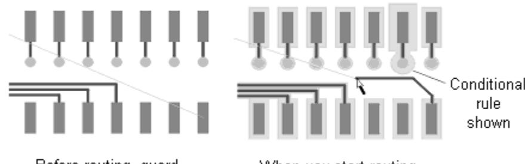

# **Preparing a Design**

Prior to a routing session in SailWind Router, you can set up your design environment for the current session and save the settings for future sessions.

#### **In this lesson:**

- Pre-routing procedures
- Changing the color of items
- Defining a layer pair
- Setting the default routing angle
- Setting a routing grid and a via grid
- Enabling real width display
- Setting auto-panning
- Setting guard bands
- Saving the default settings

#### **Preparation**

If it is not already running, start SailWind Router and open the file named **previewplaced.pcb** in the \ SailWind Projects\Samples folder.

## **Pre-routing Procedures**

Before you begin routing, you need to perform a few pre-routing procedures. The procedures vary by individual and by design. The following preparatory steps are designed specifically for this tutorial. It is recommended you follow these steps to receive the full benefit of the tutorial.

## **Changing the color of items**

# **Options button > Colors tab**

To improve visibility and reduce screen clutter when you route traces, disable the display of items not required for interactive routing.

- 1. Clear layer check boxes for the Power and Ground plane layers to disable the display of these plane layers.
- 2. Click the background color, black, in the **Color selection** area.
- 3. Click **Background** in the general options area to display the background as black.
- 4. In the general options area, click items in the **Ref. Des.**, **Keepout**, **Top Outl**, and **Bot Outl** columns to make these items invisible.
- 5. Click light green in the **Color selection** area.
- 6. Click **Connection** in the general options area to display the connections as light green.
- 7. Leave the Options dialog box open in preparation for the next topic.

**Tip:** With SailWind Router you can save color arrangements to reuse them in other designs. After you finish assigning colors to items in the Colors tab, you can save the color arrangement. In the Color scheme area of the Colors tab, click **Save as**, provide a name for the new color scheme and click **OK**.

# **Defining a layer pair**

### **Options button > Routing/General tab**

Defining a routing layer pair minimizes the amount of time spent on manual layer changes during interactive routing. Pairing routing layers limits layer changes to the members of the layer pair. For this four-layer design, the obvious routing pair is made up of the Primary and Secondary Component layers.

- 1. In the Layer Pair area, click **Primary Component Side** in the First layer list, and click **Secondary Component Side** in the Second layer list.
- 2. Leave the Options dialog box open in preparation for the next topic.

## **Setting the default routing angle**

## **Options button > Routing/General tab**

The trace routing angle setting determines the allowed routing angle (in degrees) of adjacent trace segments as they are introduced during interactive routing.

#### **There are three trace routing angle settings:**

| Routing angle | Description                                                 |
|---------------|-------------------------------------------------------------|
| Diagonal      | Adjacent trace segments are limited to 45-degree intervals. |
| Orthogonal    | Adjacent trace segments are limited to 90-degree intervals. |
| Any Angle     | Adjacent trace segments are not limited to any angle.       |

For the purpose of this tutorial, set the Routing Angle to Orthogonal.

- 1. In the Routing Angle area, click **Orthogonal**.
- 2. Click **OK** to close the Options dialog box.

## **Setting a routing grid and a via grid**

In this lesson, use a routing and via grid to facilitate the learning process.

Set a routing grid and via grid to 8.33 mils to accommodate the 8 mil trace and 8 mil space requirements of the design as follows:

- 1. Set the X Increment and Y Increment values for the Routing and the Via grids to **8.33**.
- 2. Click **OK** to save the settings and close the Design Properties dialog box. Otherwise you can use shortcut keys to set the grids.
- 3. Using the Grid shortcut key, type **gr 8.33** and press **Enter** to set the Routing grid.
- 4. Type **gv 8.33** and press **Enter** to set the Via grid.

### **Enabling real width display**

#### **Options button > Global/General tab**

You can enable or disable true width display to see trace widths in their real width.

- 1. In the Display settings area, type **8** in the Minimum line width box.
- 2. Click **Apply** to activate the setting.
- 3. Leave the Options dialog box open in preparation for the next topic.

### **Setting auto-panning**

# **Options button > Global/General tab**

During a routing session, it may be convenient to pan around the design. SailWind Router contains an auto-panning feature that automatically pans the screen following the pointer.

- 1. In the Pointer settings area, select the **Pan display with pointer movements** check box to enable the auto-panning feature.
- 2. Click **OK** to close the Options dialog box.

## **Setting guard bands**

#### **Options button > Global/General tab**

During interactive routing and editing, SailWind Router can display guard bands around all objects to indicate clearance boundaries. As the pointer approaches objects, visible outlines appear around nearby objects to indicate the clearance boundaries for rules in effect for the current operation.

- 1. In the Display settings area, select the **Show guard bands on object** check box.
- 2. Click **OK** to apply the setting and close the Options dialog box.
- 3. Do not save a copy of the design.

**You completed the pre-routing procedures tutorial.**