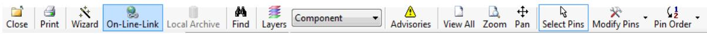

# **Chapter 3 Land Pattern Calculator**

The Land Pattern Calculator allows you to specify dimensions of a particular component and then calculates the proper land pattern dimension based upon internal formulas and user-customized .plb file settings.

The calculator can be opened two ways: from the Calculator tool bar button (in the main window) or from the Library Manager.

When opened from the Library Manager the calculator displays the selected land pattern from the library currently in the Library Manager. Otherwise, a sample part is displayed with prompts for your input.

Like the Library Manager, the calculator can open and search libraries. Calculator searches are different to the extent that only components of the same type as the calculator will be displayed. Searching can be filtered according to component data that you enter.

Each calculator stores a set of default settings and environmental values which are automatically applied based on component data. The defaults are recommendations based on studies by IPC regarding surface mount solder joint reliability. If desired, you may substitute your own settings in order to customize the land pattern design.

Calculator inputs are divided in to four categories: Tool Bar Controls, Component, Calculator Settings, and Global Settings. Generated calculations are divided into two categories: Land Pattern and Statistics.

[Calculator](#page-0-0) Toolbar Controls Generic Tab [Controls](#page-1-0) Surface Mount Grid Array Specific Tab [Controls](#page-4-0) Surface Mount Device [Non-Grid](#page-5-0) Array Specific Tab Controls [Through-Hole](#page-7-0) Device Specific Tab Controls [Analyzing Results](#page-8-0)

# **Calculator Toolbar Controls**

The Calculator toolbar contains a broad range of buttons that provide access to all of the Calculator functions.

### **Figure 12. Calculator Toolbar**

| Name   | Description                                                                                                                                          |  |
|--------|------------------------------------------------------------------------------------------------------------------------------------------------------|--|
| Close  | Closes the calculator window and returns to another open window, if any.                                                                             |  |
| Print  | Prints a two page 'data sheet' for the calculated land pattern.                                                                                      |  |
| Wizard | Opens the Land Pattern Wizard Dialog Boxand allows you to save the land pattern to a plb09 library file or create an output to selected CAD tool. |  |

## **Table 6. Calculator Toolbar Controls**

| Name                   | Description                                                                                                                                                                                                                                                                                                                                                                                                                                                                                                                                                                                  |  |  |  |
|------------------------|----------------------------------------------------------------------------------------------------------------------------------------------------------------------------------------------------------------------------------------------------------------------------------------------------------------------------------------------------------------------------------------------------------------------------------------------------------------------------------------------------------------------------------------------------------------------------------------------|--|--|--|
| On-Line-Link           | If the displayed component was loaded from a library it may have a link to a manufactures web site with an on-line data sheet. If such a link exists this toolbar button will be enabled and clicking it will go to the link.                                                                                                                                                                                                                                                                                                                                                          |  |  |  |
| Local Archive          | If the displayed component was loaded from a library it may have a link to a local directory with component documentation. If such a link exists this toolbar button will be enabled and clicking it will open the file.                                                                                                                                                                                                                                                                                                                                                               |  |  |  |
| Find                   | Opens the default library associated with calculator family type and loads the library for viewing and searching. Search results can be 'filtered' by providing additional information about characteristics of the search object. For example, if searching for a part with a particular pin configuration, enter the pitch and the total number of pins to restrict the search to land patterns with that pitch and pin count. Some characteristics can not be used to filter the search. Such characteristics are usually indicated by a '~' preceding the value label. |  |  |  |
| Layers                 | Opens a layer control panel that allows you to turn on and off layers, dimensions, pin numbers and a display grid locked to the component origin.                                                                                                                                                                                                                                                                                                                                                                                                                                         |  |  |  |
| Top-Most View Layer | This pull down menu allows you to select the layer that will be displayed 'on top' in display.                                                                                                                                                                                                                                                                                                                                                                                                                                                                                            |  |  |  |
| Advisories             | Additional advisories may result from loading a library land pattern when a verification discrepancy encountered. For information on verification, see Help topic Verifying Land Patterns.                                                                                                                                                                                                                                                                                                                                                                                             |  |  |  |
| View All               | Adjusts the display so that all elements are visible within the viewing area.                                                                                                                                                                                                                                                                                                                                                                                                                                                                                                                |  |  |  |
| Zoom                   | Sets the viewer left-mouse function to Zoom Window.                                                                                                                                                                                                                                                                                                                                                                                                                                                                                                                                          |  |  |  |
| Pan                    | Sets the viewer left-mouse function to Pan.                                                                                                                                                                                                                                                                                                                                                                                                                                                                                                                                                  |  |  |  |
| Select Pins            | Pin modification is possible in several component families (BGA, QFP, SO and others). Clicking this button changes the cursor to an arrow and pin may be selected for modification by moving the cursor over the lands and clicking the left mouse button. Pins may also be selected by dragging the cursor to form a box surrounding the pins to be selected. Selected pins are highlighted and subject to modification.                                                                                                                                                     |  |  |  |
| Modify Pins            | Pin modifications include: setting the location of pin one, setting the location of the cathode (on diodes), hiding, deleting, restoring, renumbering and reordering.                                                                                                                                                                                                                                                                                                                                                                                                                  |  |  |  |
| Pin Order              | Pin order clockwise or counter-clockwise may be selected.                                                                                                                                                                                                                                                                                                                                                                                                                                                                                                                                    |  |  |  |

|  |  | Table 6. Calculator Toolbar Controls (continued) |
|--|--|--------------------------------------------------|
|  |  |                                                  |

# **Generic Tab Controls**

The tab controls are displayed vertically. The tabs allow access to groups of settings for the components, the land patterns and the calculator, as well as global settings and statistics.

## **Figure 13. (Vertical) Calculator Tabs**

|  |  |  | Component   Land Pattern | Calculator Settings   Global Settings   Statistics |  |  |
|--|--|--|--------------------------|----------------------------------------------------|--|--|
|--|--|--|--------------------------|----------------------------------------------------|--|--|

## **Component Tab**

This tab contains controls for the entry of component data. Each calculator has a "Demo" button which will load and calculate a sample part for you.

Transfer the component dimensional data from the manufacturer's data sheet in to the appropriate fields of the calculator's Component tab. A provision for Alternate Input Format is provided to allow easy entry of component data whether it is given in the form of minimum-maximum or nominal-with-plus-or-minus tolerances. In some cases Alternate Input Format also accommodates different combinations of available component data that can result from variations in manufacturer supplied data sheet specifications.

## **Note:**

While the Alternate inputs are generally transferable from one format to another, min-max is easily derived from nominal-with-tolerance but nominal-with-tolerance can not be accurately derived from min-max.

### **Optional Entries**

When there is an optional entry the data field will be invisible or disabled until a box or button is checked indicating that the option is to be included.

• Thermal Tabs/Pads are optional for SOIC, SON, QFP and QFN.

**Tip** When you enable the Thermal Tab, you have the option to append the thermal tab information to the land pattern name. See the "Append Thermal Tab Name" check box on the "Land [Pattern](#page-3-0) Tab[" on page 60](#page-3-0).

- Fiducial's are optional for BGA and QFP. Optional fiducial's are added automatically for: BGA's when the pitch is equal to or less then 0.80mm; and in QFP's when the pitch is equal to or less then 0.50mm. You always have the option of adding or removing fiducial's but the locations are always fixed as follows: BGA's in upper right and lower left corners at the courtyard intersections; QFP's in upper right and lower left corners centered with pad rows.
- Pull-Back Leads are optional on SON and QFN when terminals are pulled back from the edge of the body.

Click OK once all entries have been made. If any errors are detected a red indicator will flash in the field. Moving the cursor over the indicator will display a 'tool tip' with an explanation of the violation.

At this point a complete calculation will be performed using the default preferences for the Settings, Environment, Rules and Drafting variables. Entries for these variables are disabled unless the User radio button is checked. All land pattern dimensional fields will populate and the Viewer window will display the component and calculated land pattern.

**Note:**

Parts selected from a library search can be modified to produce new land patterns. If you can find a component close to the one you are looking for, all you have to do is modify the numbers that are different and click the **OK** button.

## **Land Pattern Tab**

This tab is for viewing land pattern calculated dimensions. It also allows you to modify automatically generated names.

Land Pattern and Pad Stack names are generated automatically but you may change them prior to saving or creating the CAD land pattern (using the Land Pattern Wizard).

The Append Thermal Tab Name check box appears if you select the Thermal Tab check box on the ["Component](#page-2-0) Tab[" on page 59](#page-2-0). The thermal tab is optional for SOIC, SON, QFP and QFN families. After you select the check box, you must click **OK** for the regenerated name to appear.

The View Pin and Padstack Data button opens the Pins, and Padstacks tabs to list the associated data. The button is only available when the Dimensions area is populated.

**Note:** The automatic naming convention is not foolproof. It is possible for different components to produce identical names. This can happen for several reasons. For instance, if height is not a factor in the land pattern name so parts with identical footprints might have a different height component unless you intervene in the naming process. Also, the automatically generated name is typically based on certain component Nominal dimensions. Nominal dimensions are derived from averaging the min and max values so that two dimensions with the same nominal value might have vastly different min and max values which will likely result in different land patterns. When you save your part to the plb09 library a check will be made for duplicate names. If a duplicate name is encountered you will have the option to add the duplicate, overwrite the original or cancel the operation. For hints on how to deal with duplicate names see Help topic "Land Pattern Name Syntax"on page 128.

Default settings and environment are always applied to the first calculation of a new land pattern. After that, changed entries will remain until the "Clear" button (on the component tab) is used to clear the component data fields and return the calculator to its default state.

## **Calculator Settings Tab**

This tab contains controls for entering design constraints that will effect how the land pattern will calculated. Entries on this tab apply specifically to the kind of land pattern being created, BGA, chip, QFP, etc. All of the values on this tab can be assigned default values by the user Preferences (See the "Help topics for User Preferences, Surface Mount and Through Hole Devices"on page 31). Any setting may be modified if the User radio button is checked.

The "(Global)" list of environments can contain multiple user specified environments and suffixes set up on the "Preferences, Global Settings"on page 36.

## **Global Settings Tab**

This tab contains controls for entering design constraints that will effect how all land patterns will calculated. All of the values on this tab can be assigned default values by the user Preferences (See Help topic "Preferences, Global Settings"on page 36). Any setting may modified if the User radio button is checked.

# **Statistics Tab**

This tab displays information about the how the calculation satisfied the environmental goals. See Help topic ["Analyzing Results"on page 65.](#page-8-0)

# **Surface Mount Grid Array Specific Tab Controls**

The BGA calculator is set up slightly different from the other SMD calculators owing to the variety of design variation possibilities. The SMD Grid Array calculators have a number of variations that can be accessed from these tabs. These include groups of settings for the components, the land patterns and the calculator, as well as global settings and statistics.

## **Component Tab for SM Grid Array Devices**

Transfer the component dimensional data from the manufacturer's data sheet as described in Help topic "Surface Mount Device [Non-Grid](#page-5-0) Array Specific Tab Controls[" on page 62](#page-5-0). The following is an enumeration of significant differences that set BGA's apart from other families of component types.

**Fiducials**—are optional. Fiducial's are added automatically for: BGA's when the pitch is equal to or less then 0.80mm. After a calculation, Fiducial's may be unconditionally added or removed by checking the Fiducial Checkbox. Locations are always fixed as follows: in upper right and lower left corners at the courtyard intersections.

The value for either Rows or Columns may be numeric or alphanumeric. The selection for which is which is set by a pull down menu control. Alphanumeric values may be entered either as an alphanumeric or as a number. For example, a device with 23 rows may be entered either as '23' or its alphanumeric equivalent 'AC'.

**Ball Type - Collapsing and Non-collapsing balls**—At some point balls get small enough that the weight of the part and the surface tension of the solder in the ball prevent it from collapsing. This effects the size of the pad to the extent that pads for collapsing balls are typically reduced by a percentage of the ball size while non-collapsing balls are typically increased by a percentage of the ball size. Non collapsing balls usually occur only on very small BGA's.

Click OK once all entries have been made. If any errors are detected a red indicator will flash in the field. Moving the cursor over the indicator will display a 'tool tip' with an explanation of the violation.

At this point a complete calculation will be performed using the default preferences for the Settings, Environment, Rules and Drafting variables. Entries for these variables are disabled unless the User radio button is checked. All land pattern dimensional fields will populate and the Viewer window will display the component and calculated land pattern.

## **Notes:**

- Settings are applied first time any calculation takes place. After they may be modified for recalculations. If preferences are changed the changes will not appear until the calculator is reset (by clicking the 'Clear' button).
- Parts selected from a library search can be modified to produce new land patterns. If you can find a component close to the one you are looking for, all you have to do is modify the numbers that are different and select the "OK Button".

**Calculator Settings Tab for SM Grid Array Devices**

The surface mount grid array family can have a number of settings that can be applied over a range of components based on Ball (or Lead) type and size. Settings are available to control both the land pattern, solder mask and paste mask sizes. All of the values on this tab can be assigned default values by the user Preferences (See Help topic "Surface Mount Calculators, Grid Array Pages"on page 47). Any setting may modified if the User radio button is checked. The definition of the rule being applied to any particular calculation is displayed above the collection of text boxes on this tab.

Settings are applied first time any calculation takes place. After they may be modified for recalculations. If preferences are changed the changes will not appear until the calculator is reset (by clicking the 'Clear' button).

## **Statistics Tab for SM Grid Array Devices**

This tab displays the calculated potential Material Conditions. Maximum Material Condition defines the land pattern dimension.

# **Surface Mount Device Non-Grid Array Specific Tab Controls**

The non-grid array SMD calculators have a number of variations that can be accessed from these tabs. These include groups of settings for the components, the land patterns and the calculator, as well as global settings and statistics.

## **Component Tab for SM Non-Grid Array Devices**

This tab contains controls for the entry of component data. Each calculator has a "Demo" button which will load and calculate a sample part for you.

Transfer the component dimensional data from the manufacturer's data sheet in to the appropriate fields of the calculator's Component tab.

### **Optional Entries**

When there is an optional entry the data field will be invisible or disabled until a box or button is checked indicating that the option is to be included.

- Thermal Pads are optional for SOP, SON, QFP and QFN.
- Fiducial's are optional for BGA and QFP. Optional fiducial's are added automatically for: BGA's when the pitch is equal to or less then 0.80mm; and in QFP's when the pitch is equal to or less then 0.50mm. You always have the option of adding or removing fiducial's but the locations are always fixed as follows: BGA's in upper right and lower left corners at the courtyard intersections; QFP's in upper right and lower left corners centered with pad rows.
- Pull-Back Leads are optional on SON and QFN when terminals are pulled back from the edge of the body.

Click OK once all entries have been made. If any errors are detected a red indicator will flash in the field. Moving the cursor over the indicator will display a 'tool tip' with an explanation of the violation.

At this point a complete calculation will be performed using the default preferences for the Settings, Environment, Rules and Drafting variables. Entries for these variables are disabled unless the User radio button is checked. All land pattern dimensional fields will populate and the Viewer window will display the component and calculated land pattern.

#### **Notes:**

- Settings are applied first time any calculation takes place. After they may be modified for recalculations. If preferences are changed the changes will not appear until the calculator is reset (by clicking the "Clear" button on the component tab).
- Parts selected from a library search can be modified to produce new land patterns. If you can find a component close to the one you are looking for, all you have to do is modify the numbers that are different and select the "OK Button".

### **Land Pattern Tab for SM Non-Grid Array Devices**

This tab is for viewing land pattern calculated dimensions. It also allows you to modify automatically generated names.

Land Pattern and Pad Stack names are generated automatically but you may change them prior to saving or creating the CAD land pattern (using the Land Pattern Wizard).

### **Note:**

The automatic naming convention is not foolproof. It is possible for different components to produce identical names. This can happen for several reasons. For instance, if height is not a factor in the land pattern name so parts with identical footprints might have a different height component unless you intervene in the naming process. Also, the automatically generated name is typically based on certain component Nominal dimensions. Nominal dimensions are derived from averaging the min and max values so that two dimensions with the same nominal value might have vastly different min and max values which will likely result in different land patterns. When you save your part to the plb09 library a check will be made for duplicate names. If a duplicate name is encountered you will have the option to add the duplicate, overwrite the original or cancel the operation. For hints on how to deal with duplicate names see Help topic "Land Pattern Name Syntax"on page 128.

Default settings and environment are always applied to the first calculation of a new land pattern. After that, changed entries will remain until the "Reset" button is used to clear the component data fields and return the calculator to its default state.

For details on Preferences see the Help topic "Surface Mount Calculators, Non-Grid Array Pages"on page 49.

**Calculator Settings Tab for SM Non-Grid Array Devices**

This tab contains controls for entering design constraints that will effect how the land pattern will calculated. Entries on this tab apply specifically to the kind of land pattern being created, BGA, chip, QFP, etc. All of the values on this tab can be assigned default values by the user Preferences (See Help topic "Surface Mount Calculators, Non-Grid Array Pages"on page 49). Any setting may modified if the User radio button is checked.

The "(Global)" list of environments can contain multiple user specified environments and suffixes set up on the "Preferences, Global Settings"on page 36.

**Global Settings Tab for SM Non-Grid Array Devices**

This tab contains controls for entering design constraints that will effect how all land patterns will calculated. All of the values on this tab can be assigned default values by the user Preferences (See Help topic "Preferences, Global Settings"on page 36). Any setting may modified if the User radio button is checked.

**Statistics Tab for SM Non-Grid Array Devices**

This tab displays information about the how the calculation satisfied the environmental goals. See Help topic ["Analyzing Results"on page 65.](#page-8-0)

# **Through-Hole Device Specific Tab Controls**

The through-hole calculators have a number of variations that can be accessed from these tabs. These include groups of settings for the components, the land patterns and the calculator, as well as global settings.

## **Component Tab for TH Devices**

This tab contains controls for the entry of component data. Each calculator has a "Demo" button which will load and calculate a sample part for you.

Transfer the component dimensional data from the manufacturer's data sheet in to the appropriate fields of the calculator's Component tab.

## **Optional Entries**

When there is an optional entry the data field will be invisible or disabled until a box or button is checked indicating that the option is to be included. Optional entries, when left blank, will be automatically calculated and optimized to produce a value based on other component and settings data.

### **Note:**

Optional entries may not occur in some component families. Optional Entries, when present, will be annotated with an asterisk (\*). If left blank, their values will be calculated and filled in automatically.

- Lead Spacing and Mounted Height are optional for the Axial component family. Both values may be automatically calculated to compensate for lead bending, based on lead diameter, or overridden by user entered values so long as possible.
- Standoff is optional for the Radial component family. This value may be automatically calculated to compensate for lead bending, based on lead diameter, or overridden by a user entered value so long as possible.
- Gauge is optional for the Wire component family. Selecting a wire gauge will automatically produce a wire diameter. If a simple diameter is desired, it can be entered directly.

Click OK once all entries have been made. If any errors are detected a red indicator will flash in the field. Moving the cursor over the indicator will display a 'tool tip' with an explanation of the violation.

At this point a complete calculation will be performed using the default preferences for the Settings, Environment, Rules and Drafting variables. Entries for these variables are disabled unless the User radio button is checked. All land pattern dimensional fields will populate and the Viewer window will display the component and calculated land pattern.

### **Notes:**

- Settings are applied first time any calculation takes place. After they may be modified for recalculations. If preferences are changed the changes will not appear until the calculator is reset (by clicking the 'Clear' button on the component tab).
- Parts selected from a library search can be modified to produce new land patterns. If you can find a component close to the one you are looking for, all you have to do is modify the numbers that are different and select the "OK Button".

**Calculator Settings Tab for TH Devices**

This tab contains controls for entering design constraints that will effect how the land pattern will calculated. Entries on this tab apply specifically to the kind of land pattern being created, axial, radial, DIP, etc. All of the values on this tab can be assigned default values by the user Preferences (See Help topic "Through-Hole Calculators, Device Pages"on page 52). Any setting may modified if the User radio button is checked.

Other controls are the same as described in Help topic ["Surface Mount Device Non-Grid Array Specific](#page-5-0) Tab [Controls" on page 62](#page-5-0).

**Note:**

Default settings and fabrication level are always applied to the first calculation of a new land pattern. After that, changed entries will remain until the "Clear" button is used to clear the component data fields and return the calculator to its default state.

For details on Preferences see the Help topic "Through-Hole Calculators, Device Pages"on page 52.

# **Analyzing Results**

*Solder Joint Analysis* is the process of evaluating the relationship between the terminal, which is the contact area of the lead, and the land pattern. Understanding these relationships is important to determining the proper setting for the calculators and obtaining the desired results from the land pattern generation processes.

The table of Solder Joint Analysis gives you important feedback about the relationship between land and terminal. The Calculator takes all component, process and environmental variables into account then reports the minimum and maximum Protrusions of the land for the Toe Fillet, Heel Fillet and Side Fillet or Periphery for terminals with no vertical dimension.

For any given land pattern protrusion or periphery three statistical values will be displayed: the Goal; the Minimum and the Maximum.

The Goal, of course, is the target you specify as the minimum acceptable value (this is the value assigned to the calculation when the Most, Nominal or Least environment is selected, or the manually entered values in the User environment).

Its recommended, if you are not familiar with Solder Joint integrity, to accept the defaults for Settings, Tolerances, and Environment Goals.

The Minimum is a calculated value that will result in a worst case scenario if the component is in it's extreme condition, the processes (fabrication and assembly) are at their maximum tolerance, including the specified rounding condition and any trimming required to spacing minimums. Note that positive or negative values have no significance. Its the relationship that's important. The closer this value is to the goal, the better. If its larger than the goal then excessive board space is being used. If its smaller than the goal then its reliability is lessened.

The Maximum is a calculated value that will result in the most favorable scenario if the component is in its nominal condition, the processes are held to minimum tolerance, including the specified rounding condition and any trimming required to spacing minimums.

The ability to calculate and display these values is the true value of the land pattern calculator for those who require the best reliability in their PCB applications.